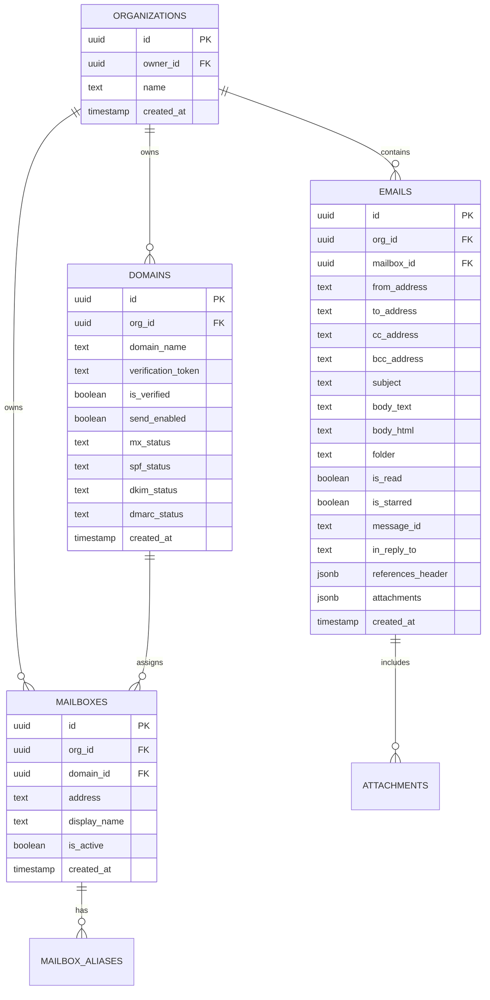
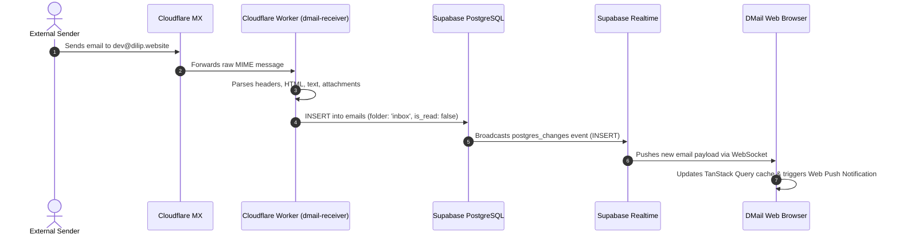
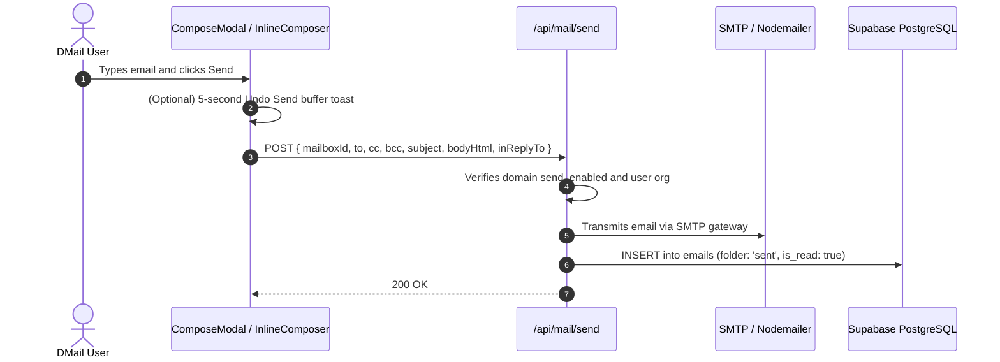

# DMail — Comprehensive Project Context & Architecture Guide

This document contains complete architectural, technical, data, and code context for the **DMail** repository. It is designed to give any AI model or developer 100% full context of the entire system.

---

## 1. Project Overview

**DMail** is a modern, production-grade custom domain webmail application. It allows users to connect custom domain names (e.g., `dilip.website`), set up virtual mailboxes (e.g., `dev@dilip.website`, `hello@dilip.website`), receive incoming emails through Cloudflare Email Routing, and compose/send outbound emails via SMTP/Nodemailer with zero configuration.

### Core Capabilities
- **Multi-Domain & Multi-Mailbox Management**: Add custom domains, generate DNS verification records (MX, SPF, DKIM, DMARC), and provision multiple mailboxes with aliases.
- **Inbound Email Receiving**: Powered by Cloudflare Email Routing Worker (`workers/dmail-receiver`) parsing raw MIME payloads and persisting them directly to Supabase.
- **Outbound Sending**: Multi-recipient (To, CC, BCC), attachments, reply chains (`In-Reply-To`, `References`), and undo-send safety buffers.
- **Real-Time Synchronisation**: Supabase Realtime WebSockets for instant inbox updates and native Web Push notifications.
- **Master-Detail Email Workspace**: Collapsible sidebar, resizable split-pane list/thread layout, touch swipe actions (archive/delete), and global shortcut overlay.
- **PWA & Offline Capability**: Progressive Web App manifest with offline status detection and caching.

---

## 2. Technology Stack

| Layer | Technologies |
| :--- | :--- |
| **Framework** | Next.js 15 (App Router), React 19, TypeScript 5 |
| **Styling & Design** | Tailwind CSS v3, Radix UI Primitives, Lucide Icons, `next-themes` |
| **Backend & Database** | Supabase (PostgreSQL 15, Auth, Realtime Postgres Changes, Storage) |
| **Server Client** | `@supabase/ssr` with Cookie-based Session Handling |
| **State & Cache** | TanStack React Query (`@tanstack/react-query` v5), React Context |
| **Email Worker** | Cloudflare Workers (`wrangler`), PostalMime / Mailparser |
| **Outbound Email** | Nodemailer, SMTP |
| **Testing** | Jest, React Testing Library, `jest-environment-jsdom` |

---

## 3. Directory Structure

```
dmail/
├── .env.local                    # Environment variables (Supabase, SMTP, Allowed Email)
├── app/
│   ├── layout.tsx                # Root layout: ThemeProvider, QueryProvider, PWA/Notification providers
│   ├── globals.css               # Global CSS tokens, custom scrollbars, animations, email styling
│   ├── page.tsx                  # Marketing / Landing page
│   ├── auth/                     # Authentication routes (login, sign-up, forgot-password, confirm)
│   ├── mail/                     # Authenticated mail application
│   │   ├── layout.tsx            # Mail layout: Server Component fetching User, Org, Mailboxes, Unread count
│   │   ├── page.tsx              # Redirects to /mail/inbox
│   │   ├── [folder]/
│   │   │   ├── page.tsx          # Dynamic folder list view (inbox, sent, drafts, trash, archive, starred)
│   │   │   └── [emailId]/
│   │   │       └── page.tsx      # Email detail view + split pane
│   │   └── settings/
│   │       ├── domains/          # Domain management and DNS verification
│   │       ├── mailboxes/        # Mailbox and alias management
│   │       └── appearance/       # Density, theme, and notification settings
│   └── api/
│       ├── domains/              # DNS lookup and domain verification endpoints
│       ├── emails/               # REST endpoints for folder email listing and single email fetch
│       ├── mail/send/            # Outbound email transmission via Nodemailer
│       └── mailboxes/            # Mailbox CRUD endpoints
├── components/
│   ├── providers.tsx             # Composed context providers
│   ├── notification-provider.tsx # Web Push & desktop notification manager
│   ├── pwa-provider.tsx          # PWA service worker registration & install prompts
│   ├── theme-switcher.tsx        # Light / Dark / System theme toggle
│   ├── offline-banner.tsx        # Network status monitor
│   ├── ui/                       # Reusable Radix UI primitives (dialog, button, dropdown, etc.)
│   └── mail/
│       ├── mail-shell.tsx        # Top-level client shell: global shortcuts, search modal, compose modal
│       ├── sidebar.tsx           # Folder navigation, mailbox list, compose trigger, storage indicator
│       ├── email-list.tsx        # Left pane: swipable email rows, multi-select, pull-to-refresh
│       ├── email-thread.tsx      # Right pane: collapsible thread messages, HTML renderer, inline composer
│       ├── resizable-split-pane.tsx # Draggable splitter between email list and thread view
│       ├── compose-modal.tsx     # Full modal email composer with rich text and attachments
│       ├── rich-text-editor.tsx  # Formatting toolbar (bold, italic, lists, links)
│       ├── global-search-modal.tsx # Instant search across subject, body, and senders
│       ├── domains-manager.tsx   # Domain verification UI and DNS record tables
│       ├── mailboxes-manager.tsx # Mailbox provisioning UI
│       └── undo-send-toast.tsx   # Configurable timer toast to cancel outgoing mail
├── lib/
│   ├── hooks/
│   │   ├── use-emails-query.ts   # TanStack Query hooks for folder list and email detail
│   │   ├── use-realtime-inbox.ts # Supabase Realtime hook for incoming mail push notifications
│   │   ├── use-recent-contacts.ts# Local contact cache for auto-completion
│   │   └── use-query-client.tsx  # QueryClient instance provider
│   ├── supabase/
│   │   ├── client.ts             # Browser-side Supabase client (`createBrowserClient`)
│   │   ├── server.ts             # Server Component client (`createServerClient` with cookies)
│   │   └── proxy.ts              # Session validation & single-user restriction proxy
│   ├── types/
│   │   ├── database.ts           # Auto-generated Supabase schema definitions
│   │   └── index.ts              # Application domain types (Email, Mailbox, Domain, ComposePayload)
│   └── utils.ts                  # Shared utility functions (cn, date formatters, address parser)
├── proxy.ts                      # Route matcher & session refresher for Next.js middleware
└── workers/
    └── dmail-receiver/           # Cloudflare Email Routing worker for incoming MIME parsing
```

---

## 4. Database Architecture & Schema

All tables are defined in PostgreSQL on Supabase with Row Level Security (RLS) scoped by `org_id` and user ownership.



### Key Table Definitions

#### `organizations`
- `id`: UUID (Primary Key)
- `owner_id`: UUID (references `auth.users.id`)
- `name`: Text (Organization or Workspace name)
- `created_at`: Timestamp

#### `domains`
- `id`: UUID (Primary Key)
- `org_id`: UUID (references `organizations.id`)
- `domain_name`: Text (e.g. `dilip.website`)
- `verification_token`: Text (used for TXT/DNS verification)
- `is_verified`: Boolean
- `send_enabled`: Boolean
- `mx_status`, `spf_status`, `dkim_status`, `dmarc_status`: Text (`pending`, `valid`, `invalid`)

#### `mailboxes`
- `id`: UUID (Primary Key)
- `org_id`: UUID (references `organizations.id`)
- `domain_id`: UUID (references `domains.id`)
- `address`: Text (full email, e.g. `dev@dilip.website`)
- `display_name`: Text
- `is_active`: Boolean

#### `emails`
- `id`: UUID (Primary Key)
- `org_id`: UUID (references `organizations.id`)
- `mailbox_id`: UUID (references `mailboxes.id`, optional)
- `from_address`: Text (raw RFC 2822 sender, e.g. `"Name" <sender@example.com>`)
- `to_address`: Text (destination recipient)
- `cc_address`, `bcc_address`: Text
- `subject`: Text
- `body_text`: Text (plain text version)
- `body_html`: Text (rich HTML markup)
- `folder`: Text (`inbox`, `sent`, `drafts`, `trash`, `archive`, `starred`)
- `is_read`: Boolean
- `is_starred`: Boolean
- `message_id`: Text (RFC Message-ID for threading)
- `in_reply_to`: Text (Message-ID of parent email)
- `references_header`: JSONB array of Message-IDs
- `attachments`: JSONB array (`[{ filename, size, type, url }]`)
- `created_at`: Timestamp

---

## 5. End-to-End Email Pipelines

### A. Inbound Email Flow


### B. Outbound Email Flow


---

## 6. Core Frontend Components & Architecture

### 1. [`app/mail/layout.tsx`](file:///d:/dmail/app/mail/layout.tsx)
Async Server Component that handles initial authentication and core scoping queries:
- Validates current user via `supabase.auth.getUser()`.
- Fetches organization for current user.
- Runs parallel queries for active mailboxes and unread email count.
- Wraps child routes in the `<MailShell />` client provider.

### 2. [`components/mail/mail-shell.tsx`](file:///d:/dmail/components/mail/mail-shell.tsx)
Top-level Client Component container:
- Provides `MailContext` (`openCompose`, `openSearch`, `recentContacts`).
- Mounts `<Sidebar />`, `<ComposeModal />`, `<GlobalSearchModal />`, and `<KeyboardShortcutsOverlay />`.
- Listens to global keyboard shortcuts (`c` = compose, `/` = search, `?` = shortcuts).
- Synchronizes browser PWA badge count with unread emails.

### 3. [`components/mail/email-list.tsx`](file:///d:/dmail/components/mail/email-list.tsx)
The master email list in the left pane:
- Displays swipable, selectable email rows with folder-specific empty states.
- Subscribes directly to Supabase Realtime `postgres_changes` for `emails` in the current organization.
- Manages batch actions (archive, delete, mark read/unread).
- Synchronizes with TanStack Query (`["emails", orgId, folder]`).

### 4. [`components/mail/email-thread.tsx`](file:///d:/dmail/components/mail/email-thread.tsx)
The detail email view in the right pane:
- Renders conversational reply threads grouped by `in_reply_to` and `message_id`.
- Renders sanitized HTML bodies using scoped CSS rules.
- Supports attachment downloads.
- Includes inline collapsible reply, reply-all, and forward composers.

### 5. [`components/mail/resizable-split-pane.tsx`](file:///d:/dmail/components/mail/resizable-split-pane.tsx)
- Draggable, persistent dual-pane splitter that stores user's pane width in `localStorage`.
- Responsive: switches between stacked mobile layout and side-by-side desktop layout.

---

## 7. Performance Architecture & Known Latency Drivers

When investigating or optimizing email click performance (left pane to right pane transition), consider the following architectural details:

### 1. Dual-Query Redundancy
In [`app/mail/[folder]/[emailId]/page.tsx`](file:///d:/dmail/app/mail/%5Bfolder%5D/%5BemailId%5D/page.tsx), opening an email currently executes:
- A query for **50 full emails** using `select("*")` (including heavy `body_html` strings of marketing newsletters).
- A query for the specific email detail.
- A query for the reply thread.
*Solution*: Split email list queries to only fetch metadata (`id`, `subject`, `from_address`, `is_read`, `created_at`), and load `body_html` lazily for the active email.

### 2. Client-Side Selection vs. Server Navigation
- Currently, clicking an email executes `router.push('/mail/[folder]/[emailId]')`, initiating a server round-trip.
- *Solution*: Store the active `selectedEmailId` in client state or shallow URL search parameters (`?id=...`). This allows the right pane to open in **< 16ms** using data already in memory, streaming heavy thread bodies in the background.

### 3. DOM Style Recalculation
- Large newsletters (Neo4j, Qdrant) with hundreds of nested tables and inline styles are injected via `dangerouslySetInnerHTML`.
- *Solution*: Render the HTML email body inside a sandboxed `<iframe>` with `srcDoc` to isolate styles and prevent main-thread layout recalculations.

---

## 8. Essential Environment Variables

```env
# Supabase Configuration
NEXT_PUBLIC_SUPABASE_URL=https://your-project.supabase.co
NEXT_PUBLIC_SUPABASE_PUBLISHABLE_KEY=your-anon-key
SUPABASE_SERVICE_ROLE_KEY=your-service-role-key

# Single-User Access Security (Optional restriction)
ALLOWED_EMAIL=your-authorized-email@domain.com

# SMTP Outbound Gateway
SMTP_HOST=smtp.mailchannels.net
SMTP_PORT=587
SMTP_USER=your-smtp-user
SMTP_PASSWORD=your-smtp-password
SMTP_SECURE=false

# App URL
NEXT_PUBLIC_APP_URL=http://localhost:3000
```

---

## 9. Key Commands

```powershell
# Run development server
npm run dev

# Run production build & start
npm run build
npm run start

# Run unit tests
npm test

# Run tests with coverage
npm run test:coverage

# Lint codebase
npm run lint
`````

---

## 24. Recent Architecture & UI Enhancements (September 2026)

### 24.1 Auto-Starring Rules Engine for Trusted Domains
- **File**: [`lib/email-rules.ts`](file:///d:/dmail/lib/email-rules.ts)
- **Worker Integration**: [`workers/dmail-receiver/src/index.ts`](file:///d:/dmail/workers/dmail-receiver/src/index.ts)
- Automatically evaluates incoming sender addresses against institutional and trusted public email domains (`nitdelhi.ac.in`, `gmail.com`, `outlook.com`, `proton.me`, `icloud.com`, `yahoo.com`, `zoho.com`, and subdomains like `*.nitdelhi.ac.in`).
- Sets `is_starred: true` on initial ingestion to ensure important communications are immediately prominent.

### 24.2 Sandboxed HTML Email Iframe Viewer (`EmailIframeViewer`)
- **File**: [`components/mail/email-iframe-viewer.tsx`](file:///d:/dmail/components/mail/email-iframe-viewer.tsx)
- Replaces raw `dangerouslySetInnerHTML` injections with a secure, sandboxed iframe (`sandbox="allow-same-origin allow-popups allow-popups-to-escape-sandbox"`).
- Uses an isolated content root (`#dmail-content-root`) with `ResizeObserver` measuring scroll heights.
- Prevents infinite height expansion feedback loops by decoupling internal styling from the outer container.

### 24.3 Gmail-Style Message Details Popover
- **File**: [`components/mail/email-thread.tsx`](file:///d:/dmail/components/mail/email-thread.tsx)
- Displays comprehensive delivery headers (From, To, CC, BCC, Date, Subject, Mailed-By, Signed-By, TLS Security indicator).
- **Responsive Layout**: `-left-[54px] sm:left-0` with `w-[calc(100vw-24px)] max-w-[360px] sm:w-[420px]` guaranteeing symmetrical 12px margin on mobile devices without right-edge clipping.
- **Simultaneous Scroll Auto-Dismissal**: Captures `scroll` and `wheel` in passive mode (`{ passive: true }`), allowing native fluid scrolling while dismissing the popover on the same motion.
- **Interaction Protection**: Internal text selection remains protected while global `mousedown`, `touchstart`, and `window.blur` dismiss on outside interaction.

### 24.4 Resizable Split-Pane Layout Persistence
- **File**: [`components/mail/resizable-split-pane.tsx`](file:///d:/dmail/components/mail/resizable-split-pane.tsx)
- Automatically persists user-defined panel split ratios to `localStorage` under `dmail_split_ratio`.
- Synchronizes split state across folder navigation, page reloads, and window resizes with clamp boundaries (20%–60%).

### 24.5 Professional Email List Row Redesign
- **File**: [`components/mail/email-list.tsx`](file:///d:/dmail/components/mail/email-list.tsx)
- Replaces generic checkboxes with colorful Sender Initials Badges that dynamically morph into interactive checkboxes on hover or selection.
- Features clean brand name normalization (`formatAddressDisplay`) for service addresses.
- Clear visual hierarchy distinguishing unread (bold card, unread pulse dot) and read items.

### 24.6 Universal Brand Logo & Navigation
- **Files**: [`components/mail/sidebar.tsx`](file:///d:/dmail/components/mail/sidebar.tsx), [`components/mail/mail-shell.tsx`](file:///d:/dmail/components/mail/mail-shell.tsx), [`components/login-form.tsx`](file:///d:/dmail/components/login-form.tsx), [`components/sign-up-form.tsx`](file:///d:/dmail/components/sign-up-form.tsx)
- DMail logo, brand name, and combined header group act as interactive links navigating directly to `/`.
---

---

---

---

---

## 10. Complete Source Code of Every File

### 10.1 Configuration & Core Entry Files

#### package.json

`json
{
  "private": true,
  "scripts": {
    "dev": "next dev",
    "build": "next build",
    "start": "next start",
    "lint": "eslint .",
    "test": "jest",
    "test:watch": "jest --watch",
    "test:coverage": "jest --coverage"
  },
  "dependencies": {
    "@hookform/resolvers": "^5.5.7",
    "@radix-ui/react-avatar": "^1.2.6",
    "@radix-ui/react-checkbox": "^1.3.1",
    "@radix-ui/react-dialog": "^1.1.23",
    "@radix-ui/react-dropdown-menu": "^2.1.14",
    "@radix-ui/react-label": "^2.1.6",
    "@radix-ui/react-scroll-area": "^1.2.18",
    "@radix-ui/react-select": "^2.3.7",
    "@radix-ui/react-separator": "^1.1.15",
    "@radix-ui/react-slot": "^1.2.2",
    "@radix-ui/react-tabs": "^1.1.21",
    "@radix-ui/react-toast": "^1.2.23",
    "@radix-ui/react-tooltip": "^1.2.16",
    "@supabase/ssr": "latest",
    "@supabase/supabase-js": "latest",
    "@tanstack/react-query": "^5.101.4",
    "@tanstack/react-table": "^8.21.3",
    "@types/nodemailer": "^8.0.1",
    "class-variance-authority": "^0.7.1",
    "clsx": "^2.1.1",
    "date-fns": "^4.4.0",
    "lucide-react": "^0.511.0",
    "next": "latest",
    "next-themes": "^0.4.6",
    "nodemailer": "^9.0.3",
    "react": "^19.0.0",
    "react-dom": "^19.0.0",
    "react-hook-form": "^7.83.0",
    "tailwind-merge": "^3.3.0",
    "zod": "^4.4.3"
  },
  "devDependencies": {
    "@eslint/eslintrc": "^3",
    "@testing-library/dom": "^10.4.2",
    "@testing-library/jest-dom": "^7.0.1",
    "@testing-library/react": "^16.3.3",
    "@types/jest": "^30.0.0",
    "@types/node": "^20",
    "@types/react": "^19",
    "@types/react-dom": "^19",
    "autoprefixer": "^10.4.20",
    "eslint": "^9",
    "eslint-config-next": "15.3.1",
    "jest": "^30.5.1",
    "jest-environment-jsdom": "^30.5.1",
    "postcss": "^8",
    "tailwindcss": "^3.4.1",
    "tailwindcss-animate": "^1.0.7",
    "typescript": "^5"
  }
}

`

#### next.config.ts

`ts
import type { NextConfig } from "next";

const nextConfig: NextConfig = {};

export default nextConfig;

`

#### tailwind.config.ts

`ts
import type { Config } from "tailwindcss";

export default {
  darkMode: ["class"],
  content: [
    "./pages/**/*.{js,ts,jsx,tsx,mdx}",
    "./components/**/*.{js,ts,jsx,tsx,mdx}",
    "./app/**/*.{js,ts,jsx,tsx,mdx}",
    "./src/**/*.{js,ts,jsx,tsx,mdx}",
  ],
  theme: {
    extend: {
      colors: {
        background: "hsl(var(--background))",
        foreground: "hsl(var(--foreground))",
        card: {
          DEFAULT: "hsl(var(--card))",
          foreground: "hsl(var(--card-foreground))",
        },
        popover: {
          DEFAULT: "hsl(var(--popover))",
          foreground: "hsl(var(--popover-foreground))",
        },
        primary: {
          DEFAULT: "hsl(var(--primary))",
          foreground: "hsl(var(--primary-foreground))",
        },
        secondary: {
          DEFAULT: "hsl(var(--secondary))",
          foreground: "hsl(var(--secondary-foreground))",
        },
        muted: {
          DEFAULT: "hsl(var(--muted))",
          foreground: "hsl(var(--muted-foreground))",
        },
        accent: {
          DEFAULT: "hsl(var(--accent))",
          foreground: "hsl(var(--accent-foreground))",
        },
        destructive: {
          DEFAULT: "hsl(var(--destructive))",
          foreground: "hsl(var(--destructive-foreground))",
        },
        border: "hsl(var(--border))",
        input: "hsl(var(--input))",
        ring: "hsl(var(--ring))",
        chart: {
          "1": "hsl(var(--chart-1))",
          "2": "hsl(var(--chart-2))",
          "3": "hsl(var(--chart-3))",
          "4": "hsl(var(--chart-4))",
          "5": "hsl(var(--chart-5))",
        },
      },
      borderRadius: {
        lg: "var(--radius)",
        md: "calc(var(--radius) - 2px)",
        sm: "calc(var(--radius) - 4px)",
      },
    },
  },
  plugins: [require("tailwindcss-animate")],
} satisfies Config;

`

#### proxy.ts

`ts
import { updateSession } from "@/lib/supabase/proxy";
import { type NextRequest } from "next/server";

export async function proxy(request: NextRequest) {
  return await updateSession(request);
}

export const config = {
  matcher: [
    /*
     * Match all request paths except:
     * - _next/static (static files)
     * - _next/image (image optimization files)
     * - favicon.ico (favicon file)
     * - images - .svg, .png, .jpg, .jpeg, .gif, .webp
     * Feel free to modify this pattern to include more paths.
     */
    "/((?!_next/static|_next/image|favicon.ico|.*\\.(?:svg|png|jpg|jpeg|gif|webp)$).*)",
  ],
};

`

#### app/layout.tsx

`tsx
import type { Metadata, Viewport } from "next";
import { Providers } from "@/components/providers";
import "./globals.css";

const defaultUrl = process.env.VERCEL_URL
  ? `https://${process.env.VERCEL_URL}`
  : "http://localhost:3000";

export const viewport: Viewport = {
  themeColor: [
    { media: "(prefers-color-scheme: light)", color: "#8B1E2D" },
    { media: "(prefers-color-scheme: dark)", color: "#0f0608" },
  ],
  width: "device-width",
  initialScale: 1,
  maximumScale: 1,
  userScalable: false,
  viewportFit: "cover",
};

export const metadata: Metadata = {
  metadataBase: new URL(defaultUrl),
  title: "DMail — Custom Domain Email",
  description:
    "Production-grade webmail with custom domain support. Send and receive emails from your own domain with zero configuration.",
  manifest: "/manifest.webmanifest",
  icons: {
    icon: [
      { url: "/icons/icon-192.png", sizes: "192x192", type: "image/png" },
      { url: "/icons/icon-512.png", sizes: "512x512", type: "image/png" },
    ],
    shortcut: "/icons/icon-192.png",
    apple: "/icons/apple-touch-icon.png",
  },
  appleWebApp: {
    capable: true,
    statusBarStyle: "black-translucent",
    title: "DMail",
  },
  formatDetection: {
    telephone: false,
  },
};

export default function RootLayout({
  children,
}: Readonly<{
  children: React.ReactNode;
}>) {
  return (
    <html lang="en" suppressHydrationWarning>
      <body className="antialiased selection:bg-primary selection:text-primary-foreground">
        <Providers>{children}</Providers>
      </body>
    </html>
  );
}

`

#### app/globals.css

`css
@import url('https://fonts.googleapis.com/css2?family=Inter:wght@300;400;500;600;700&display=swap');

@tailwind base;
@tailwind components;
@tailwind utilities;

@layer base {
  :root {
    --background: 350 15% 98%;
    --foreground: 352 35% 10%;
    --card: 0 0% 100%;
    --card-foreground: 352 35% 10%;
    --popover: 0 0% 100%;
    --popover-foreground: 352 35% 10%;
    --primary: 352 64% 33%; /* #8B1E2D */
    --primary-foreground: 0 0% 98%;
    --secondary: 350 15% 94%;
    --secondary-foreground: 352 35% 15%;
    --muted: 350 10% 93%;
    --muted-foreground: 352 15% 45%;
    --accent: 352 64% 33%;
    --accent-foreground: 0 0% 98%;
    --destructive: 0 84.2% 60.2%;
    --destructive-foreground: 0 0% 98%;
    --border: 350 15% 88%;
    --input: 350 15% 88%;
    --ring: 352 64% 33%;
    --radius: 0.65rem;
    --sidebar-width: 240px;
    --email-list-width: 380px;

    /* Extended semantic tokens */
    --success: 142 71% 45%;
    --success-foreground: 0 0% 100%;
    --warning: 38 92% 50%;
    --warning-foreground: 0 0% 100%;
  }

  .dark {
    --background: 352 30% 6%;
    --foreground: 350 15% 95%;
    --card: 352 25% 9%;
    --card-foreground: 350 15% 95%;
    --popover: 352 25% 11%;
    --popover-foreground: 350 15% 95%;
    --primary: 352 80% 58%; /* Crisp, vibrant primary in dark mode */
    --primary-foreground: 0 0% 100%;
    --secondary: 352 20% 14%;
    --secondary-foreground: 350 15% 95%;
    --muted: 352 15% 15%;
    --muted-foreground: 350 10% 65%;
    --accent: 352 80% 58%;
    --accent-foreground: 0 0% 100%;
    --destructive: 0 62.8% 50.6%;
    --destructive-foreground: 0 0% 98%;
    --border: 352 20% 18%;
    --input: 352 20% 18%;
    --ring: 352 80% 58%;

    --success: 142 71% 45%;
    --warning: 38 92% 50%;
  }
}

@layer base {
  * {
    @apply border-border;
  }

  body {
    @apply bg-background text-foreground font-sans antialiased;
    font-family: 'Inter', var(--font-geist-sans), system-ui, -apple-system, sans-serif;
    padding-top: env(safe-area-inset-top, 0px);
    padding-bottom: env(safe-area-inset-bottom, 0px);
    padding-left: env(safe-area-inset-left, 0px);
    padding-right: env(safe-area-inset-right, 0px);
    touch-action: manipulation;
    -webkit-tap-highlight-color: transparent;
    scrollbar-gutter: stable;
  }

  /* Custom scrollbar with theme integration */
  ::-webkit-scrollbar {
    width: 6px;
    height: 6px;
  }

  ::-webkit-scrollbar-track {
    background: transparent;
  }

  ::-webkit-scrollbar-thumb {
    background: hsl(var(--muted-foreground) / 0.3);
    border-radius: 3px;
  }

  ::-webkit-scrollbar-thumb:hover {
    background: hsl(var(--muted-foreground) / 0.5);
  }
}

@layer components {
  /* Enhanced Glass morphism surfaces */
  .glass {
    @apply bg-card/95 backdrop-blur-md border border-border/80 shadow-sm;
  }

  .glass-hover {
    @apply glass transition-all duration-200;
  }

  .glass-hover:hover {
    @apply bg-card border-[#8B1E2D]/40 shadow-md;
  }

  .glass-card {
    @apply bg-card/80 backdrop-blur-sm border border-border/60 shadow-sm rounded-xl;
  }

  /* Solid primary button background */
  .gradient-primary {
    background: #8B1E2D;
  }

  .gradient-accent {
    background: #8B1E2D;
  }

  /* Subtle dot-pulse animation for "new mail" indicator */
  .pulse-dot {
    @apply relative;
  }

  .pulse-dot::after {
    content: '';
    @apply absolute top-0 right-0 w-2 h-2 rounded-full;
    background: #8B1E2D;
    animation: pulse-ring 2s cubic-bezier(0.4, 0, 0.6, 1) infinite;
  }

  /* Email row - dense list item */
  .email-row {
    @apply flex items-center gap-3 px-3 py-2 cursor-pointer transition-colors duration-100 border-b border-border/30;
  }

  .email-row:hover {
    @apply bg-secondary/50;
  }

  .email-row.active {
    @apply bg-primary/10 border-l-2 border-l-primary;
  }

  .email-row.unread {
    @apply font-semibold;
  }

  /* Keyboard shortcut badge */
  .kbd {
    @apply inline-flex items-center justify-center px-1.5 py-0.5 text-[9px] font-mono font-semibold rounded leading-none;
    @apply bg-secondary text-muted-foreground border border-border/80 shadow-sm;
    letter-spacing: 0.05em;
    min-width: 22px;
  }

  /* Touch accessibility target min height/width */
  .touch-target {
    min-width: 44px;
    min-height: 44px;
    display: inline-flex;
    align-items: center;
    justify-content: center;
  }

  /* Skeleton Loading Shimmer */
  .skeleton-shimmer {
    background: linear-gradient(
      90deg,
      hsl(var(--muted) / 0.4) 0%,
      hsl(var(--muted) / 0.8) 50%,
      hsl(var(--muted) / 0.4) 100%
    );
    background-size: 200% 100%;
    animation: shimmer 1.5s infinite;
  }
}

@layer utilities {
  .text-balance {
    text-wrap: balance;
  }
}

/* Keyframe animations */
@keyframes pulse-ring {
  0% {
    box-shadow: 0 0 0 0 hsl(352 64% 45% / 0.5);
  }
  70% {
    box-shadow: 0 0 0 6px hsl(352 64% 45% / 0);
  }
  100% {
    box-shadow: 0 0 0 0 hsl(352 64% 45% / 0);
  }
}

@keyframes shimmer {
  0% {
    background-position: -200% 0;
  }
  100% {
    background-position: 200% 0;
  }
}

@keyframes slide-in-right {
  from {
    transform: translateX(100%);
    opacity: 0;
  }
  to {
    transform: translateX(0);
    opacity: 1;
  }
}

@keyframes slide-in-up {
  from {
    transform: translateY(12px);
    opacity: 0;
  }
  to {
    transform: translateY(0);
    opacity: 1;
  }
}

@keyframes fade-in {
  from {
    opacity: 0;
  }
  to {
    opacity: 1;
  }
}

@keyframes progress-indeterminate {
  0% {
    transform: translateX(-100%) scaleX(0.2);
  }
  50% {
    transform: translateX(0%) scaleX(0.7);
  }
  100% {
    transform: translateX(100%) scaleX(0.2);
  }
}

.animate-progress-indeterminate {
  animation: progress-indeterminate 1.2s ease-in-out infinite;
  transform-origin: left;
}

.animate-slide-in-right {
  animation: slide-in-right 0.2s ease-out;
}

.animate-slide-in-up {
  animation: slide-in-up 0.18s cubic-bezier(0.16, 1, 0.3, 1);
}

.animate-fade-in {
  animation: fade-in 0.15s ease-out;
}

/* Scoped styles for ultra-fast rich HTML emails */
.email-rendered-body {
  word-break: break-word;
  overflow-wrap: break-word;
  max-width: 100%;
}
.email-rendered-body img {
  max-width: 100% !important;
  height: auto !important;
  border-radius: 6px;
}
.email-rendered-body table {
  max-width: 100% !important;
  border-collapse: collapse;
}
.email-rendered-body a {
  color: hsl(var(--primary));
  text-decoration: underline;
}
.email-rendered-body pre {
  background: hsl(var(--secondary) / 0.5);
  padding: 0.75rem;
  border-radius: 0.5rem;
  overflow-x: auto;
  font-size: 0.8125rem;
}
.email-rendered-body blockquote {
  border-left: 3px solid hsl(var(--primary));
  margin: 0.5rem 0;
  padding-left: 0.75rem;
  color: hsl(var(--muted-foreground));
}

/* Contenteditable placeholder styling */
[contenteditable][data-placeholder]:empty:before {
  content: attr(data-placeholder);
  color: hsl(var(--muted-foreground) / 0.5);
  pointer-events: none;
  display: block;
}

`

#### app/manifest.ts

`ts
import type { MetadataRoute } from "next";

export default function manifest(): MetadataRoute.Manifest {
  return {
    name: "DMail — Custom Domain Email",
    short_name: "DMail",
    description: "Production-grade custom domain email web application.",
    start_url: "/mail/inbox",
    display: "standalone",
    background_color: "#0f0608",
    theme_color: "#8B1E2D",
    orientation: "any",
    icons: [
      {
        src: "/icons/icon-192.png",
        sizes: "192x192",
        type: "image/png",
        purpose: "any",
      },
      {
        src: "/icons/icon-192.png",
        sizes: "192x192",
        type: "image/png",
        purpose: "maskable",
      },
      {
        src: "/icons/icon-512.png",
        sizes: "512x512",
        type: "image/png",
        purpose: "any",
      },
      {
        src: "/icons/icon-512.png",
        sizes: "512x512",
        type: "image/png",
        purpose: "maskable",
      },
    ],
    shortcuts: [
      {
        name: "Inbox",
        url: "/mail/inbox",
        description: "Open DMail Inbox",
      },
      {
        name: "Settings",
        url: "/mail/settings",
        description: "Open DMail Settings",
      },
    ],
  };
}

`

#### components/providers.tsx

`tsx
"use client";

import { type ReactNode } from "react";
import { ThemeProvider } from "next-themes";
import { QueryProvider } from "@/lib/hooks/use-query-client";
import { PwaProvider } from "@/components/pwa-provider";
import { NotificationProvider } from "@/components/notification-provider";

export function Providers({ children }: { children: ReactNode }) {
  return (
    <ThemeProvider
      attribute="class"
      defaultTheme="dark"
      enableSystem
      disableTransitionOnChange
    >
      <PwaProvider>
        <NotificationProvider>
          <QueryProvider>{children}</QueryProvider>
        </NotificationProvider>
      </PwaProvider>
    </ThemeProvider>
  );
}

`

#### components/pwa-provider.tsx

`tsx
"use client";

import { createContext, useContext, useEffect, useState, type ReactNode } from "react";

interface PwaContextType {
  isInstallable: boolean;
  isInstalled: boolean;
  installApp: () => Promise<void>;
}

const PwaContext = createContext<PwaContextType>({
  isInstallable: false,
  isInstalled: false,
  installApp: async () => {},
});

export const usePWA = () => useContext(PwaContext);

export function PwaProvider({ children }: { children: ReactNode }) {
  const [deferredPrompt, setDeferredPrompt] = useState<any>(null);
  const [isInstallable, setIsInstallable] = useState(false);
  const [isInstalled, setIsInstalled] = useState(false);

  useEffect(() => {
    // Check if app is already running in standalone mode (installed)
    const isStandalone =
      window.matchMedia("(display-mode: standalone)").matches ||
      (window.navigator as any).standalone === true;

    if (isStandalone) {
      setIsInstalled(true);
    }

    // Register Service Worker
    if ("serviceWorker" in navigator && process.env.NODE_ENV === "production") {
      navigator.serviceWorker
        .register("/sw.js")
        .then((reg) => {
          console.log("DMail ServiceWorker registered:", reg.scope);
        })
        .catch((err) => {
          console.warn("DMail ServiceWorker registration failed:", err);
        });
    }

    // Capture beforeinstallprompt event
    const handleBeforeInstallPrompt = (e: Event) => {
      e.preventDefault();
      setDeferredPrompt(e);
      setIsInstallable(true);
    };

    const handleAppInstalled = () => {
      setIsInstalled(true);
      setIsInstallable(false);
      setDeferredPrompt(null);
    };

    window.addEventListener("beforeinstallprompt", handleBeforeInstallPrompt);
    window.addEventListener("appinstalled", handleAppInstalled);

    return () => {
      window.removeEventListener("beforeinstallprompt", handleBeforeInstallPrompt);
      window.removeEventListener("appinstalled", handleAppInstalled);
    };
  }, []);

  const installApp = async () => {
    if (!deferredPrompt) return;

    deferredPrompt.prompt();
    const { outcome } = await deferredPrompt.userChoice;

    if (outcome === "accepted") {
      setIsInstalled(true);
      setIsInstallable(false);
    }
    setDeferredPrompt(null);
  };

  return (
    <PwaContext.Provider value={{ isInstallable, isInstalled, installApp }}>
      {children}
    </PwaContext.Provider>
  );
}

`

#### components/notification-provider.tsx

`tsx
"use client";

import { createContext, useContext, useEffect, useState, useCallback, type ReactNode } from "react";
import { Bell, X } from "lucide-react";

interface InAppToast {
  id: string;
  title: string;
  body?: string;
}

interface NotificationContextType {
  permission: NotificationPermission;
  isEnabled: boolean;
  isSupported: boolean;
  isBadgeSupported: boolean;
  requestPermission: () => Promise<boolean>;
  toggleNotifications: (enable?: boolean) => Promise<boolean>;
  sendNotification: (title: string, options?: NotificationOptions) => Promise<void>;
  sendTestNotification: () => Promise<void>;
  updateBadge: (count: number) => void;
  activeToast: InAppToast | null;
  dismissToast: () => void;
}

const NotificationContext = createContext<NotificationContextType>({
  permission: "default",
  isEnabled: true,
  isSupported: false,
  isBadgeSupported: false,
  requestPermission: async () => false,
  toggleNotifications: async () => false,
  sendNotification: async () => {},
  sendTestNotification: async () => {},
  updateBadge: () => {},
  activeToast: null,
  dismissToast: () => {},
});

export const useNotifications = () => useContext(NotificationContext);

export function NotificationProvider({ children }: { children: ReactNode }) {
  const [permission, setPermission] = useState<NotificationPermission>("default");
  const [isEnabled, setIsEnabled] = useState(true);
  const [isSupported, setIsSupported] = useState(false);
  const [isBadgeSupported, setIsBadgeSupported] = useState(false);
  const [activeToast, setActiveToast] = useState<InAppToast | null>(null);

  useEffect(() => {
    if (typeof window !== "undefined") {
      if ("Notification" in window) {
        setIsSupported(true);
        setPermission(Notification.permission);
      }
      if ("setAppBadge" in navigator) {
        setIsBadgeSupported(true);
      }
      const savedEnabled = localStorage.getItem("dmail_notifications_enabled");
      if (savedEnabled !== null) {
        setIsEnabled(savedEnabled === "true");
      }
    }
  }, []);

  const requestPermission = useCallback(async (): Promise<boolean> => {
    if (typeof window === "undefined" || !("Notification" in window)) return false;

    try {
      const res = await Notification.requestPermission();
      setPermission(res);
      return res === "granted";
    } catch (err) {
      console.warn("Error requesting notification permission:", err);
      return false;
    }
  }, []);

  const toggleNotifications = useCallback(
    async (enable?: boolean): Promise<boolean> => {
      const targetState = enable !== undefined ? enable : !isEnabled;

      if (targetState) {
        let currentPerm = Notification.permission;
        if (currentPerm !== "granted") {
          const granted = await requestPermission();
          if (!granted) {
            setIsEnabled(false);
            localStorage.setItem("dmail_notifications_enabled", "false");
            return false;
          }
        }
        setIsEnabled(true);
        localStorage.setItem("dmail_notifications_enabled", "true");
        return true;
      } else {
        setIsEnabled(false);
        localStorage.setItem("dmail_notifications_enabled", "false");
        if ("clearAppBadge" in navigator) {
          (navigator as any).clearAppBadge().catch(() => {});
        }
        return false;
      }
    },
    [isEnabled, requestPermission]
  );

  const dismissToast = useCallback(() => {
    setActiveToast(null);
  }, []);

  const sendNotification = useCallback(
    async (title: string, options?: NotificationOptions) => {
      if (!isEnabled) return;

      // 1. Show in-app visual popup banner immediately on screen
      const toastId = "toast-" + Date.now();
      setActiveToast({
        id: toastId,
        title,
        body: options?.body,
      });

      // Auto dismiss toast after 6 seconds
      setTimeout(() => {
        setActiveToast((prev) => (prev?.id === toastId ? null : prev));
      }, 6000);

      // 2. Dispatch OS / System Notification for Windows Action Center / Android System Tray
      if (typeof window === "undefined" || !("Notification" in window)) return;

      let currentPerm = Notification.permission;
      if (currentPerm === "default") {
        const res = await Notification.requestPermission();
        setPermission(res);
        currentPerm = res;
      }

      if (currentPerm !== "granted") return;

      const origin = window.location.origin;
      const iconUrl = `${origin}/icons/icon-192.png`;

      const notificationOptions: any = {
        icon: iconUrl,
        badge: iconUrl,
        requireInteraction: true,
        vibrate: [200, 100, 200],
        tag: options?.tag || `dmail-notification-${Date.now()}`,
        renotify: true,
        ...options,
      };

      // Play soft notification sound chime if Web Audio API is supported
      try {
        const audioCtx = new (window.AudioContext || (window as any).webkitAudioContext)();
        const osc = audioCtx.createOscillator();
        const gain = audioCtx.createGain();
        osc.type = "sine";
        osc.frequency.setValueAtTime(587.33, audioCtx.currentTime); // D5
        osc.frequency.exponentialRampToValueAtTime(880, audioCtx.currentTime + 0.15); // A5
        gain.gain.setValueAtTime(0.15, audioCtx.currentTime);
        gain.gain.exponentialRampToValueAtTime(0.001, audioCtx.currentTime + 0.3);
        osc.connect(gain);
        gain.connect(audioCtx.destination);
        osc.start();
        osc.stop(audioCtx.currentTime + 0.3);
      } catch (e) {
        // Audio context may be restricted before user interaction
      }

      let systemTriggered = false;

      // Primary: Trigger via Service Worker (Required for Android & PWA Action Center)
      if ("serviceWorker" in navigator) {
        try {
          const reg = await navigator.serviceWorker.ready;
          if (reg && reg.showNotification) {
            await reg.showNotification(title, notificationOptions);
            systemTriggered = true;
          }
        } catch (err) {
          console.warn("SW showNotification error:", err);
        }
      }

      // Secondary Fallback: Trigger via native Notification constructor (Windows / Desktop Chrome / Edge)
      if (!systemTriggered) {
        try {
          const n = new Notification(title, notificationOptions);
          n.onclick = () => {
            window.focus();
            if (options?.data?.url) {
              window.location.href = options.data.url;
            }
          };
        } catch (err) {
          console.warn("Native Notification constructor error:", err);
        }
      }
    },
    [isEnabled]
  );

  const sendTestNotification = useCallback(async () => {
    if (!isEnabled) {
      await toggleNotifications(true);
    }
    let currentPerm = Notification.permission;
    if (currentPerm !== "granted") {
      const granted = await requestPermission();
      if (!granted) return;
    }

    await sendNotification("DMail Windows & Android System Alert 📬", {
      body: "Push notifications, Windows Action Center & PWA icon badging are working on your device!",
      tag: "test-notification-" + Date.now(),
      data: { url: "/mail/inbox" },
    });
  }, [isEnabled, toggleNotifications, requestPermission, sendNotification]);

  const updateBadge = useCallback(
    (count: number) => {
      if (typeof window === "undefined" || !isEnabled) return;

      if ("setAppBadge" in navigator) {
        if (count > 0) {
          (navigator as any).setAppBadge(count).catch((err: any) => {
            console.warn("Failed to set app badge:", err);
          });
        } else {
          (navigator as any).clearAppBadge().catch((err: any) => {
            console.warn("Failed to clear app badge:", err);
          });
        }
      }
    },
    [isEnabled]
  );

  return (
    <NotificationContext.Provider
      value={{
        permission,
        isEnabled,
        isSupported,
        isBadgeSupported,
        requestPermission,
        toggleNotifications,
        sendNotification,
        sendTestNotification,
        updateBadge,
        activeToast,
        dismissToast,
      }}
    >
      {children}

      {/* Floating In-App Visual Notification Popup Banner */}
      {activeToast && (
        <div className="fixed top-4 right-4 z-[9999] max-w-sm w-full bg-card/95 backdrop-blur-md border border-primary/40 rounded-xl shadow-sm p-4 animate-slide-in-up flex items-start gap-3">
          <div className="w-9 h-9 rounded-lg bg-primary/10 flex items-center justify-center flex-shrink-0 mt-0.5">
            <Bell className="w-5 h-5 text-primary" />
          </div>
          <div className="flex-1 min-w-0">
            <div className="flex items-center justify-between gap-2">
              <h4 className="text-sm font-bold text-foreground truncate">{activeToast.title}</h4>
              <span className="text-[10px] font-mono px-1.5 py-0.5 rounded bg-primary/10 text-primary font-semibold">
                DMail
              </span>
            </div>
            {activeToast.body && (
              <p className="text-xs text-muted-foreground mt-1 leading-relaxed line-clamp-2">
                {activeToast.body}
              </p>
            )}
          </div>
          <button
            onClick={dismissToast}
            className="p-1 rounded-lg hover:bg-secondary text-muted-foreground hover:text-foreground transition-colors flex-shrink-0"
            aria-label="Dismiss Notification"
          >
            <X className="w-4 h-4" />
          </button>
        </div>
      )}
    </NotificationContext.Provider>
  );
}

`

#### components/theme-switcher.tsx

`tsx
"use client";

import { Button } from "@/components/ui/button";
import {
  DropdownMenu,
  DropdownMenuContent,
  DropdownMenuRadioGroup,
  DropdownMenuRadioItem,
  DropdownMenuTrigger,
} from "@/components/ui/dropdown-menu";
import { Laptop, Moon, Sun } from "lucide-react";
import { useTheme } from "next-themes";
import { useEffect, useState } from "react";

const ICON_SIZE = 16;

/**
 * ThemeSwitcher renders a dropdown menu to choose Light, Dark, or System mode.
 */
export const ThemeSwitcher = ({
  align = "start",
  size = "sm",
  variant = "ghost",
}: {
  align?: "start" | "center" | "end";
  size?: "default" | "sm" | "lg" | "icon";
  variant?: "ghost" | "outline" | "default" | "secondary";
}) => {
  const [mounted, setMounted] = useState(false);
  const { theme, setTheme } = useTheme();

  useEffect(() => {
    setMounted(true);
  }, []);

  if (!mounted) {
    return (
      <Button variant={variant} size={size} disabled aria-label="Toggle theme">
        <Sun size={ICON_SIZE} className="text-muted-foreground opacity-50" />
      </Button>
    );
  }

  return (
    <DropdownMenu>
      <DropdownMenuTrigger asChild>
        <Button variant={variant} size={size} aria-label="Select theme">
          {theme === "light" ? (
            <Sun key="light" size={ICON_SIZE} className="text-amber-500" />
          ) : theme === "dark" ? (
            <Moon key="dark" size={ICON_SIZE} className="text-slate-300" />
          ) : (
            <Laptop key="system" size={ICON_SIZE} className="text-muted-foreground" />
          )}
        </Button>
      </DropdownMenuTrigger>
      <DropdownMenuContent className="w-36" align={align}>
        <DropdownMenuRadioGroup value={theme} onValueChange={(val) => setTheme(val)}>
          <DropdownMenuRadioItem className="flex items-center gap-2 cursor-pointer" value="light">
            <Sun size={ICON_SIZE} className="text-amber-500" />
            <span>Light</span>
          </DropdownMenuRadioItem>
          <DropdownMenuRadioItem className="flex items-center gap-2 cursor-pointer" value="dark">
            <Moon size={ICON_SIZE} className="text-slate-400" />
            <span>Dark</span>
          </DropdownMenuRadioItem>
          <DropdownMenuRadioItem className="flex items-center gap-2 cursor-pointer" value="system">
            <Laptop size={ICON_SIZE} className="text-muted-foreground" />
            <span>System</span>
          </DropdownMenuRadioItem>
        </DropdownMenuRadioGroup>
      </DropdownMenuContent>
    </DropdownMenu>
  );
};

/**
 * ThemeToggle renders a quick 1-click icon toggle button between Light and Dark modes.
 */
export const ThemeToggle = ({
  size = "sm",
  variant = "ghost",
  className = "",
}: {
  size?: "default" | "sm" | "lg" | "icon";
  variant?: "ghost" | "outline" | "default" | "secondary";
  className?: string;
}) => {
  const [mounted, setMounted] = useState(false);
  const { resolvedTheme, setTheme } = useTheme();

  useEffect(() => {
    setMounted(true);
  }, []);

  if (!mounted) {
    return (
      <Button variant={variant} size={size} className={className} disabled aria-label="Toggle theme">
        <Sun size={ICON_SIZE} className="text-muted-foreground opacity-50" />
      </Button>
    );
  }

  const isDark = resolvedTheme === "dark";

  return (
    <Button
      variant={variant}
      size={size}
      className={className}
      onClick={() => setTheme(isDark ? "light" : "dark")}
      title={isDark ? "Switch to light mode" : "Switch to dark mode"}
      aria-label="Toggle light and dark mode"
    >
      {isDark ? (
        <Sun size={ICON_SIZE} className="text-amber-400 hover:text-amber-300 transition-colors" />
      ) : (
        <Moon size={ICON_SIZE} className="text-slate-600 hover:text-slate-800 transition-colors" />
      )}
    </Button>
  );
};

`

#### components/offline-banner.tsx

`tsx
"use client";

import { useState, useEffect } from "react";
import { WifiOff } from "lucide-react";

export function OfflineBanner() {
  const [isOffline, setIsOffline] = useState(false);

  useEffect(() => {
    function handleOnline() {
      setIsOffline(false);
    }
    function handleOffline() {
      setIsOffline(true);
    }

    if (typeof window !== "undefined") {
      setIsOffline(!navigator.onLine);
      window.addEventListener("online", handleOnline);
      window.addEventListener("offline", handleOffline);
    }

    return () => {
      if (typeof window !== "undefined") {
        window.removeEventListener("online", handleOnline);
        window.removeEventListener("offline", handleOffline);
      }
    };
  }, []);

  if (!isOffline) return null;

  return (
    <div className="w-full bg-amber-500/15 border-b border-amber-500/30 text-amber-600 dark:text-amber-400 px-4 py-2 text-xs font-medium flex items-center justify-center gap-2 z-50 animate-fade-in">
      <WifiOff className="w-4 h-4 flex-shrink-0" />
      <span>You are currently offline. Displaying cached mail workspace.</span>
    </div>
  );
}

`

### 10.2 Types, Utilities & Supabase Clients

#### lib/types/index.ts

`ts
import type { Database, Tables, TablesInsert, TablesUpdate } from "./database";

// ──────────────────────────────────────────────
// Row types (convenience aliases)
// ──────────────────────────────────────────────
export type Organization = Tables<"organizations">;
export type Domain = Tables<"domains">;
export type Mailbox = Tables<"mailboxes">;
export type MailboxAlias = Tables<"mailbox_aliases">;
export type ForwardingRule = Tables<"forwarding_rules">;
export type Autoresponder = Tables<"autoresponders">;
export type Signature = Tables<"signatures">;
export type Email = Tables<"emails">;
export type EmailListItem = Omit<
  Email,
  "body_html" | "body_text" | "raw_headers" | "received_at" | "references_header" | "sent_at"
> & {
  body_html?: string | null;
  body_text?: string | null;
  raw_headers?: any;
  received_at?: string | null;
  references_header?: string[] | null;
  sent_at?: string | null;
};
export type EmailSend = Tables<"email_sends">;
export type OrgSendQuota = Tables<"org_send_quotas">;

// ──────────────────────────────────────────────
// Insert types
// ──────────────────────────────────────────────
export type EmailInsert = TablesInsert<"emails">;
export type DomainInsert = TablesInsert<"domains">;
export type MailboxInsert = TablesInsert<"mailboxes">;

// ──────────────────────────────────────────────
// Update types
// ──────────────────────────────────────────────
export type EmailUpdate = TablesUpdate<"emails">;
export type DomainUpdate = TablesUpdate<"domains">;

// ──────────────────────────────────────────────
// Composite / UI types
// ──────────────────────────────────────────────
export type MailboxWithDomain = Mailbox & {
  domains: Domain;
};

export type EmailThread = {
  threadId: string; // The root message_id
  subject: string;
  emails: Email[];
  lastMessageAt: string;
  isRead: boolean;
  isStarred: boolean;
};

export type ComposePayload = {
  mailboxId: string;
  to: string[];
  cc?: string[];
  bcc?: string[];
  subject: string;
  bodyHtml: string;
  bodyText?: string;
  inReplyTo?: string;
  references?: string[];
  attachments?: File[];
};

export type FolderType =
  | "inbox"
  | "sent"
  | "drafts"
  | "trash"
  | "archive"
  | "starred";

export type DnsStatus = "pending" | "valid" | "invalid";

export type DomainVerificationResult = {
  mx_status: DnsStatus;
  spf_status: DnsStatus;
  dkim_status: DnsStatus;
  dmarc_status: DnsStatus;
  send_enabled: boolean;
};

// Re-export database types
export type { Database, Tables, TablesInsert, TablesUpdate };

`

#### lib/types/database.ts

`ts
export type Json =
  | string
  | number
  | boolean
  | null
  | { [key: string]: Json | undefined }
  | Json[]

export type Database = {
  public: {
    Tables: {
      autoresponders: {
        Row: {
          body: string | null
          ends_at: string | null
          id: string
          is_active: boolean | null
          mailbox_id: string
          starts_at: string | null
          subject: string | null
        }
        Insert: {
          body?: string | null
          ends_at?: string | null
          id?: string
          is_active?: boolean | null
          mailbox_id: string
          starts_at?: string | null
          subject?: string | null
        }
        Update: {
          body?: string | null
          ends_at?: string | null
          id?: string
          is_active?: boolean | null
          mailbox_id?: string
          starts_at?: string | null
          subject?: string | null
        }
        Relationships: [
          {
            foreignKeyName: "autoresponders_mailbox_id_fkey"
            columns: ["mailbox_id"]
            isOneToOne: false
            referencedRelation: "mailboxes"
            referencedColumns: ["id"]
          },
        ]
      }
      domains: {
        Row: {
          catch_all_mailbox_id: string | null
          created_at: string | null
          dkim_status: string | null
          dmarc_status: string | null
          domain_name: string
          id: string
          is_verified: boolean | null
          last_dns_check_at: string | null
          mx_status: string | null
          org_id: string
          send_enabled: boolean | null
          spf_status: string | null
          verification_token: string
        }
        Insert: {
          catch_all_mailbox_id?: string | null
          created_at?: string | null
          dkim_status?: string | null
          dmarc_status?: string | null
          domain_name: string
          id?: string
          is_verified?: boolean | null
          last_dns_check_at?: string | null
          mx_status?: string | null
          org_id: string
          send_enabled?: boolean | null
          spf_status?: string | null
          verification_token?: string
        }
        Update: {
          catch_all_mailbox_id?: string | null
          created_at?: string | null
          dkim_status?: string | null
          dmarc_status?: string | null
          domain_name?: string
          id?: string
          is_verified?: boolean | null
          last_dns_check_at?: string | null
          mx_status?: string | null
          org_id?: string
          send_enabled?: boolean | null
          spf_status?: string | null
          verification_token?: string
        }
        Relationships: [
          {
            foreignKeyName: "domains_org_id_fkey"
            columns: ["org_id"]
            isOneToOne: false
            referencedRelation: "organizations"
            referencedColumns: ["id"]
          },
          {
            foreignKeyName: "fk_domains_catch_all"
            columns: ["catch_all_mailbox_id"]
            isOneToOne: false
            referencedRelation: "mailboxes"
            referencedColumns: ["id"]
          },
        ]
      }
      email_sends: {
        Row: {
          bounce_reason: string | null
          cf_message_id: string | null
          created_at: string | null
          id: string
          mailbox_id: string
          org_id: string
          status: string | null
          subject: string | null
          to_address: string
        }
        Insert: {
          bounce_reason?: string | null
          cf_message_id?: string | null
          created_at?: string | null
          id?: string
          mailbox_id: string
          org_id: string
          status?: string | null
          subject?: string | null
          to_address: string
        }
        Update: {
          bounce_reason?: string | null
          cf_message_id?: string | null
          created_at?: string | null
          id?: string
          mailbox_id?: string
          org_id?: string
          status?: string | null
          subject?: string | null
          to_address?: string
        }
        Relationships: [
          {
            foreignKeyName: "email_sends_mailbox_id_fkey"
            columns: ["mailbox_id"]
            isOneToOne: false
            referencedRelation: "mailboxes"
            referencedColumns: ["id"]
          },
          {
            foreignKeyName: "email_sends_org_id_fkey"
            columns: ["org_id"]
            isOneToOne: false
            referencedRelation: "organizations"
            referencedColumns: ["id"]
          },
        ]
      }
      emails: {
        Row: {
          attachments: Json | null
          bcc_address: string | null
          body_html: string | null
          body_text: string | null
          cc_address: string | null
          created_at: string | null
          folder: string | null
          from_address: string
          id: string
          in_reply_to: string | null
          is_read: boolean | null
          is_starred: boolean | null
          labels: string[] | null
          mailbox_id: string
          message_id: string | null
          org_id: string
          raw_headers: Json | null
          received_at: string | null
          references_header: string[] | null
          sent_at: string | null
          subject: string | null
          to_address: string
        }
        Insert: {
          attachments?: Json | null
          bcc_address?: string | null
          body_html?: string | null
          body_text?: string | null
          cc_address?: string | null
          created_at?: string | null
          folder?: string | null
          from_address: string
          id?: string
          in_reply_to?: string | null
          is_read?: boolean | null
          is_starred?: boolean | null
          labels?: string[] | null
          mailbox_id: string
          message_id?: string | null
          org_id: string
          raw_headers?: Json | null
          received_at?: string | null
          references_header?: string[] | null
          sent_at?: string | null
          subject?: string | null
          to_address: string
        }
        Update: {
          attachments?: Json | null
          bcc_address?: string | null
          body_html?: string | null
          body_text?: string | null
          cc_address?: string | null
          created_at?: string | null
          folder?: string | null
          from_address?: string
          id?: string
          in_reply_to?: string | null
          is_read?: boolean | null
          is_starred?: boolean | null
          labels?: string[] | null
          mailbox_id?: string
          message_id?: string | null
          org_id?: string
          raw_headers?: Json | null
          received_at?: string | null
          references_header?: string[] | null
          sent_at?: string | null
          subject?: string | null
          to_address?: string
        }
        Relationships: [
          {
            foreignKeyName: "emails_mailbox_id_fkey"
            columns: ["mailbox_id"]
            isOneToOne: false
            referencedRelation: "mailboxes"
            referencedColumns: ["id"]
          },
          {
            foreignKeyName: "emails_org_id_fkey"
            columns: ["org_id"]
            isOneToOne: false
            referencedRelation: "organizations"
            referencedColumns: ["id"]
          },
        ]
      }
      forwarding_rules: {
        Row: {
          created_at: string | null
          forward_to: string
          id: string
          is_active: boolean | null
          keep_copy: boolean | null
          mailbox_id: string
        }
        Insert: {
          created_at?: string | null
          forward_to: string
          id?: string
          is_active?: boolean | null
          keep_copy?: boolean | null
          mailbox_id: string
        }
        Update: {
          created_at?: string | null
          forward_to?: string
          id?: string
          is_active?: boolean | null
          keep_copy?: boolean | null
          mailbox_id?: string
        }
        Relationships: [
          {
            foreignKeyName: "forwarding_rules_mailbox_id_fkey"
            columns: ["mailbox_id"]
            isOneToOne: false
            referencedRelation: "mailboxes"
            referencedColumns: ["id"]
          },
        ]
      }
      mailbox_aliases: {
        Row: {
          alias_address: string
          created_at: string | null
          id: string
          mailbox_id: string
        }
        Insert: {
          alias_address: string
          created_at?: string | null
          id?: string
          mailbox_id: string
        }
        Update: {
          alias_address?: string
          created_at?: string | null
          id?: string
          mailbox_id?: string
        }
        Relationships: [
          {
            foreignKeyName: "mailbox_aliases_mailbox_id_fkey"
            columns: ["mailbox_id"]
            isOneToOne: false
            referencedRelation: "mailboxes"
            referencedColumns: ["id"]
          },
        ]
      }
      mailboxes: {
        Row: {
          address: string
          created_at: string | null
          display_name: string | null
          domain_id: string
          id: string
          is_active: boolean | null
          org_id: string
        }
        Insert: {
          address: string
          created_at?: string | null
          display_name?: string | null
          domain_id: string
          id?: string
          is_active?: boolean | null
          org_id: string
        }
        Update: {
          address?: string
          created_at?: string | null
          display_name?: string | null
          domain_id?: string
          id?: string
          is_active?: boolean | null
          org_id?: string
        }
        Relationships: [
          {
            foreignKeyName: "mailboxes_domain_id_fkey"
            columns: ["domain_id"]
            isOneToOne: false
            referencedRelation: "domains"
            referencedColumns: ["id"]
          },
          {
            foreignKeyName: "mailboxes_org_id_fkey"
            columns: ["org_id"]
            isOneToOne: false
            referencedRelation: "organizations"
            referencedColumns: ["id"]
          },
        ]
      }
      org_send_quotas: {
        Row: {
          daily_limit: number | null
          org_id: string
          reset_at: string | null
          sent_today: number | null
        }
        Insert: {
          daily_limit?: number | null
          org_id: string
          reset_at?: string | null
          sent_today?: number | null
        }
        Update: {
          daily_limit?: number | null
          org_id?: string
          reset_at?: string | null
          sent_today?: number | null
        }
        Relationships: [
          {
            foreignKeyName: "org_send_quotas_org_id_fkey"
            columns: ["org_id"]
            isOneToOne: true
            referencedRelation: "organizations"
            referencedColumns: ["id"]
          },
        ]
      }
      organizations: {
        Row: {
          created_at: string | null
          id: string
          name: string
          owner_id: string
        }
        Insert: {
          created_at?: string | null
          id?: string
          name: string
          owner_id: string
        }
        Update: {
          created_at?: string | null
          id?: string
          name?: string
          owner_id?: string
        }
        Relationships: []
      }
      signatures: {
        Row: {
          html_body: string | null
          id: string
          is_default: boolean | null
          mailbox_id: string
        }
        Insert: {
          html_body?: string | null
          id?: string
          is_default?: boolean | null
          mailbox_id: string
        }
        Update: {
          html_body?: string | null
          id?: string
          is_default?: boolean | null
          mailbox_id?: string
        }
        Relationships: [
          {
            foreignKeyName: "signatures_mailbox_id_fkey"
            columns: ["mailbox_id"]
            isOneToOne: false
            referencedRelation: "mailboxes"
            referencedColumns: ["id"]
          },
        ]
      }
    }
    Views: {
      [_ in never]: never
    }
    Functions: {
      check_send_quota: { Args: { target_org_id: string }; Returns: boolean }
      resolve_mailbox: {
        Args: { target_address: string }
        Returns: {
          address: string
          display_name: string
          domain_id: string
          mailbox_id: string
          org_id: string
        }[]
      }
    }
    Enums: {
      [_ in never]: never
    }
    CompositeTypes: {
      [_ in never]: never
    }
  }
}

type DefaultSchema = Database[Extract<keyof Database, "public">]

export type Tables<
  DefaultSchemaTableNameOrOptions extends
    | keyof (DefaultSchema["Tables"] & DefaultSchema["Views"])
    | { schema: keyof Database },
  TableName extends DefaultSchemaTableNameOrOptions extends {
    schema: keyof Database
  }
    ? keyof (Database[DefaultSchemaTableNameOrOptions["schema"]]["Tables"] &
        Database[DefaultSchemaTableNameOrOptions["schema"]]["Views"])
    : never = never,
> = DefaultSchemaTableNameOrOptions extends {
  schema: keyof Database
}
  ? (Database[DefaultSchemaTableNameOrOptions["schema"]]["Tables"] &
      Database[DefaultSchemaTableNameOrOptions["schema"]]["Views"])[TableName] extends {
      Row: infer R
    }
    ? R
    : never
  : DefaultSchemaTableNameOrOptions extends keyof (DefaultSchema["Tables"] &
        DefaultSchema["Views"])
    ? (DefaultSchema["Tables"] &
        DefaultSchema["Views"])[DefaultSchemaTableNameOrOptions] extends {
        Row: infer R
      }
      ? R
      : never
    : never

export type TablesInsert<
  DefaultSchemaTableNameOrOptions extends
    | keyof DefaultSchema["Tables"]
    | { schema: keyof Database },
  TableName extends DefaultSchemaTableNameOrOptions extends {
    schema: keyof Database
  }
    ? keyof Database[DefaultSchemaTableNameOrOptions["schema"]]["Tables"]
    : never = never,
> = DefaultSchemaTableNameOrOptions extends {
  schema: keyof Database
}
  ? Database[DefaultSchemaTableNameOrOptions["schema"]]["Tables"][TableName] extends {
      Insert: infer I
    }
    ? I
    : never
  : DefaultSchemaTableNameOrOptions extends keyof DefaultSchema["Tables"]
    ? DefaultSchema["Tables"][DefaultSchemaTableNameOrOptions] extends {
        Insert: infer I
      }
      ? I
      : never
    : never

export type TablesUpdate<
  DefaultSchemaTableNameOrOptions extends
    | keyof DefaultSchema["Tables"]
    | { schema: keyof Database },
  TableName extends DefaultSchemaTableNameOrOptions extends {
    schema: keyof Database
  }
    ? keyof Database[DefaultSchemaTableNameOrOptions["schema"]]["Tables"]
    : never = never,
> = DefaultSchemaTableNameOrOptions extends {
  schema: keyof Database
}
  ? Database[DefaultSchemaTableNameOrOptions["schema"]]["Tables"][TableName] extends {
      Update: infer U
    }
    ? U
    : never
  : DefaultSchemaTableNameOrOptions extends keyof DefaultSchema["Tables"]
    ? DefaultSchema["Tables"][DefaultSchemaTableNameOrOptions] extends {
        Update: infer U
      }
      ? U
      : never
    : never

`

#### lib/supabase/client.ts

`ts
import { createBrowserClient } from "@supabase/ssr";

export function createClient() {
  return createBrowserClient(
    process.env.NEXT_PUBLIC_SUPABASE_URL!,
    process.env.NEXT_PUBLIC_SUPABASE_PUBLISHABLE_KEY!,
  );
}

`

#### lib/supabase/server.ts

`ts
import { createServerClient } from "@supabase/ssr";
import { cookies } from "next/headers";

/**
 * Especially important if using Fluid compute: Don't put this client in a
 * global variable. Always create a new client within each function when using
 * it.
 */
export async function createClient() {
  const cookieStore = await cookies();

  return createServerClient(
    process.env.NEXT_PUBLIC_SUPABASE_URL!,
    process.env.NEXT_PUBLIC_SUPABASE_PUBLISHABLE_KEY!,
    {
      cookies: {
        getAll() {
          return cookieStore.getAll();
        },
        setAll(cookiesToSet) {
          try {
            cookiesToSet.forEach(({ name, value, options }) =>
              cookieStore.set(name, value, {
                ...options,
                maxAge: 60 * 60 * 24, // 24 hours in seconds
                sameSite: "lax",
                secure: process.env.NODE_ENV === "production",
              }),
            );
          } catch {
            // The `setAll` method was called from a Server Component.
            // This can be ignored if you have proxy refreshing
            // user sessions.
          }
        },
      },
    },
  );
}

`

#### lib/supabase/proxy.ts

`ts
import { createServerClient } from "@supabase/ssr";
import { NextResponse, type NextRequest } from "next/server";
import { hasEnvVars } from "../utils";

export async function updateSession(request: NextRequest) {
  let supabaseResponse = NextResponse.next({
    request,
  });

  if (!hasEnvVars) {
    return supabaseResponse;
  }

  // Automatically forward any OAuth/PKCE `code` parameter to /auth/confirm handler
  if (
    request.nextUrl.searchParams.has("code") &&
    !request.nextUrl.pathname.startsWith("/auth/confirm")
  ) {
    const confirmUrl = request.nextUrl.clone();
    confirmUrl.pathname = "/auth/confirm";
    return NextResponse.redirect(confirmUrl);
  }

  const supabase = createServerClient(
    process.env.NEXT_PUBLIC_SUPABASE_URL!,
    process.env.NEXT_PUBLIC_SUPABASE_PUBLISHABLE_KEY!,
    {
      cookies: {
        getAll() {
          return request.cookies.getAll();
        },
        setAll(cookiesToSet) {
          cookiesToSet.forEach(({ name, value, options }) =>
            request.cookies.set(name, value)
          );
          supabaseResponse = NextResponse.next({
            request,
          });
          cookiesToSet.forEach(({ name, value, options }) =>
            supabaseResponse.cookies.set(name, value, {
              ...options,
              maxAge: 60 * 60 * 24, // 24 hours in seconds
              sameSite: "lax",
              secure: process.env.NODE_ENV === "production",
            })
          );
        },
      },
    },
  );

  const {
    data: { user },
  } = await supabase.auth.getUser();

  const ALLOWED_EMAIL = process.env.ALLOWED_EMAIL ?? "231210040@nitdelhi.ac.in";

  // Single-user restriction: Block any user other than ALLOWED_EMAIL (skip if ALLOWED_EMAIL is "*")
  if (
    user &&
    ALLOWED_EMAIL !== "*" &&
    user.email?.toLowerCase() !== ALLOWED_EMAIL.toLowerCase()
  ) {
    await supabase.auth.signOut();
    const url = request.nextUrl.clone();
    url.pathname = "/auth/login";
    url.searchParams.set("error", "Access restricted to authorized account only.");
    return NextResponse.redirect(url);
  }

  // Protected routes: redirect to login if not authenticated
  if (
    !user &&
    request.nextUrl.pathname.startsWith("/mail")
  ) {
    const url = request.nextUrl.clone();
    url.pathname = "/auth/login";
    url.searchParams.set("redirect", request.nextUrl.pathname);
    return NextResponse.redirect(url);
  }

  // If authenticated and visiting auth pages, redirect to mail
  if (
    user &&
    (request.nextUrl.pathname.startsWith("/auth/login") ||
      request.nextUrl.pathname.startsWith("/auth/sign-up"))
  ) {
    const url = request.nextUrl.clone();
    url.pathname = "/mail/inbox";
    return NextResponse.redirect(url);
  }

  return supabaseResponse;
}

`

#### lib/utils.ts

`ts
import { clsx, type ClassValue } from "clsx";
import { twMerge } from "tailwind-merge";

export function cn(...inputs: ClassValue[]) {
  return twMerge(clsx(inputs));
}

export const hasEnvVars =
  process.env.NEXT_PUBLIC_SUPABASE_URL &&
  process.env.NEXT_PUBLIC_SUPABASE_PUBLISHABLE_KEY;

export const getURL = (path: string = "") => {
  let url =
    typeof window !== "undefined" && window.location.origin
      ? window.location.origin
      : process.env.NEXT_PUBLIC_SITE_URL ?? "http://localhost:3000";

  url = url.includes("http") ? url : `https://${url}`;
  url = url.endsWith("/") ? url.slice(0, -1) : url;

  const cleanPath = path ? (path.startsWith("/") ? path : `/${path}`) : "";
  return `${url}${cleanPath}`;
};

`

### 10.3 State Hooks & React Query Cache

#### lib/hooks/use-emails-query.ts

`ts
"use client";

import { useQuery, useQueryClient } from "@tanstack/react-query";
import type { Email, EmailListItem } from "@/lib/types";
import { createClient } from "@/lib/supabase/client";

export function useFolderEmails(
  folder: string,
  orgId: string,
  initialData?: (Email | EmailListItem)[]
) {
  return useQuery({
    queryKey: ["emails", orgId, folder],
    queryFn: async () => {
      const res = await fetch(`/api/emails?folder=${encodeURIComponent(folder)}`);
      if (!res.ok) {
        throw new Error("Failed to fetch folder emails");
      }
      const data = await res.json();
      return (data.emails ?? []) as EmailListItem[];
    },
    initialData: initialData as EmailListItem[] | undefined,
    staleTime: 1000 * 60 * 5,  // 5 minutes
    gcTime: 1000 * 60 * 15,     // 15 minutes cache retention
    refetchOnWindowFocus: false,
    refetchOnMount: false,
  });
}

export function useEmailDetail(
  emailId: string,
  initialData?: { email: Email; threadEmails: Email[] }
) {
  return useQuery({
    queryKey: ["email-detail", emailId],
    queryFn: async () => {
      const res = await fetch(`/api/emails/${encodeURIComponent(emailId)}`);
      if (!res.ok) {
        throw new Error("Failed to fetch email detail");
      }
      return res.json() as Promise<{ email: Email; threadEmails: Email[] }>;
    },
    initialData,
    staleTime: 1000 * 60 * 5,
    gcTime: 1000 * 60 * 15,
    refetchOnWindowFocus: false,
    refetchOnMount: false,
  });
}

`

#### lib/hooks/use-realtime-inbox.ts

`ts
"use client";

import { useEffect, useCallback } from "react";
import { createClient } from "@/lib/supabase/client";
import type { Email } from "@/lib/types";

function extractSenderName(rawAddress: string | undefined): string {
  if (!rawAddress) return "Someone";
  const match = rawAddress.match(/^(?:"?([^"]*)"?\s)?<([^>]+)>$/);
  if (match && match[1]?.trim()) return match[1].trim();
  if (rawAddress.includes("@")) return rawAddress.split("@")[0];
  return rawAddress;
}

/**
 * Subscribes to Supabase Realtime for new emails in the user's org.
 * Triggers native push notifications when new mail arrives.
 * NOTE: EmailList handles its own INSERT/UPDATE/DELETE subscriptions for UI updates.
 * This hook only handles push notifications for new emails.
 */
export function useRealtimeInbox(orgId: string) {
  const handleNewEmail = useCallback((emailPayload?: Partial<Email>) => {
    // Trigger system push notification if permission granted
    if (
      emailPayload &&
      typeof window !== "undefined" &&
      "Notification" in window &&
      Notification.permission === "granted"
    ) {
      const sender = extractSenderName(emailPayload.from_address);
      const title = `New Email from ${sender}`;
      const body = emailPayload.subject || emailPayload.body_text?.slice(0, 80) || "You received a new email.";

      try {
        if ("serviceWorker" in navigator && navigator.serviceWorker.controller) {
          navigator.serviceWorker.ready.then((reg) => {
            reg.showNotification(title, {
              body,
              icon: "/icons/icon-192.png",
              badge: "/icons/icon-192.png",
              tag: `email-${emailPayload.id ?? Date.now()}`,
              data: { url: `/mail/inbox/${emailPayload.id ?? ""}` },
            });
          });
        } else {
          new Notification(title, {
            body,
            icon: "/icons/icon-192.png",
            badge: "/icons/icon-192.png",
            tag: `email-${emailPayload.id ?? Date.now()}`,
          });
        }
      } catch (err) {
        console.warn("Realtime notification trigger error:", err);
      }
    }
  }, []);

  useEffect(() => {
    const client = createClient();
    const channelId = `inbox-notify-${orgId}-${Math.random().toString(36).substring(2, 7)}`;
    const channel = client
      .channel(channelId)
      .on(
        "postgres_changes",
        {
          event: "INSERT",
          schema: "public",
          table: "emails",
          filter: `org_id=eq.${orgId}`,
        },
        (payload) => {
          console.log("[Realtime] New email received:", payload.new);
          handleNewEmail(payload.new as Email);
        }
      )
      .subscribe();

    return () => {
      client.removeChannel(channel);
    };
  }, [orgId, handleNewEmail]);
}

`

#### lib/hooks/use-recent-contacts.ts

`ts
"use client";

import { useEffect, useState, useCallback } from "react";
import { createClient } from "@/lib/supabase/client";

const CACHE_KEY = "dmail:recent-contacts";
const CACHE_TTL = 1000 * 60 * 30; // 30 minutes

interface CachedContacts {
  addresses: string[];
  timestamp: number;
}

/**
 * Hook that fetches unique email addresses the user has sent to,
 * ordered by most recently used. Results are cached in localStorage
 * for 30 minutes to avoid repeated DB queries.
 */
export function useRecentContacts() {
  const [contacts, setContacts] = useState<string[]>([]);
  const [loading, setLoading] = useState(true);

  const fetchContacts = useCallback(async () => {
    const supabase = createClient();

    // Check localStorage cache first
    try {
      const cached = localStorage.getItem(CACHE_KEY);
      if (cached) {
        const parsed: CachedContacts = JSON.parse(cached);
        if (Date.now() - parsed.timestamp < CACHE_TTL) {
          setContacts(parsed.addresses);
          setLoading(false);
          return;
        }
      }
    } catch {
      // Cache miss or corrupt — continue to fetch
    }

    // Fetch unique to_address from sent emails, most recent first
    const { data, error } = await supabase
      .from("emails")
      .select("to_address, cc_address, bcc_address, sent_at")
      .eq("folder", "sent")
      .order("sent_at", { ascending: false })
      .limit(200);

    if (error || !data) {
      setLoading(false);
      return;
    }

    // Extract and deduplicate all addresses
    const addressMap = new Map<string, number>(); // address -> latest timestamp

    for (const email of data) {
      const allFields = [
        email.to_address,
        email.cc_address,
        email.bcc_address,
      ].filter(Boolean);

      for (const field of allFields) {
        const addrs = (field as string).split(",").map((a) => a.trim().toLowerCase());
        for (const addr of addrs) {
          if (addr && addr.includes("@") && !addressMap.has(addr)) {
            addressMap.set(addr, Date.now());
          }
        }
      }
    }

    // Also extract from_address of received emails (people who emailed us)
    const { data: receivedData } = await supabase
      .from("emails")
      .select("from_address")
      .eq("folder", "inbox")
      .order("created_at", { ascending: false })
      .limit(200);

    if (receivedData) {
      for (const email of receivedData) {
        const addr = email.from_address.trim().toLowerCase();
        if (addr && addr.includes("@") && !addressMap.has(addr)) {
          addressMap.set(addr, Date.now());
        }
      }
    }

    const uniqueAddresses = Array.from(addressMap.keys());

    // Cache in localStorage
    try {
      localStorage.setItem(
        CACHE_KEY,
        JSON.stringify({
          addresses: uniqueAddresses,
          timestamp: Date.now(),
        } satisfies CachedContacts)
      );
    } catch {
      // localStorage full — ignore
    }

    setContacts(uniqueAddresses);
    setLoading(false);
  }, []);

  useEffect(() => {
    fetchContacts();
  }, [fetchContacts]);

  /** Call this after sending an email to add new addresses to cache immediately */
  const addToCache = useCallback((newAddresses: string[]) => {
    setContacts((prev) => {
      const set = new Set(prev);
      for (const addr of newAddresses) {
        const normalized = addr.trim().toLowerCase();
        if (normalized && normalized.includes("@")) {
          set.delete(normalized); // remove to re-add at front
        }
      }
      const updated = [
        ...newAddresses.map((a) => a.trim().toLowerCase()).filter((a) => a.includes("@")),
        ...Array.from(set),
      ];

      // Update localStorage cache
      try {
        localStorage.setItem(
          CACHE_KEY,
          JSON.stringify({
            addresses: updated,
            timestamp: Date.now(),
          } satisfies CachedContacts)
        );
      } catch {}

      return updated;
    });
  }, []);

  /** Invalidate the cache to force a re-fetch */
  const invalidateCache = useCallback(() => {
    try {
      localStorage.removeItem(CACHE_KEY);
    } catch {}
    fetchContacts();
  }, [fetchContacts]);

  return { contacts, loading, addToCache, invalidateCache };
}

`

#### lib/hooks/use-query-client.tsx

`tsx
"use client";

import { QueryClient, QueryClientProvider } from "@tanstack/react-query";
import { useState, type ReactNode } from "react";

export function QueryProvider({ children }: { children: ReactNode }) {
  const [queryClient] = useState(
    () =>
      new QueryClient({
        defaultOptions: {
          queries: {
            staleTime: 1000 * 60 * 5,      // 5 minutes — data fresh across navigations
            gcTime: 1000 * 60 * 10,         // 10 minutes — keep unused cache alive
            retry: 1,                        // Only retry once on failure
            refetchOnWindowFocus: false,     // Don't refetch just because user switches tabs
            refetchOnReconnect: true,        // Refetch when network comes back
            refetchOnMount: false,           // Don't refetch if data is still fresh
          },
        },
      })
  );

  return (
    <QueryClientProvider client={queryClient}>
      {children}
    </QueryClientProvider>
  );
}

`

### 10.4 Mail App Routes & Layouts

#### app/mail/layout.tsx

`tsx
import { createClient } from "@/lib/supabase/server";
import { redirect } from "next/navigation";
import { MailShell } from "@/components/mail/mail-shell";

export default async function MailLayout({
  children,
}: {
  children: React.ReactNode;
}) {
  const supabase = await createClient();
  const {
    data: { user },
  } = await supabase.auth.getUser();

  if (!user) {
    redirect("/auth/login");
  }

  // Fetch org first (needed for scoping all other queries)
  const { data: org } = await supabase
    .from("organizations")
    .select("*")
    .eq("owner_id", user.id)
    .single();

  if (!org) {
    redirect("/auth/login");
  }

  // Fetch mailboxes + unread count IN PARALLEL (was sequential before)
  const [mailboxesResult, unreadResult] = await Promise.all([
    supabase
      .from("mailboxes")
      .select(`
        id,
        address,
        display_name,
        is_active,
        created_at,
        domain_id,
        org_id,
        domains:domain_id (
          domain_name,
          send_enabled
        )
      `)
      .eq("org_id", org.id)
      .eq("is_active", true),
    supabase
      .from("emails")
      .select("*", { count: "exact", head: true })
      .eq("org_id", org.id)
      .eq("folder", "inbox")
      .eq("is_read", false),
  ]);

  const mailboxes = (mailboxesResult.data ?? []).map((mb) => ({
    ...mb,
    domains: Array.isArray(mb.domains) ? mb.domains[0] ?? null : mb.domains,
  }));

  return (
    <MailShell
      user={user}
      org={org}
      mailboxes={mailboxes ?? []}
      unreadCount={unreadResult.count ?? 0}
    >
      {children}
    </MailShell>
  );
}


`

#### app/mail/page.tsx

`tsx
import { redirect } from "next/navigation";

export default function MailPage() {
  redirect("/mail/inbox");
}

`

#### app/mail/[folder]/layout.tsx

`tsx
import { createClient } from "@/lib/supabase/server";
import { redirect } from "next/navigation";
import { cookies } from "next/headers";
import { EmailList } from "@/components/mail/email-list";
import { ResizableSplitPane } from "@/components/mail/resizable-split-pane";
import type { ReactNode } from "react";

interface FolderLayoutProps {
  children: ReactNode;
  params: Promise<{ folder: string }>;
}

const VALID_FOLDERS = [
  "inbox",
  "sent",
  "drafts",
  "trash",
  "archive",
  "starred",
];

export default async function FolderLayout({
  children,
  params,
}: FolderLayoutProps) {
  const { folder } = await params;

  if (!VALID_FOLDERS.includes(folder)) {
    redirect("/mail/inbox");
  }

  const supabase = await createClient();

  // Validate authentication
  const {
    data: { user },
  } = await supabase.auth.getUser();

  if (!user) redirect("/auth/login");

  const { data: org } = await supabase
    .from("organizations")
    .select("id")
    .eq("owner_id", user.id)
    .single();

  if (!org) redirect("/auth/login");

  // Query ONLY lightweight metadata for the email list (exclude body_html)
  const baseQuery = supabase
    .from("emails")
    .select(
      "id, org_id, mailbox_id, from_address, to_address, cc_address, bcc_address, subject, folder, is_read, is_starred, created_at, message_id, in_reply_to, attachments, labels"
    )
    .eq("org_id", org.id)
    .order("created_at", { ascending: false })
    .limit(50);

  const emailQuery =
    folder === "starred"
      ? baseQuery.eq("is_starred", true)
      : baseQuery.eq("folder", folder);

  const { data: emails } = await emailQuery;

  const cookieStore = await cookies();
  const splitCookie = cookieStore.get("dmail_split_pane_width");
  const parsedWidth = splitCookie ? parseInt(splitCookie.value, 10) : undefined;
  const initialSplitWidth =
    parsedWidth && !isNaN(parsedWidth) && parsedWidth >= 280 && parsedWidth <= 650
      ? parsedWidth
      : 380;

  const leftPane = (
    <EmailList
      emails={emails ?? []}
      folder={folder}
      orgId={org.id}
    />
  );

  return (
    <ResizableSplitPane
      left={leftPane}
      right={children}
      defaultWidth={initialSplitWidth}
      minWidth={280}
      maxWidth={650}
    />
  );
}

`

#### app/mail/[folder]/page.tsx

`tsx
import { Mail } from "lucide-react";

export default function FolderPage() {
  return (
    <div className="flex flex-col items-center justify-center h-full bg-background/50 text-muted-foreground p-8 text-center animate-fade-in border-l border-border/20">
      <div className="w-16 h-16 rounded-2xl bg-primary/10 text-primary flex items-center justify-center mb-4 shadow-sm">
        <Mail className="w-8 h-8 stroke-[1.75]" />
      </div>
      <h3 className="text-base font-bold text-foreground mb-1">Select an email to read</h3>
      <p className="text-xs text-muted-foreground max-w-[260px]">
        Choose a message from the list on the left to view the complete thread conversation.
      </p>
    </div>
  );
}

`

#### app/mail/[folder]/[emailId]/page.tsx

`tsx
import { createClient } from "@/lib/supabase/server";
import { redirect, notFound } from "next/navigation";
import { EmailThread } from "@/components/mail/email-thread";

export const dynamic = "force-dynamic";

interface EmailDetailPageProps {
  params: Promise<{ folder: string; emailId: string }>;
}

const VALID_FOLDERS = [
  "inbox",
  "sent",
  "drafts",
  "trash",
  "archive",
  "starred",
];

export default async function EmailDetailPage({ params }: EmailDetailPageProps) {
  const { folder, emailId } = await params;

  if (!VALID_FOLDERS.includes(folder)) {
    redirect("/mail/inbox");
  }

  const supabase = await createClient();
  const {
    data: { user },
  } = await supabase.auth.getUser();

  if (!user) redirect("/auth/login");

  const { data: org } = await supabase
    .from("organizations")
    .select("id")
    .eq("owner_id", user.id)
    .single();

  if (!org) redirect("/auth/login");

  // Fetch only the selected email
  const { data: email, error } = await supabase
    .from("emails")
    .select("*")
    .eq("id", emailId)
    .eq("org_id", org.id)
    .single();

  if (error || !email) notFound();

  // Fetch thread emails if part of a reply chain
  let threadEmails = [email];

  if (email.message_id || email.in_reply_to) {
    let relatedQuery = supabase
      .from("emails")
      .select("*")
      .eq("org_id", org.id)
      .neq("id", email.id)
      .order("created_at", { ascending: true });

    if (email.in_reply_to && email.message_id) {
      relatedQuery = relatedQuery.or(
        `in_reply_to.eq."${email.message_id}",message_id.eq."${email.in_reply_to}"`
      );
    } else if (email.message_id) {
      relatedQuery = relatedQuery.eq("in_reply_to", email.message_id);
    } else if (email.in_reply_to) {
      relatedQuery = relatedQuery.eq("message_id", email.in_reply_to);
    }

    const { data: related } = await relatedQuery;

    if (related && related.length > 0) {
      threadEmails = [...related, email].sort(
        (a, b) =>
          new Date(a.created_at ?? 0).getTime() -
          new Date(b.created_at ?? 0).getTime()
      );
    }
  }

  // Decoupled asynchronous write - does not block page rendering
  if (!email.is_read) {
    supabase
      .from("emails")
      .update({ is_read: true })
      .eq("id", emailId)
      .then();
  }

  return (
    <EmailThread
      emails={threadEmails}
      currentEmailId={emailId}
      folder={folder}
    />
  );
}

`

#### app/mail/[folder]/[emailId]/loading.tsx

`tsx
export default function EmailDetailLoading() {
  return (
    <div className="flex flex-col h-full bg-background border-l border-border/20 overflow-hidden animate-fade-in">
      {/* Header bar skeleton */}
      <div className="flex items-center justify-between px-4 sm:px-6 h-14 border-b border-border/40 flex-shrink-0">
        <div className="flex items-center gap-3">
          <div className="w-8 h-8 rounded-lg bg-secondary/60 skeleton-shimmer" />
          <div className="w-48 h-4 rounded bg-secondary/60 skeleton-shimmer" />
        </div>
        <div className="flex items-center gap-2">
          <div className="w-7 h-7 rounded-md bg-secondary/60 skeleton-shimmer" />
          <div className="w-7 h-7 rounded-md bg-secondary/60 skeleton-shimmer" />
        </div>
      </div>

      {/* Message content skeleton */}
      <div className="flex-1 overflow-y-auto p-4 sm:p-6 space-y-6">
        {/* Subject */}
        <div className="space-y-2">
          <div className="w-3/4 h-6 rounded-md bg-secondary/70 skeleton-shimmer" />
        </div>

        {/* Sender line */}
        <div className="flex items-center gap-3 pt-2">
          <div className="w-10 h-10 rounded-full bg-secondary/70 skeleton-shimmer flex-shrink-0" />
          <div className="space-y-1.5 flex-1">
            <div className="w-36 h-4 rounded bg-secondary/70 skeleton-shimmer" />
            <div className="w-24 h-3 rounded bg-secondary/50 skeleton-shimmer" />
          </div>
          <div className="w-16 h-3 rounded bg-secondary/50 skeleton-shimmer" />
        </div>

        {/* Email body shimmer lines */}
        <div className="space-y-3 pt-4 pl-0 sm:pl-[52px]">
          <div className="w-full h-4 rounded bg-secondary/60 skeleton-shimmer" />
          <div className="w-11/12 h-4 rounded bg-secondary/60 skeleton-shimmer" />
          <div className="w-4/5 h-4 rounded bg-secondary/60 skeleton-shimmer" />
          <div className="w-2/3 h-4 rounded bg-secondary/50 skeleton-shimmer" />
          <div className="h-4" />
          <div className="w-full h-4 rounded bg-secondary/60 skeleton-shimmer" />
          <div className="w-5/6 h-4 rounded bg-secondary/60 skeleton-shimmer" />
          <div className="w-3/4 h-4 rounded bg-secondary/50 skeleton-shimmer" />
        </div>
      </div>
    </div>
  );
}

`

#### app/mail/settings/page.tsx

`tsx
import { createClient } from "@/lib/supabase/server";
import { redirect } from "next/navigation";
import Link from "next/link";
import { Globe, Mail, Building2 } from "lucide-react";
import { AppearanceSettings } from "@/components/mail/appearance-settings";
import { NotificationSettings } from "@/components/mail/notification-settings";
import { SignaturesManager } from "@/components/mail/signatures-manager";

export default async function SettingsPage() {
  const supabase = await createClient();
  const {
    data: { user },
  } = await supabase.auth.getUser();

  if (!user) redirect("/auth/login");

  const { data: org } = await supabase
    .from("organizations")
    .select("*")
    .eq("owner_id", user.id)
    .single();

  if (!org) redirect("/auth/login");

  // Fetch all settings data IN PARALLEL (was 4 sequential queries before)
  const [domainsResult, mailboxesResult, quotaResult] = await Promise.all([
    supabase
      .from("domains")
      .select("*", { count: "exact", head: true })
      .eq("org_id", org.id),
    supabase
      .from("mailboxes")
      .select("*")
      .eq("org_id", org.id)
      .eq("is_active", true),
    supabase
      .from("org_send_quotas")
      .select("*")
      .eq("org_id", org.id)
      .single(),
  ]);

  const domainCount = domainsResult.count;
  const mailboxesData = mailboxesResult.data;
  const mailboxCount = mailboxesResult.data?.length ?? 0;
  const quota = quotaResult.data;

  return (
    <div className="flex-1 overflow-y-auto">
      <div className="max-w-3xl mx-auto px-6 py-8">
        <h1 className="text-2xl font-bold mb-2">Settings</h1>
        <p className="text-sm text-muted-foreground mb-8">
          Manage your workspace, domains, mailboxes, and signatures.
        </p>

        {/* Organization info */}
        <div className="glass rounded-xl p-6 mb-6">
          <div className="flex items-center gap-3 mb-4">
            <div className="w-10 h-10 rounded-lg bg-primary/10 flex items-center justify-center">
              <Building2 className="w-5 h-5 text-primary" />
            </div>
            <div>
              <h2 className="font-semibold">{org.name}</h2>
              <p className="text-xs text-muted-foreground">{user.email}</p>
            </div>
          </div>

          {quota && (
            <div className="flex items-center gap-4 text-sm text-muted-foreground mt-4 pt-4 border-t border-border/30">
              <span>
                Daily send quota:{" "}
                <span className="text-foreground font-medium">
                  {quota.sent_today} / {quota.daily_limit}
                </span>
              </span>
            </div>
          )}
        </div>

        {/* Appearance / Theme Settings */}
        <AppearanceSettings />

        {/* Push Notifications & App Icon Badging Settings */}
        <NotificationSettings />

        {/* Signatures Manager */}
        <SignaturesManager mailboxes={mailboxesData ?? []} />

        {/* Quick links */}
        <div className="grid grid-cols-1 sm:grid-cols-2 gap-4">
          <Link
            href="/mail/settings/domains"
            className="glass-hover rounded-xl p-6 group"
          >
            <div className="flex items-center gap-3 mb-2">
              <Globe className="w-5 h-5 text-primary" />
              <h3 className="font-semibold">Domains</h3>
            </div>
            <p className="text-sm text-muted-foreground">
              {domainCount ?? 0} domain{domainCount !== 1 ? "s" : ""} configured.
              Add and verify custom domains.
            </p>
          </Link>

          <Link
            href="/mail/settings/mailboxes"
            className="glass-hover rounded-xl p-6 group"
          >
            <div className="flex items-center gap-3 mb-2">
              <Mail className="w-5 h-5 text-primary" />
              <h3 className="font-semibold">Mailboxes</h3>
            </div>
            <p className="text-sm text-muted-foreground">
              {mailboxCount ?? 0} mailbox{mailboxCount !== 1 ? "es" : ""} active.
              Create and manage email addresses.
            </p>
          </Link>
        </div>
      </div>
    </div>
  );
}


`

#### app/mail/settings/domains/page.tsx

`tsx
import { createClient } from "@/lib/supabase/server";
import { redirect } from "next/navigation";
import { DomainsManager } from "@/components/mail/domains-manager";

export default async function DomainsSettingsPage() {
  const supabase = await createClient();
  const {
    data: { user },
  } = await supabase.auth.getUser();

  if (!user) redirect("/auth/login");

  const { data: org } = await supabase
    .from("organizations")
    .select("id")
    .eq("owner_id", user.id)
    .single();

  if (!org) redirect("/auth/login");

  // Fetch domains (org already fetched above, no further parallelization needed)
  const { data: domains } = await supabase
    .from("domains")
    .select("*")
    .eq("org_id", org.id)
    .order("created_at", { ascending: false });

  return (
    <div className="flex-1 overflow-y-auto">
      <div className="max-w-3xl mx-auto px-6 py-8">
        <DomainsManager domains={domains ?? []} orgId={org.id} />
      </div>
    </div>
  );
}


`

#### app/mail/settings/mailboxes/page.tsx

`tsx
import { createClient } from "@/lib/supabase/server";
import { redirect } from "next/navigation";
import { MailboxesManager } from "@/components/mail/mailboxes-manager";

export default async function MailboxesSettingsPage() {
  const supabase = await createClient();
  const {
    data: { user },
  } = await supabase.auth.getUser();

  if (!user) redirect("/auth/login");

  const { data: org } = await supabase
    .from("organizations")
    .select("id")
    .eq("owner_id", user.id)
    .single();

  if (!org) redirect("/auth/login");

  // Fetch mailboxes + domains IN PARALLEL (was sequential before)
  const [mailboxesResult, domainsResult] = await Promise.all([
    supabase
      .from("mailboxes")
      .select(`
        id,
        address,
        display_name,
        is_active,
        created_at,
        domain_id,
        org_id,
        domains:domain_id (
          domain_name,
          send_enabled
        )
      `)
      .eq("org_id", org.id)
      .order("created_at", { ascending: false }),
    supabase
      .from("domains")
      .select("id, domain_name")
      .eq("org_id", org.id),
  ]);

  const formattedMailboxes = (mailboxesResult.data ?? []).map((mb) => ({
    ...mb,
    domains: Array.isArray(mb.domains) ? mb.domains[0] ?? null : mb.domains,
  }));

  return (
    <div className="flex-1 overflow-y-auto">
      <div className="max-w-3xl mx-auto px-6 py-8">
        <MailboxesManager
          mailboxes={formattedMailboxes as any}
          domains={domainsResult.data ?? []}
        />
      </div>
    </div>
  );
}


`

### 10.5 Core Mail UI Components

#### components/mail/mail-shell.tsx

`tsx
"use client";

import { createContext, useContext, useEffect, useState, useCallback, type ReactNode } from "react";
import { Menu, X, Plus } from "lucide-react";
import { Sidebar } from "@/components/mail/sidebar";
import { ComposeModal } from "@/components/mail/compose-modal";
import { GlobalSearchModal } from "@/components/mail/global-search-modal";
import { KeyboardShortcutsOverlay } from "@/components/mail/keyboard-shortcuts-overlay";
import { OfflineBanner } from "@/components/offline-banner";
import { ThemeToggle } from "@/components/theme-switcher";
import { PwaInstallButton } from "@/components/pwa-install-button";
import { useNotifications } from "@/components/notification-provider";
import { useRealtimeInbox } from "@/lib/hooks/use-realtime-inbox";
import { useRecentContacts } from "@/lib/hooks/use-recent-contacts";
import type { Organization, Mailbox } from "@/lib/types";
import type { User } from "@supabase/supabase-js";

interface ReplyContext {
  inReplyTo?: string;
  references?: string[];
  subject?: string;
  to?: string;
}

interface MailContextType {
  openCompose: (context?: ReplyContext) => void;
  openSearch: () => void;
  recentContacts: string[];
  addContactsToCache: (addrs: string[]) => void;
}

const MailContext = createContext<MailContextType>({
  openCompose: () => {},
  openSearch: () => {},
  recentContacts: [],
  addContactsToCache: () => {},
});

export const useMailContext = () => useContext(MailContext);

function BadgeSync({ unreadCount }: { unreadCount: number }) {
  const { updateBadge } = useNotifications();
  useEffect(() => {
    updateBadge(unreadCount);
  }, [unreadCount, updateBadge]);
  return null;
}

interface MailShellProps {
  user: User;
  org: Organization;
  mailboxes: (Mailbox & { domains: { domain_name: string; send_enabled: boolean | null } })[];
  unreadCount: number;
  children: ReactNode;
}

export function MailShell({
  user,
  org,
  mailboxes,
  unreadCount,
  children,
}: MailShellProps) {
  const [composeOpen, setComposeOpen] = useState(false);
  const [searchOpen, setSearchOpen] = useState(false);
  const [shortcutsOpen, setShortcutsOpen] = useState(false);
  const [mobileSidebarOpen, setMobileSidebarOpen] = useState(false);
  const [replyContext, setReplyContext] = useState<ReplyContext | null>(null);
  const { contacts: recentContacts, addToCache } = useRecentContacts();

  useRealtimeInbox(org.id);

  const handleCompose = useCallback(
    (context?: ReplyContext) => {
      setReplyContext(context ?? null);
      setComposeOpen(true);
    },
    []
  );

  const handleOpenSearch = useCallback(() => {
    setSearchOpen(true);
  }, []);

  // Global keyboard shortcuts (⌘K / Ctrl+K search, ? help)
  useEffect(() => {
    function handleKeyDown(e: KeyboardEvent) {
      if ((e.metaKey || e.ctrlKey) && e.key.toLowerCase() === "k") {
        e.preventDefault();
        setSearchOpen((prev) => !prev);
        return;
      }

      const target = e.target as HTMLElement;
      if (
        target.tagName === "INPUT" ||
        target.tagName === "TEXTAREA" ||
        target.isContentEditable
      ) {
        return;
      }

      switch (e.key) {
        case "?":
          e.preventDefault();
          setShortcutsOpen((prev) => !prev);
          break;
        case "c":
          e.preventDefault();
          handleCompose();
          break;
        case "Escape":
          setShortcutsOpen(false);
          setComposeOpen(false);
          setSearchOpen(false);
          setMobileSidebarOpen(false);
          break;
      }
    }

    window.addEventListener("keydown", handleKeyDown);
    return () => window.removeEventListener("keydown", handleKeyDown);
  }, [handleCompose]);

  return (
    <>
      <BadgeSync unreadCount={unreadCount} />
      <MailContext.Provider
        value={{
          openCompose: handleCompose,
          openSearch: handleOpenSearch,
          recentContacts,
          addContactsToCache: addToCache,
        }}
      >
        <div className="h-screen w-full flex flex-col overflow-hidden bg-background">
          <OfflineBanner />

          <div className="flex-1 flex flex-col md:flex-row overflow-hidden w-full h-full">
            {/* Mobile Header Bar (< md screens) */}
            <header className="md:hidden flex items-center justify-between px-4 h-14 border-b border-border bg-card flex-shrink-0 z-30 shadow-sm">
              <div className="flex items-center gap-3">
                <button
                  onClick={() => setMobileSidebarOpen(true)}
                  className="p-2 -ml-2 rounded-lg hover:bg-secondary text-foreground transition-colors"
                  aria-label="Open Navigation Drawer"
                >
                  <Menu className="w-5 h-5 text-foreground" />
                </button>
                <div className="flex items-center gap-2">
                  
                  <span className="text-lg font-extrabold tracking-tight text-foreground flex items-center">
                    <span className="text-primary">D</span>Mail
                  </span>
                </div>
              </div>

              <div className="flex items-center gap-1">
                <PwaInstallButton size="icon" variant="ghost" showText={false} />
                <ThemeToggle size="icon" variant="ghost" />
              </div>
            </header>

            {/* Mobile Sidebar Overlay Drawer */}
            {mobileSidebarOpen && (
              <div className="fixed inset-0 z-50 md:hidden flex">
                <div
                  className="fixed inset-0 bg-black/60 backdrop-blur-sm animate-fade-in"
                  onClick={() => setMobileSidebarOpen(false)}
                />
                <div className="relative w-[280px] max-w-[80vw] h-full bg-card shadow-2xl z-10 animate-slide-in-right">
                  <button
                    onClick={() => setMobileSidebarOpen(false)}
                    className="absolute top-3 right-3 p-1.5 rounded-lg bg-secondary/80 text-muted-foreground hover:text-foreground z-20"
                    aria-label="Close Navigation Drawer"
                  >
                    <X className="w-4 h-4" />
                  </button>
                  <Sidebar
                    org={org}
                    mailboxes={mailboxes}
                    unreadCount={unreadCount}
                    onCompose={() => {
                      setMobileSidebarOpen(false);
                      handleCompose();
                    }}
                    user={user}
                    onNavigate={() => setMobileSidebarOpen(false)}
                  />
                </div>
              </div>
            )}

            {/* Desktop Sidebar (>= md screens) */}
            <div className="hidden md:block h-full flex-shrink-0">
              <Sidebar
                org={org}
                mailboxes={mailboxes}
                unreadCount={unreadCount}
                onCompose={() => handleCompose()}
                user={user}
              />
            </div>

            {/* Main Content Area */}
            <main className="flex-1 flex overflow-hidden w-full h-full min-w-0">
              {children}
            </main>
          </div>

          {/* Mobile Floating Action Button (FAB) for Compose */}
          <button
            onClick={() => handleCompose()}
            className="md:hidden fixed bottom-6 right-6 z-40 p-4 rounded-full bg-primary text-primary-foreground shadow-xl hover:bg-primary/90 active:scale-95 transition-all flex items-center justify-center touch-target"
            title="Compose New Mail"
            aria-label="Compose New Mail"
          >
            <Plus className="w-6 h-6 stroke-[2.5]" />
          </button>

          {/* Compose Modal */}
          <ComposeModal
            open={composeOpen}
            onOpenChange={setComposeOpen}
            mailboxes={mailboxes}
            orgId={org.id}
            replyContext={replyContext}
            recentContacts={recentContacts}
            onContactsUsed={addToCache}
          />

          {/* Global Search Modal (⌘K) */}
          <GlobalSearchModal
            open={searchOpen}
            onOpenChange={setSearchOpen}
            orgId={org.id}
          />

          {/* Keyboard Shortcuts */}
          <KeyboardShortcutsOverlay
            open={shortcutsOpen}
            onOpenChange={setShortcutsOpen}
          />
        </div>
      </MailContext.Provider>
    </>
  );
}

`

#### components/mail/sidebar.tsx

`tsx
"use client";

import Link from "next/link";
import { usePathname } from "next/navigation";
import {
  Inbox,
  Send,
  FileEdit,
  Star,
  Archive,
  Trash2,
  AlertTriangle,
  Settings,
  Plus,
  LogOut,
  Copy,
  Check,
} from "lucide-react";
import type { Organization, Mailbox } from "@/lib/types";
import type { User } from "@supabase/supabase-js";
import { createClient } from "@/lib/supabase/client";
import { ThemeSwitcher } from "@/components/theme-switcher";
import { PwaInstallButton } from "@/components/pwa-install-button";
import { useState } from "react";

interface SidebarProps {
  org: Organization;
  mailboxes: (Mailbox & { domains: { domain_name: string; send_enabled: boolean | null } })[];
  unreadCount: number;
  onCompose: () => void;
  user: User;
  onNavigate?: () => void;
}

const folders = [
  { name: "Inbox", slug: "inbox", icon: Inbox },
  { name: "Sent", slug: "sent", icon: Send },
  { name: "Drafts", slug: "drafts", icon: FileEdit },
  { name: "Starred", slug: "starred", icon: Star },
  { name: "Archive", slug: "archive", icon: Archive },
  { name: "Trash", slug: "trash", icon: Trash2 },
];

export function Sidebar({
  org,
  mailboxes,
  unreadCount,
  onCompose,
  user,
  onNavigate,
}: SidebarProps) {
  const pathname = usePathname();
  const supabase = createClient();
  const [copiedId, setCopiedId] = useState<string | null>(null);

  const handleSignOut = async () => {
    await supabase.auth.signOut();
    window.location.href = "/auth/login";
  };

  const handleCopyAddress = (e: React.MouseEvent, mbId: string, address: string) => {
    e.stopPropagation();
    navigator.clipboard.writeText(address);
    setCopiedId(mbId);
    setTimeout(() => setCopiedId(null), 2000);
  };

  return (
    <aside className="w-[var(--sidebar-width)] h-full flex flex-col border-r border-border bg-card">
      {/* Brand Header */}
      <div className="px-4 h-14 flex items-center justify-between border-b border-border/80 min-w-0">
        <div className="flex items-center gap-2.5">
          
          <span className="text-base font-bold tracking-tight text-foreground flex items-center">
            <span className="text-primary">D</span>Mail
          </span>
        </div>
        <span className="text-[10px] font-semibold tracking-wide px-2 py-0.5 rounded bg-secondary text-muted-foreground">
          Workspace
        </span>
      </div>

      {/* Compose Button */}
      <div className="p-3">
        <button
          onClick={() => {
            onCompose();
            onNavigate?.();
          }}
          className="w-full flex items-center gap-2 px-4 py-2.5 rounded-lg bg-primary text-primary-foreground text-sm font-semibold hover:bg-primary/90 transition-colors shadow-sm"
        >
          <Plus className="w-4 h-4" />
          <span>Compose</span>
        </button>
      </div>

      {/* Folder Navigation */}
      <nav className="flex-1 overflow-y-auto px-2.5 py-2 space-y-6">
        <div className="space-y-1">
          {folders.map((folder) => {
            const isActive =
              pathname === `/mail/${folder.slug}` ||
              pathname.startsWith(`/mail/${folder.slug}/`);
            const showBadge = folder.slug === "inbox" && unreadCount > 0;

            return (
              <Link
                key={folder.slug}
                href={`/mail/${folder.slug}`}
                onClick={() => onNavigate?.()}
                className={`
                  flex items-center gap-3 px-3 py-2 rounded-lg text-sm font-medium transition-colors
                  ${
                    isActive
                      ? "bg-primary/10 text-primary font-bold"
                      : "text-foreground/80 hover:bg-secondary hover:text-foreground"
                  }
                `}
              >
                <folder.icon className={`w-4 h-4 flex-shrink-0 ${isActive ? "text-primary" : "text-muted-foreground"}`} />
                <span className="flex-1">{folder.name}</span>
                {showBadge && (
                  <span className="px-2 py-0.5 text-[11px] font-bold rounded-full bg-primary text-primary-foreground min-w-[20px] text-center shadow-sm">
                    {unreadCount > 99 ? "99+" : unreadCount}
                  </span>
                )}
              </Link>
            );
          })}
        </div>

        {/* Mailboxes List */}
        {mailboxes.length > 0 && (
          <div className="pt-2 border-t border-border/50">
            <div className="px-3 mb-2 text-[10px] font-bold uppercase tracking-wider text-muted-foreground">
              Connected Mailboxes
            </div>
            <div className="space-y-1">
              {mailboxes.map((mb) => (
                <div
                  key={mb.id}
                  onClick={(e) => handleCopyAddress(e, mb.id, mb.address)}
                  className="flex items-center gap-2 px-2.5 py-1.5 rounded-lg text-[11px] text-foreground/80 hover:bg-secondary/70 hover:text-foreground transition-all cursor-pointer group/mb min-w-0"
                  title={`Click to copy ${mb.address}`}
                >
                  <div className="w-1.5 h-1.5 rounded-full bg-emerald-500 flex-shrink-0" />
                  <span className="truncate flex-1 font-mono">{mb.address}</span>
                  <button
                    onClick={(e) => handleCopyAddress(e, mb.id, mb.address)}
                    className={`p-1 rounded hover:bg-background text-muted-foreground hover:text-foreground transition-opacity flex-shrink-0 ${
                      copiedId === mb.id
                        ? "opacity-100"
                        : "opacity-0 group-hover/mb:opacity-100"
                    }`}
                    title="Copy email address"
                  >
                    {copiedId === mb.id ? (
                      <Check className="w-3 h-3 text-emerald-500 animate-scale-in" />
                    ) : (
                      <Copy className="w-3 h-3" />
                    )}
                  </button>
                </div>
              ))}
            </div>
          </div>
        )}
      </nav>

      {/* Bottom: Settings & User Account */}
      <div className="border-t border-border p-2.5 space-y-1 bg-muted/20">
        <Link
          href="/mail/settings"
          onClick={() => onNavigate?.()}
          className={`
            flex items-center gap-3 px-3 py-2 rounded-lg text-sm font-medium transition-colors
            ${
              pathname.startsWith("/mail/settings")
                ? "bg-primary/10 text-primary font-bold"
                : "text-foreground/80 hover:bg-secondary hover:text-foreground"
            }
          `}
        >
          <Settings className="w-4 h-4 text-muted-foreground" />
          <span>Settings & Domains</span>
        </Link>

        <div className="pt-1 flex items-center justify-between px-2 py-1.5 text-xs text-muted-foreground gap-1">
          <span className="truncate max-w-[120px] font-mono text-[10px] text-foreground/75" title={user.email}>
            {user.email}
          </span>
          <div className="flex items-center gap-0.5 flex-shrink-0">
            <PwaInstallButton showText={false} variant="ghost" size="icon" />
            <ThemeSwitcher size="icon" variant="ghost" align="start" />
            <button
              onClick={handleSignOut}
              className="p-1.5 rounded-md hover:bg-secondary hover:text-foreground text-muted-foreground transition-colors"
              title="Sign out"
            >
              <LogOut className="w-3.5 h-3.5" />
            </button>
          </div>
        </div>
      </div>
    </aside>
  );
}

`

#### components/mail/email-list.tsx

`tsx
"use client";

import React, { useState, useEffect, useCallback, useRef, type TouchEvent } from "react";
import { useRouter, usePathname } from "next/navigation";
import {
  Star,
  Archive,
  Trash2,
  MailOpen,
  Mail as MailIcon,
  RefreshCw,
  CheckSquare,
  Square,
  SlidersHorizontal,
  Search,
  Check,
  X,
  Inbox,
  Send,
  FileEdit,
  AlertTriangle,
  Clock,
  Sparkles,
} from "lucide-react";
import { createClient } from "@/lib/supabase/client";
import { useMailContext } from "@/components/mail/mail-shell";
import type { Email, EmailListItem } from "@/lib/types";

interface EmailListProps {
  emails: (Email | EmailListItem)[];
  folder: string;
  orgId: string;
  onOpenSearch?: () => void;
  onSnoozeEmail?: (emailId: string) => void;
}

const folderLabels: Record<string, string> = {
  inbox: "Inbox",
  sent: "Sent",
  drafts: "Drafts",
  trash: "Trash",
  archive: "Archive",
  starred: "Starred",
};

const folderEmptyStates: Record<
  string,
  { title: string; description: string; icon: any }
> = {
  inbox: {
    title: "All caught up! 🎉",
    description: "Your inbox is completely clear.",
    icon: Inbox,
  },
  sent: {
    title: "No sent messages",
    description: "Emails you send will appear right here.",
    icon: Send,
  },
  drafts: {
    title: "No saved drafts",
    description: "In-progress messages will be auto-saved here.",
    icon: FileEdit,
  },
  trash: {
    title: "Trash is empty",
    description: "Deleted messages will stay here until cleared.",
    icon: Trash2,
  },
  archive: {
    title: "Archive is empty",
    description: "Archived conversations will be stored here.",
    icon: Archive,
  },
  starred: {
    title: "No starred emails",
    description: "Star important messages to find them quickly.",
    icon: Star,
  },
};

function formatAddressDisplay(rawAddress: string) {
  if (!rawAddress) return { name: "Unknown", address: "" };

  const match = rawAddress.match(/^(?:"?([^"]*)"?\s)?<([^>]+)>$/);
  if (match) {
    const name = match[1]?.trim() || match[2].split("@")[0];
    return { name, address: match[2] };
  }

  if (rawAddress.includes("@")) {
    const parts = rawAddress.split("@");
    return { name: parts[0], address: rawAddress };
  }

  return { name: rawAddress, address: rawAddress };
}

function formatShortDate(dateStr: string | null): string {
  if (!dateStr) return "";
  const date = new Date(dateStr);
  const now = new Date();
  const diffMs = now.getTime() - date.getTime();
  const diffMins = Math.floor(diffMs / (1000 * 60));
  const diffHours = Math.floor(diffMs / (1000 * 60 * 60));
  const diffDays = Math.floor(diffMs / (1000 * 60 * 60 * 24));

  if (diffMins < 1) return "Just now";
  if (diffMins < 60) return `${diffMins}m ago`;
  if (diffHours < 24) return `${diffHours}h ago`;
  if (diffDays < 7) return `${diffDays}d ago`;
  return date.toLocaleDateString("en-US", { month: "short", day: "numeric" });
}

/* ──────────────────────────────────────────────
   Skeleton Loading State Component
   ────────────────────────────────────────────── */
function EmailListSkeleton({ density }: { density: "comfortable" | "compact" }) {
  return (
    <div className="divide-y divide-border/30">
      {Array.from({ length: 6 }).map((_, i) => (
        <div
          key={i}
          className={`flex items-start gap-3.5 px-4 ${
            density === "compact" ? "py-2" : "py-3.5"
          }`}
        >
          <div className="w-4 h-4 rounded skeleton-shimmer mt-1 flex-shrink-0" />
          <div className="flex-1 space-y-2">
            <div className="flex justify-between items-center">
              <div className="w-28 h-3.5 rounded skeleton-shimmer" />
              <div className="w-12 h-3 rounded skeleton-shimmer" />
            </div>
            <div className="w-48 h-3 rounded skeleton-shimmer" />
            {density === "comfortable" && (
              <div className="w-full max-w-[280px] h-2.5 rounded skeleton-shimmer" />
            )}
          </div>
        </div>
      ))}
    </div>
  );
}

/* ──────────────────────────────────────────────
   Single Swipable Email Row Component
   ────────────────────────────────────────────── */
const SwipableEmailRow = React.memo(function SwipableEmailRow({
  email,
  folder,
  selectedId,
  isSelected,
  density,
  onSelectToggle,
  onOpenEmail,
  onToggleStar,
  onArchive,
  onTrash,
  onMarkReadToggle,
  onSnooze,
}: {
  email: Email | EmailListItem;
  folder: string;
  selectedId: string | null;
  isSelected: boolean;
  density: "comfortable" | "compact";
  onSelectToggle: (e: React.MouseEvent, id: string) => void;
  onOpenEmail: (email: Email | EmailListItem) => void;
  onToggleStar: (e: React.MouseEvent, id: string, starred: boolean) => void;
  onArchive: (e: React.MouseEvent, id: string) => void;
  onTrash: (e: React.MouseEvent, id: string) => void;
  onMarkReadToggle: (id: string, isRead: boolean) => void;
  onSnooze?: (id: string) => void;
}) {
  const [swipeOffset, setSwipeOffset] = useState(0);
  const touchStartX = useRef<number | null>(null);
  const isSwiping = useRef(false);

  const handleTouchStart = (e: TouchEvent) => {
    touchStartX.current = e.touches[0].clientX;
    isSwiping.current = true;
  };

  const handleTouchMove = (e: TouchEvent) => {
    if (touchStartX.current === null || !isSwiping.current) return;
    const currentX = e.touches[0].clientX;
    const diffX = currentX - touchStartX.current;

    // Resistance formula
    if (Math.abs(diffX) < 180) {
      setSwipeOffset(diffX);
    }
  };

  const handleTouchEnd = (e: React.TouchEvent) => {
    if (!isSwiping.current) return;
    isSwiping.current = false;

    if (swipeOffset > 90) {
      // Swiped right -> Archive
      onArchive(e as any, email.id);
    } else if (swipeOffset < -90) {
      // Swiped left -> Delete
      onTrash(e as any, email.id);
    }

    setSwipeOffset(0);
    touchStartX.current = null;
  };

  const senderInfo = formatAddressDisplay(
    folder === "sent" ? email.to_address : email.from_address
  );

  return (
    <div className="relative overflow-hidden group">
      {/* Swipe Background Action Indicator (only visible during touch swipe) */}
      {swipeOffset !== 0 && (
        <div
          className={`absolute inset-0 flex items-center justify-between px-6 transition-colors font-medium text-xs text-white z-0 ${
            swipeOffset > 0 ? "bg-emerald-600 justify-start" : "bg-rose-600 justify-end"
          }`}
        >
          {swipeOffset > 0 ? (
            <div className="flex items-center gap-2">
              <Archive className="w-5 h-5" />
              <span>Archive</span>
            </div>
          ) : (
            <div className="flex items-center gap-2">
              <span>Delete</span>
              <Trash2 className="w-5 h-5" />
            </div>
          )}
        </div>
      )}

      {/* Row content */}
      <div
        onTouchStart={handleTouchStart}
        onTouchMove={handleTouchMove}
        onTouchEnd={handleTouchEnd}
        onClick={() => onOpenEmail(email)}
        style={{
          transform: `translateX(${swipeOffset}px)`,
          transition: swipeOffset === 0 ? "transform 0.2s cubic-bezier(0.16, 1, 0.3, 1)" : "none",
        }}
        className={`
          flex items-start gap-3 px-4 ${density === "compact" ? "py-2" : "py-3"}
          cursor-pointer transition-colors duration-150 relative bg-card z-10 select-none border-b border-border/30
          ${selectedId === email.id ? "bg-primary/10 border-l-4 border-l-primary" : ""}
          ${isSelected ? "bg-primary/5" : ""}
          ${!email.is_read ? "font-semibold bg-card" : "bg-card hover:bg-secondary/40"}
        `}
      >
        {/* Selection Checkbox */}
        <button
          onClick={(e) => onSelectToggle(e, email.id)}
          className="pt-0.5 text-muted-foreground hover:text-foreground transition-colors touch-target -ml-1"
          title={isSelected ? "Deselect" : "Select"}
        >
          {isSelected ? (
            <CheckSquare className="w-4 h-4 text-primary" />
          ) : (
            <Square className="w-4 h-4 text-muted-foreground/50 hover:text-muted-foreground" />
          )}
        </button>

        {/* Star & Unread Indicator */}
        <div className="flex flex-col items-center gap-1.5 pt-0.5 flex-shrink-0">
          <button
            onClick={(e) => onToggleStar(e, email.id, !!email.is_starred)}
            className="text-muted-foreground hover:text-amber-500 transition-colors p-0.5"
            title={email.is_starred ? "Unstar" : "Star"}
          >
            <Star
              className={`w-4 h-4 ${
                email.is_starred
                  ? "fill-amber-500 text-amber-500"
                  : "text-muted-foreground/40 hover:text-amber-500"
              }`}
            />
          </button>
          {!email.is_read && (
            <span className="w-2 h-2 rounded-full bg-primary shadow-sm pulse-dot" title="Unread" />
          )}
        </div>

        {/* Content Column */}
        <div className="flex-1 min-w-0">
          {/* Sender & Date */}
          <div className="flex items-center justify-between gap-2 mb-0.5">
            <span
              className={`text-sm truncate leading-snug ${
                !email.is_read ? "font-bold text-foreground" : "font-semibold text-foreground/80"
              }`}
            >
              {folder === "sent" ? `To: ${senderInfo.name}` : senderInfo.name}
            </span>
            <span className="text-[11px] font-mono text-muted-foreground whitespace-nowrap flex-shrink-0">
              {formatShortDate(email.created_at)}
            </span>
          </div>

          {/* Subject */}
          <h4
            className={`text-xs truncate leading-snug mb-0.5 ${
              !email.is_read ? "font-bold text-foreground" : "font-medium text-foreground/80"
            }`}
          >
            {email.subject ?? "(no subject)"}
          </h4>

          {/* Body Snippet */}
          {density === "comfortable" && email.body_text && (
            <p className="text-[11px] text-muted-foreground/75 truncate leading-relaxed">
              {email.body_text}
            </p>
          )}
        </div>

        {/* Hover Quick Actions Toolbar */}
        <div className="hidden group-hover:flex items-center gap-0.5 bg-card/95 backdrop-blur-sm p-1 rounded-lg border border-border shadow-md absolute right-3 top-2.5 z-20">
          <button
            onClick={(e) => onArchive(e, email.id)}
            className="p-1.5 rounded hover:bg-secondary text-muted-foreground hover:text-foreground transition-colors"
            title="Archive"
          >
            <Archive className="w-3.5 h-3.5" />
          </button>
          <button
            onClick={(e) => onTrash(e, email.id)}
            className="p-1.5 rounded hover:bg-secondary text-muted-foreground hover:text-destructive transition-colors"
            title="Delete"
          >
            <Trash2 className="w-3.5 h-3.5" />
          </button>
          <button
            onClick={(e) => {
              e.stopPropagation();
              onMarkReadToggle(email.id, !!email.is_read);
            }}
            className="p-1.5 rounded hover:bg-secondary text-muted-foreground hover:text-foreground transition-colors"
            title={email.is_read ? "Mark unread" : "Mark read"}
          >
            {email.is_read ? <MailIcon className="w-3.5 h-3.5" /> : <MailOpen className="w-3.5 h-3.5" />}
          </button>
          {onSnooze && (
            <button
              onClick={(e) => {
                e.stopPropagation();
                onSnooze(email.id);
              }}
              className="p-1.5 rounded hover:bg-secondary text-muted-foreground hover:text-primary transition-colors"
              title="Snooze"
            >
              <Clock className="w-3.5 h-3.5" />
            </button>
          )}
        </div>
      </div>
    </div>
  );
});

import { useQueryClient } from "@tanstack/react-query";
import { useFolderEmails } from "@/lib/hooks/use-emails-query";

/* ──────────────────────────────────────────────
   Main EmailList Component
   ────────────────────────────────────────────── */
export function EmailList({
  emails: initialEmails,
  folder,
  orgId,
  onOpenSearch,
  onSnoozeEmail,
}: EmailListProps) {
  const queryClient = useQueryClient();
  const { data: cachedEmails = initialEmails, refetch, isFetching } = useFolderEmails(
    folder,
    orgId,
    initialEmails
  );

  const [emails, setEmails] = useState<(Email | EmailListItem)[]>(cachedEmails);
  const [selectedId, setSelectedId] = useState<string | null>(null);
  const [selectedEmailIds, setSelectedEmailIds] = useState<string[]>([]);
  const [isRefreshing, setIsRefreshing] = useState(false);
  const [density, setDensity] = useState<"comfortable" | "compact">("comfortable");
  const [pullDistance, setPullDistance] = useState(0);

  const isLoading = isFetching && emails.length === 0;

  const touchContainerRef = useRef<HTMLDivElement>(null);
  const touchStartY = useRef<number | null>(null);
  const router = useRouter();
  const pathname = usePathname();
  const supabase = createClient();
  const { openSearch } = useMailContext();
  const handleSearchClick = onOpenSearch ?? openSearch;

  // Sync selectedId with active route (e.g. /mail/inbox/[emailId])
  useEffect(() => {
    if (pathname) {
      const segments = pathname.split("/").filter(Boolean);
      if (segments.length >= 3 && segments[0] === "mail") {
        setSelectedId(segments[2]);
      } else {
        setSelectedId(null);
      }
    }
  }, [pathname]);

  // Sync state when cachedEmails updates
  useEffect(() => {
    if (cachedEmails) {
      setEmails(cachedEmails);
    }
  }, [cachedEmails]);

  // Sync initial emails into query cache immediately
  useEffect(() => {
    if (initialEmails && initialEmails.length > 0) {
      queryClient.setQueryData(["emails", orgId, folder], initialEmails);
    }
  }, [initialEmails, orgId, folder, queryClient]);

  // Realtime postgres changes subscription synced directly with query cache
  useEffect(() => {
    const client = createClient();
    const channelId = `email-list-${folder}-${orgId}-${Math.random().toString(36).substring(2, 7)}`;
    const channel = client
      .channel(channelId)
      .on(
        "postgres_changes",
        {
          event: "*",
          schema: "public",
          table: "emails",
          filter: `org_id=eq.${orgId}`,
        },
        (payload) => {
          if (payload.eventType === "INSERT") {
            const newEmail = payload.new as Email;
            const matchesFolder =
              folder === "starred" ? newEmail.is_starred : newEmail.folder === folder;

            if (matchesFolder) {
              queryClient.setQueryData<Email[]>(["emails", orgId, folder], (prev = []) => {
                if (prev.some((e) => e.id === newEmail.id)) return prev;
                return [newEmail, ...prev];
              });
              setEmails((prev) => {
                if (prev.some((e) => e.id === newEmail.id)) return prev;
                return [newEmail, ...prev];
              });
            }
          } else if (payload.eventType === "UPDATE") {
            const updatedEmail = payload.new as Email;
            const matchesFolder =
              folder === "starred" ? updatedEmail.is_starred : updatedEmail.folder === folder;

            queryClient.setQueryData<Email[]>(["emails", orgId, folder], (prev = []) => {
              if (matchesFolder) {
                const exists = prev.some((e) => e.id === updatedEmail.id);
                return exists
                  ? prev.map((e) => (e.id === updatedEmail.id ? updatedEmail : e))
                  : [updatedEmail, ...prev];
              } else {
                return prev.filter((e) => e.id !== updatedEmail.id);
              }
            });

            setEmails((prev) => {
              const existing = prev.find((e) => e.id === updatedEmail.id);
              if (
                existing &&
                existing.is_read === updatedEmail.is_read &&
                existing.is_starred === updatedEmail.is_starred &&
                existing.folder === updatedEmail.folder
              ) {
                return prev;
              }
              if (matchesFolder) {
                const exists = prev.some((e) => e.id === updatedEmail.id);
                return exists
                  ? prev.map((e) => (e.id === updatedEmail.id ? { ...e, ...updatedEmail } : e))
                  : [updatedEmail, ...prev];
              } else {
                return prev.filter((e) => e.id !== updatedEmail.id);
              }
            });
          } else if (payload.eventType === "DELETE") {
            const oldEmail = payload.old as { id: string };
            queryClient.setQueryData<Email[]>(["emails", orgId, folder], (prev = []) =>
              prev.filter((e) => e.id !== oldEmail.id)
            );
            setEmails((prev) => prev.filter((e) => e.id !== oldEmail.id));
          }
        }
      )
      .subscribe();

    return () => {
      client.removeChannel(channel);
    };
  }, [orgId, folder, queryClient]);

  const refresh = useCallback(async () => {
    setIsRefreshing(true);
    await refetch();
    setTimeout(() => setIsRefreshing(false), 300);
  }, [refetch]);

  // Touch Pull-to-refresh
  const handleTouchStartPull = (e: React.TouchEvent) => {
    if (touchContainerRef.current && touchContainerRef.current.scrollTop === 0) {
      touchStartY.current = e.touches[0].clientY;
    }
  };

  const handleTouchMovePull = (e: React.TouchEvent) => {
    if (touchStartY.current === null) return;
    const currentY = e.touches[0].clientY;
    const dist = currentY - touchStartY.current;

    if (dist > 0 && dist < 120) {
      setPullDistance(dist);
    }
  };

  const handleTouchEndPull = () => {
    if (pullDistance > 60) {
      refresh();
    }
    setPullDistance(0);
    touchStartY.current = null;
  };

  const toggleStar = useCallback(
    async (e: React.MouseEvent, emailId: string, currentStarred: boolean) => {
      e.stopPropagation();
      const updatedStarred = !currentStarred;
      queryClient.setQueryData<Email[]>(["emails", orgId, folder], (prev = []) =>
        prev.map((em) => (em.id === emailId ? { ...em, is_starred: updatedStarred } : em))
      );
      setEmails((prev) =>
        prev.map((em) => (em.id === emailId ? { ...em, is_starred: updatedStarred } : em))
      );
      await supabase.from("emails").update({ is_starred: updatedStarred }).eq("id", emailId);
    },
    [supabase, orgId, folder, queryClient]
  );

  const archiveEmail = useCallback(
    async (e: React.MouseEvent, emailId: string) => {
      e.stopPropagation();
      queryClient.setQueryData<Email[]>(["emails", orgId, folder], (prev = []) =>
        prev.filter((em) => em.id !== emailId)
      );
      setEmails((prev) => prev.filter((em) => em.id !== emailId));
      await supabase.from("emails").update({ folder: "archive" }).eq("id", emailId);
    },
    [supabase, orgId, folder, queryClient]
  );

  const trashEmail = useCallback(
    async (e: React.MouseEvent, emailId: string) => {
      e.stopPropagation();
      queryClient.setQueryData<Email[]>(["emails", orgId, folder], (prev = []) =>
        prev.filter((em) => em.id !== emailId)
      );
      setEmails((prev) => prev.filter((em) => em.id !== emailId));
      await supabase.from("emails").update({ folder: "trash" }).eq("id", emailId);
    },
    [supabase, orgId, folder, queryClient]
  );

  const markReadToggle = useCallback(
    async (emailId: string, isRead: boolean) => {
      const updatedRead = !isRead;
      queryClient.setQueryData<Email[]>(["emails", orgId, folder], (prev = []) =>
        prev.map((em) => (em.id === emailId ? { ...em, is_read: updatedRead } : em))
      );
      setEmails((prev) =>
        prev.map((em) => (em.id === emailId ? { ...em, is_read: updatedRead } : em))
      );
      await supabase.from("emails").update({ is_read: updatedRead }).eq("id", emailId);
    },
    [supabase, orgId, folder, queryClient]
  );

  const handleSelectToggle = (e: React.MouseEvent, emailId: string) => {
    e.stopPropagation();
    setSelectedEmailIds((prev) =>
      prev.includes(emailId) ? prev.filter((id) => id !== emailId) : [...prev, emailId]
    );
  };

  const handleSelectAll = () => {
    if (selectedEmailIds.length === emails.length) {
      setSelectedEmailIds([]);
    } else {
      setSelectedEmailIds(emails.map((e) => e.id));
    }
  };

  // Batch actions
  const handleBatchArchive = async () => {
    const ids = selectedEmailIds;
    queryClient.setQueryData<Email[]>(["emails", orgId, folder], (prev = []) =>
      prev.filter((e) => !ids.includes(e.id))
    );
    setEmails((prev) => prev.filter((e) => !ids.includes(e.id)));
    setSelectedEmailIds([]);
    await supabase.from("emails").update({ folder: "archive" }).in("id", ids);
  };

  const handleBatchDelete = async () => {
    const ids = selectedEmailIds;
    queryClient.setQueryData<Email[]>(["emails", orgId, folder], (prev = []) =>
      prev.filter((e) => !ids.includes(e.id))
    );
    setEmails((prev) => prev.filter((e) => !ids.includes(e.id)));
    setSelectedEmailIds([]);
    await supabase.from("emails").update({ folder: "trash" }).in("id", ids);
  };

  const handleBatchMarkRead = async (isRead: boolean) => {
    const ids = selectedEmailIds;
    queryClient.setQueryData<Email[]>(["emails", orgId, folder], (prev = []) =>
      prev.map((e) => (ids.includes(e.id) ? { ...e, is_read: isRead } : e))
    );
    setEmails((prev) =>
      prev.map((e) => (ids.includes(e.id) ? { ...e, is_read: isRead } : e))
    );
    setSelectedEmailIds([]);
    await supabase.from("emails").update({ is_read: isRead }).in("id", ids);
  };

  const openEmail = useCallback(
    (email: Email | EmailListItem) => {
      setSelectedId(email.id);

      if (!email.is_read) {
        queryClient.setQueryData<Email[]>(["emails", orgId, folder], (prev = []) =>
          prev.map((em) => (em.id === email.id ? { ...em, is_read: true } : em))
        );
        setEmails((prev) =>
          prev.map((em) => (em.id === email.id ? { ...em, is_read: true } : em))
        );
        supabase.from("emails").update({ is_read: true }).eq("id", email.id).then();
      }
      router.push(`/mail/${folder}/${email.id}`);
    },
    [supabase, folder, router, orgId, queryClient]
  );

  const EmptyStateIcon = folderEmptyStates[folder]?.icon ?? Inbox;

  return (
    <div className="w-full flex flex-col h-full border-r border-border bg-card/20 select-none">
      {/* Top Bar / Header */}
      <div className="flex items-center justify-between px-4 h-14 border-b border-border flex-shrink-0 bg-card">
        {selectedEmailIds.length > 0 ? (
          /* Multi-Select Batch Actions Header */
          <div className="flex items-center justify-between w-full animate-fade-in">
            <div className="flex items-center gap-2">
              <button
                onClick={handleSelectAll}
                className="p-1 rounded hover:bg-secondary text-primary font-bold text-xs flex items-center gap-1.5"
              >
                <CheckSquare className="w-4 h-4" />
                <span>{selectedEmailIds.length} Selected</span>
              </button>
            </div>

            <div className="flex items-center gap-1">
              <button
                onClick={handleBatchArchive}
                className="p-2 rounded-lg hover:bg-secondary text-foreground transition-colors"
                title="Archive Selected"
              >
                <Archive className="w-4 h-4" />
              </button>
              <button
                onClick={() => handleBatchMarkRead(true)}
                className="p-2 rounded-lg hover:bg-secondary text-foreground transition-colors"
                title="Mark Read"
              >
                <MailOpen className="w-4 h-4" />
              </button>
              <button
                onClick={handleBatchDelete}
                className="p-2 rounded-lg hover:bg-secondary text-destructive transition-colors"
                title="Delete Selected"
              >
                <Trash2 className="w-4 h-4" />
              </button>
              <button
                onClick={() => setSelectedEmailIds([])}
                className="p-1.5 rounded hover:bg-secondary text-muted-foreground ml-1"
                title="Clear Selection"
              >
                <X className="w-4 h-4" />
              </button>
            </div>
          </div>
        ) : (
          /* Standard Header Bar */
          <>
            <div className="flex items-center gap-2">
              <h1 className="text-lg font-extrabold text-foreground tracking-tight">
                {folderLabels[folder] ?? folder}
              </h1>
              <span className="text-xs font-mono text-muted-foreground px-2 py-0.5 rounded-full bg-secondary">
                {emails.length}
              </span>
            </div>

            <div className="flex items-center gap-1">
              {/* Quick Search Button (Ctrl+K / ⌘K) */}
              <button
                onClick={handleSearchClick}
                className="px-2 py-1.5 rounded-lg hover:bg-secondary/70 text-muted-foreground hover:text-foreground transition-colors flex items-center gap-1.5 text-xs border border-border/40 bg-card/60"
                title="Search (Ctrl+K)"
              >
                <Search className="w-3.5 h-3.5 text-primary" />
                <span className="hidden sm:inline-flex items-center gap-0.5 text-[10px] font-sans font-semibold text-muted-foreground">
                  <kbd className="px-1 py-0.5 rounded bg-secondary border border-border text-[9px] font-mono leading-none">Ctrl</kbd>
                  <span className="text-[9px]">+</span>
                  <kbd className="px-1 py-0.5 rounded bg-secondary border border-border text-[9px] font-mono leading-none">K</kbd>
                </span>
              </button>

              {/* Density Toggle */}
              <button
                onClick={() =>
                  setDensity((d) => (d === "comfortable" ? "compact" : "comfortable"))
                }
                className="p-2 rounded-lg hover:bg-secondary text-muted-foreground hover:text-foreground transition-colors"
                title={`Density: ${density}`}
              >
                <SlidersHorizontal className="w-4 h-4" />
              </button>

              {/* Refresh Button */}
              <button
                onClick={refresh}
                className="p-2 rounded-lg hover:bg-secondary text-muted-foreground hover:text-foreground transition-colors"
                title="Refresh"
              >
                <RefreshCw className={`w-4 h-4 ${isRefreshing ? "animate-spin" : ""}`} />
              </button>
            </div>
          </>
        )}
      </div>

      {/* Touch Pull-to-refresh Indicator */}
      {pullDistance > 0 && (
        <div
          style={{ height: `${pullDistance}px` }}
          className="flex items-center justify-center bg-primary/5 border-b border-primary/20 text-primary overflow-hidden transition-all"
        >
          <RefreshCw className={`w-4 h-4 ${pullDistance > 60 ? "animate-spin" : ""}`} />
        </div>
      )}

      {/* Main Email List Content */}
      <div
        ref={touchContainerRef}
        onTouchStart={handleTouchStartPull}
        onTouchMove={handleTouchMovePull}
        onTouchEnd={handleTouchEndPull}
        className="flex-1 overflow-y-auto divide-y divide-border/40"
      >
        {isLoading ? (
          <EmailListSkeleton density={density} />
        ) : emails.length === 0 ? (
          <div className="flex flex-col items-center justify-center h-full text-muted-foreground py-20 px-4 text-center animate-fade-in">
            <div className="w-14 h-14 rounded-2xl bg-primary/10 text-primary flex items-center justify-center mb-4 shadow-sm">
              <EmptyStateIcon className="w-7 h-7" />
            </div>
            <h3 className="text-base font-bold text-foreground mb-1">
              {folderEmptyStates[folder]?.title ?? "No messages"}
            </h3>
            <p className="text-xs text-muted-foreground max-w-[240px]">
              {folderEmptyStates[folder]?.description ?? "This folder is currently empty."}
            </p>
          </div>
        ) : (
          emails.map((email) => (
            <SwipableEmailRow
              key={email.id}
              email={email}
              folder={folder}
              selectedId={selectedId}
              isSelected={selectedEmailIds.includes(email.id)}
              density={density}
              onSelectToggle={handleSelectToggle}
              onOpenEmail={openEmail}
              onToggleStar={toggleStar}
              onArchive={archiveEmail}
              onTrash={trashEmail}
              onMarkReadToggle={markReadToggle}
              onSnooze={onSnoozeEmail}
            />
          ))
        )}
      </div>
    </div>
  );
}

`

#### components/mail/email-thread.tsx

`tsx
"use client";

import { useState, useRef, useEffect, useCallback, useMemo } from "react";
import { useRouter } from "next/navigation";
import {
  ArrowLeft,
  Reply,
  ReplyAll,
  Forward,
  Star,
  Archive,
  Trash2,
  Download,
  ChevronDown,
  ChevronUp,
  Paperclip,
  MoreVertical,
  Send,
  X,
  Minimize2,
  Maximize2,
} from "lucide-react";
import { format, formatDistanceToNow } from "date-fns";
import { createClient } from "@/lib/supabase/client";
import { useMailContext } from "@/components/mail/mail-shell";
import { RichTextEditor } from "@/components/mail/rich-text-editor";
import { EmailIframeViewer } from "@/components/mail/email-iframe-viewer";
import type { Email } from "@/lib/types";

/* ──────────────────────────────────────────────
   Types
   ────────────────────────────────────────────── */
interface EmailThreadProps {
  emails: Email[];
  currentEmailId: string;
  folder: string;
}

type ReplyMode = "reply" | "replyAll" | "forward" | null;

/* ──────────────────────────────────────────────
   Utility helpers
   ────────────────────────────────────────────── */
function getInitials(email: string): string {
  const name = email.split("@")[0];
  if (!name) return "?";
  return name.charAt(0).toUpperCase();
}

function getAvatarColor(email: string): string {
  // Generate consistent color from email - use theme burgundy
  return "#8B1E2D";
}

function formatRelativeDate(dateStr: string | null): string {
  if (!dateStr) return "";
  const date = new Date(dateStr);
  const now = new Date();
  const diffDays = Math.floor(
    (now.getTime() - date.getTime()) / (1000 * 60 * 60 * 24)
  );
  if (diffDays === 0) {
    return format(date, "h:mm a");
  } else if (diffDays < 7) {
    return format(date, "EEE, h:mm a");
  } else {
    return format(date, "MMM d, yyyy, h:mm a");
  }
}

function buildQuotedContent(email: Email): string {
  const date = email.created_at
    ? format(new Date(email.created_at), "EEE, MMM d, yyyy 'at' h:mm a")
    : "";
  const from = email.from_address;

  const header = `\n\n---------- Forwarded message ----------\nFrom: ${from}\nDate: ${date}\nSubject: ${email.subject ?? "(no subject)"}\nTo: ${email.to_address}\n\n`;

  const replyHeader = `\n\nOn ${date}, ${from} wrote:\n> `;

  return email.body_text ?? "";
}

function buildQuotedHtml(email: Email, mode: ReplyMode): string {
  const date = email.created_at
    ? format(new Date(email.created_at), "EEE, MMM d, yyyy 'at' h:mm a")
    : "";
  const from = email.from_address;
  const originalBody = email.body_html || email.body_text?.replace(/\n/g, "<br/>") || "";

  if (mode === "forward") {
    return `<br/><br/><div style="border-top:1px solid #ccc;padding-top:10px;margin-top:10px;color:#555;">
      <p style="margin:0;font-size:13px;"><b>---------- Forwarded message ----------</b></p>
      <p style="margin:0;font-size:13px;">From: <b>${from}</b></p>
      <p style="margin:0;font-size:13px;">Date: ${date}</p>
      <p style="margin:0;font-size:13px;">Subject: ${email.subject ?? "(no subject)"}</p>
      <p style="margin:0;font-size:13px;">To: ${email.to_address}</p>
      <br/>${originalBody}
    </div>`;
  }

  // Reply / Reply All
  return `<br/><br/><div style="border-left:3px solid #8B1E2D;padding-left:12px;margin-left:0;color:#555;">
    <p style="margin:0 0 8px 0;font-size:12px;color:#888;">On ${date}, <b>${from}</b> wrote:</p>
    ${originalBody}
  </div>`;
}

function prepareEmailHtml(html: string): string {
  if (!html) return "";
  let prepared = html.replace(/<a\s+(?:[^>]*?\s+)?href="([^"]*)"([^>]*)>/gi, (match, href, rest) => {
    if (rest.includes("target=")) return match;
    return `<a href="${href}" target="_blank" rel="noopener noreferrer"${rest}>`;
  });
  // Add loading="lazy" to all img tags if not already present
  prepared = prepared.replace(/]*\bloading=)([^>]*?)>/gi, '');
  return prepared;
}

/* ──────────────────────────────────────────────
   Single Email Message (collapsible)
   ────────────────────────────────────────────── */
function EmailMessage({
  email,
  isLast,
  isFirst,
  defaultExpanded,
  onReply,
  onReplyAll,
  onForward,
}: {
  email: Email;
  isLast: boolean;
  isFirst: boolean;
  defaultExpanded: boolean;
  onReply: () => void;
  onReplyAll: () => void;
  onForward: () => void;
}) {
  const [expanded, setExpanded] = useState(defaultExpanded);
  const [showActions, setShowActions] = useState(false);

  const sanitizedHtml = useMemo(() => {
    return email.body_html ? prepareEmailHtml(email.body_html) : "";
  }, [email.body_html]);

  const attachments = Array.isArray(email.attachments) ? email.attachments : [];
  const hasAttachments = attachments.length > 0;

  // Collapsed state — compact single line
  if (!expanded) {
    return (
      <button
        onClick={() => setExpanded(true)}
        className="w-full flex items-center gap-3 px-3 sm:px-6 py-3 hover:bg-secondary/30 transition-colors text-left group"
      >
        <div
          className="w-8 h-8 rounded-full flex items-center justify-center text-xs font-bold flex-shrink-0 text-white"
          style={{ background: getAvatarColor(email.from_address) }}
        >
          {getInitials(email.from_address)}
        </div>
        <div className="flex-1 min-w-0 flex items-center gap-2">
          <span className="text-sm font-semibold text-foreground truncate max-w-[140px] sm:max-w-[180px]">
            {email.from_address.split("@")[0]}
          </span>
          <span className="text-xs text-muted-foreground truncate flex-1 hidden sm:inline">
            — {email.body_text?.slice(0, 100) ?? ""}
          </span>
        </div>
        <span className="text-[11px] text-muted-foreground flex-shrink-0 font-mono whitespace-nowrap">
          {formatRelativeDate(email.created_at)}
        </span>
      </button>
    );
  }

  // Expanded state — full message
  return (
    <div
      className="group min-w-0 overflow-hidden"
      onMouseEnter={() => setShowActions(true)}
      onMouseLeave={() => setShowActions(false)}
    >
      {/* Message Header */}
      <div className="flex items-start gap-3 px-3 sm:px-6 pt-5 pb-3 min-w-0">
        <div
          className="w-10 h-10 rounded-full flex items-center justify-center text-sm font-bold flex-shrink-0 text-white mt-0.5"
          style={{ background: getAvatarColor(email.from_address) }}
        >
          {getInitials(email.from_address)}
        </div>

        <div className="flex-1 min-w-0 overflow-hidden">
          <div className="flex items-baseline justify-between gap-2">
            <div className="flex items-baseline gap-1.5 min-w-0 flex-1">
              <span className="text-sm font-bold text-foreground truncate">
                {email.from_address.split("@")[0]}
              </span>
              <span className="text-xs text-muted-foreground truncate hidden sm:inline">
                &lt;{email.from_address}&gt;
              </span>
            </div>

            <div className="flex items-center gap-1.5 flex-shrink-0">
              <span className="text-[11px] text-muted-foreground font-mono whitespace-nowrap">
                {formatRelativeDate(email.created_at)}
              </span>

              {/* Action buttons — visible on hover */}
              <div
                className={`hidden sm:flex items-center gap-0.5 transition-opacity duration-150 ${
                  showActions ? "opacity-100" : "opacity-0"
                }`}
              >
                <button
                  onClick={onReply}
                  className="p-1.5 rounded-md hover:bg-secondary text-muted-foreground hover:text-primary transition-colors"
                  title="Reply"
                >
                  <Reply className="w-4 h-4" />
                </button>
                <button
                  onClick={onReplyAll}
                  className="p-1.5 rounded-md hover:bg-secondary text-muted-foreground hover:text-primary transition-colors"
                  title="Reply All"
                >
                  <ReplyAll className="w-4 h-4" />
                </button>
                <button
                  onClick={onForward}
                  className="p-1.5 rounded-md hover:bg-secondary text-muted-foreground hover:text-primary transition-colors"
                  title="Forward"
                >
                  <Forward className="w-4 h-4" />
                </button>
              </div>

              <button
                onClick={() => setExpanded(false)}
                className="p-1.5 rounded-md hover:bg-secondary text-muted-foreground transition-colors"
                title="Collapse message"
              >
                <ChevronUp className="w-4 h-4" />
              </button>
            </div>
          </div>

          {/* To / CC line */}
          <div className="text-xs text-muted-foreground mt-0.5 flex items-center gap-1 min-w-0">
            <span className="flex-shrink-0">to</span>
            <span className="font-mono text-[11px] text-foreground/80 truncate">
              {email.to_address}
            </span>
            {email.cc_address && (
              <>
                <span className="mx-0.5">&middot;</span>
                <span className="flex-shrink-0">cc</span>
                <span className="font-mono text-[11px] text-foreground/80 truncate">
                  {email.cc_address}
                </span>
              </>
            )}
          </div>
        </div>
      </div>

      {/* Message Body */}
      <div className="px-3 sm:px-6 pb-4 sm:pl-[68px]">
        {email.body_html ? (
          <div className="text-sm leading-relaxed overflow-x-auto max-w-full text-foreground/90 select-text">
            <EmailIframeViewer content={sanitizedHtml} />
          </div>
        ) : (
          <pre className="whitespace-pre-wrap font-sans text-sm text-foreground/90 leading-relaxed m-0">
            {email.body_text ?? ""}
          </pre>
        )}

        {/* Attachments */}
        {hasAttachments && (
          <div className="mt-5 pt-3">
            <div className="flex flex-wrap gap-2">
              {attachments.map((att: any, i: number) => (
                <a
                  key={i}
                  href={att.url}
                  target="_blank"
                  rel="noopener noreferrer"
                  className="inline-flex items-center gap-2 px-3 py-2 rounded-lg border border-border/80 hover:border-primary/40 bg-card text-xs font-medium text-foreground transition-all group/att"
                >
                  <div className="w-8 h-8 rounded bg-primary/10 flex items-center justify-center flex-shrink-0">
                    <Download className="w-4 h-4 text-primary" />
                  </div>
                  <div className="min-w-0">
                    <div className="truncate max-w-[160px]">
                      {att.filename ?? `Attachment ${i + 1}`}
                    </div>
                    {att.size && (
                      <div className="text-[10px] text-muted-foreground font-mono">
                        {att.size < 1024 * 1024
                          ? `${(att.size / 1024).toFixed(0)} KB`
                          : `${(att.size / (1024 * 1024)).toFixed(1)} MB`}
                      </div>
                    )}
                  </div>
                </a>
              ))}
            </div>
          </div>
        )}
      </div>
    </div>
  );
}

/* ──────────────────────────────────────────────
   Inline Reply Composer
   ────────────────────────────────────────────── */
function InlineReplyComposer({
  mode,
  targetEmail,
  allEmails,
  onClose,
  onSent,
  mailboxId,
}: {
  mode: ReplyMode;
  targetEmail: Email;
  allEmails: Email[];
  onClose: () => void;
  onSent: () => void;
  mailboxId?: string;
}) {
  const [to, setTo] = useState("");
  const [cc, setCc] = useState("");
  const [showCc, setShowCc] = useState(false);
  const [body, setBody] = useState("");
  const [sending, setSending] = useState(false);
  const [error, setError] = useState<string | null>(null);
  const [isExpanded, setIsExpanded] = useState(true);
  const [showQuoted, setShowQuoted] = useState(false);
  const textareaRef = useRef<HTMLTextAreaElement>(null);

  // Build initial recipients and subject based on mode
  useEffect(() => {
    if (mode === "reply") {
      setTo(targetEmail.from_address);
      setCc("");
    } else if (mode === "replyAll") {
      setTo(targetEmail.from_address);
      // Add other recipients to CC
      const otherRecipients = new Set<string>();
      if (targetEmail.to_address) {
        targetEmail.to_address.split(",").forEach((a) => {
          const addr = a.trim().toLowerCase();
          if (addr && addr !== targetEmail.from_address.toLowerCase()) {
            otherRecipients.add(addr);
          }
        });
      }
      if (targetEmail.cc_address) {
        targetEmail.cc_address.split(",").forEach((a) => {
          const addr = a.trim().toLowerCase();
          if (addr) otherRecipients.add(addr);
        });
      }
      setCc(Array.from(otherRecipients).join(", "));
      if (otherRecipients.size > 0) setShowCc(true);
    } else if (mode === "forward") {
      setTo("");
      setCc("");
    }
  }, [mode, targetEmail]);

  // Focus textarea on mount
  useEffect(() => {
    setTimeout(() => textareaRef.current?.focus(), 100);
  }, []);

  const subject = (() => {
    const sub = targetEmail.subject ?? "";
    if (mode === "forward") {
      return sub.startsWith("Fwd:") ? sub : `Fwd: ${sub}`;
    }
    return sub.startsWith("Re:") ? sub : `Re: ${sub}`;
  })();

  const quotedHtml = buildQuotedHtml(targetEmail, mode);

  const handleSend = async () => {
    const toAddresses = to
      .split(",")
      .map((a) => a.trim())
      .filter(Boolean);
    if (toAddresses.length === 0) {
      setError("Please add at least one recipient.");
      return;
    }

    setSending(true);
    setError(null);

    try {
      const fullBodyHtml = `<div>${body.replace(/\n/g, "<br/>")}</div>${quotedHtml}`;
      const fullBodyText = body + "\n\n" + buildQuotedContent(targetEmail);

      const ccAddresses = cc
        .split(",")
        .map((a) => a.trim())
        .filter(Boolean);

      const res = await fetch("/api/mail/send", {
        method: "POST",
        headers: { "Content-Type": "application/json" },
        body: JSON.stringify({
          mailboxId,
          to: toAddresses,
          cc: ccAddresses.length > 0 ? ccAddresses : undefined,
          subject,
          bodyHtml: fullBodyHtml,
          bodyText: fullBodyText,
          inReplyTo:
            mode !== "forward" ? (targetEmail.message_id ?? undefined) : undefined,
          references:
            mode !== "forward" && targetEmail.message_id
              ? [
                  ...(targetEmail.references_header ?? []),
                  targetEmail.message_id,
                ]
              : undefined,
        }),
      });

      if (!res.ok) {
        const data = await res.json();
        throw new Error(data.error ?? "Failed to send email");
      }

      onSent();
    } catch (err: any) {
      setError(err.message);
    } finally {
      setSending(false);
    }
  };

  const modeLabel =
    mode === "reply" ? "Reply" : mode === "replyAll" ? "Reply All" : "Forward";
  const ModeIcon =
    mode === "reply" ? Reply : mode === "replyAll" ? ReplyAll : Forward;

  return (
    <div className="mx-2 sm:mx-6 mb-6 border border-border rounded-xl bg-card overflow-hidden animate-slide-in-up">
      {/* Composer Header */}
      <div className="flex items-center justify-between px-4 py-2.5 border-b border-border/60 bg-secondary/30">
        <div className="flex items-center gap-2 text-sm font-semibold text-foreground">
          <ModeIcon className="w-4 h-4 text-primary" />
          {modeLabel}
        </div>
        <div className="flex items-center gap-1">
          <button
            onClick={() => setIsExpanded(!isExpanded)}
            className="p-1 rounded hover:bg-secondary text-muted-foreground transition-colors"
          >
            {isExpanded ? (
              <Minimize2 className="w-3.5 h-3.5" />
            ) : (
              <Maximize2 className="w-3.5 h-3.5" />
            )}
          </button>
          <button
            onClick={onClose}
            className="p-1 rounded hover:bg-secondary text-muted-foreground hover:text-destructive transition-colors"
          >
            <X className="w-3.5 h-3.5" />
          </button>
        </div>
      </div>

      {isExpanded && (
        <>
          {/* To field */}
          <div className="flex items-center gap-2 px-4 py-2 border-b border-border/30">
            <span className="text-xs text-muted-foreground w-6 flex-shrink-0">
              To
            </span>
            <input
              type="text"
              value={to}
              onChange={(e) => setTo(e.target.value)}
              className="flex-1 bg-transparent text-sm outline-none placeholder:text-muted-foreground/40"
              placeholder="Recipients (comma-separated)"
            />
            {!showCc && (
              <button
                onClick={() => setShowCc(true)}
                className="text-[11px] text-muted-foreground hover:text-primary transition-colors font-medium"
              >
                Cc
              </button>
            )}
          </div>

          {/* CC field */}
          {showCc && (
            <div className="flex items-center gap-2 px-4 py-2 border-b border-border/30">
              <span className="text-xs text-muted-foreground w-6 flex-shrink-0">
                Cc
              </span>
              <input
                type="text"
                value={cc}
                onChange={(e) => setCc(e.target.value)}
                className="flex-1 bg-transparent text-sm outline-none placeholder:text-muted-foreground/40"
                placeholder="CC recipients"
              />
            </div>
          )}

          {/* Body */}
          <div className="px-4 pt-3 pb-1">
            <RichTextEditor
              value={body}
              onChange={setBody}
              placeholder="Write your reply..."
              minHeight="140px"
            />
          </div>

          {/* Quoted content toggle */}
          <div className="px-4 pb-2">
            <button
              onClick={() => setShowQuoted(!showQuoted)}
              className="inline-flex items-center gap-1 text-[11px] text-muted-foreground hover:text-foreground transition-colors"
            >
              <span className="inline-block w-4 text-center">
                {showQuoted ? "▼" : "▶"}
              </span>
              <span>
                {showQuoted ? "Hide" : "Show"} quoted text
              </span>
            </button>
            {showQuoted && (
              <div
                className="mt-2 pl-3 border-l-2 border-primary/30 text-xs text-muted-foreground max-h-[200px] overflow-y-auto"
                dangerouslySetInnerHTML={{
                  __html:
                    targetEmail.body_html ||
                    targetEmail.body_text?.replace(/\n/g, "<br/>") ||
                    "",
                }}
              />
            )}
          </div>

          {/* Error */}
          {error && (
            <div className="px-4 pb-2">
              <p className="text-xs text-destructive bg-destructive/10 rounded-md px-3 py-1.5">
                {error}
              </p>
            </div>
          )}

          {/* Footer */}
          <div className="flex items-center justify-between px-4 py-3 border-t border-border/40">
            <div className="text-[11px] text-muted-foreground">
              Ctrl+Enter to send
            </div>
            <div className="flex items-center gap-2">
              <button
                onClick={onClose}
                className="px-3 py-1.5 rounded-lg text-xs font-medium text-muted-foreground hover:text-foreground hover:bg-secondary transition-colors"
              >
                Discard
              </button>
              <button
                onClick={handleSend}
                disabled={sending || !to.trim()}
                className="inline-flex items-center gap-2 px-4 py-2 rounded-lg bg-primary text-primary-foreground text-xs font-semibold hover:bg-primary/90 transition-colors disabled:opacity-50 disabled:cursor-not-allowed shadow-sm"
              >
                {sending ? (
                  <>
                    <div className="w-3.5 h-3.5 border-2 border-white/30 border-t-white rounded-full animate-spin" />
                    Sending...
                  </>
                ) : (
                  <>
                    <Send className="w-3.5 h-3.5" />
                    Send
                  </>
                )}
              </button>
            </div>
          </div>
        </>
      )}
    </div>
  );
}

import { useEmailDetail } from "@/lib/hooks/use-emails-query";
import { useQueryClient } from "@tanstack/react-query";

/* ──────────────────────────────────────────────
   Main EmailThread Component
   ────────────────────────────────────────────── */
export function EmailThread({
  emails: initialEmails,
  currentEmailId,
  folder,
}: EmailThreadProps) {
  const router = useRouter();
  const supabase = createClient();
  const queryClient = useQueryClient();
  const { openCompose } = useMailContext();

  // Check if initialEmails from server already has rich body content
  const serverHasBody = initialEmails.some((e) => Boolean(e.body_html || e.body_text));

  const { data: threadData } = useEmailDetail(
    currentEmailId,
    serverHasBody
      ? {
          email: initialEmails.find((e) => e.id === currentEmailId) ?? initialEmails[0],
          threadEmails: initialEmails,
        }
      : undefined
  );

  const emails = serverHasBody ? initialEmails : (threadData?.threadEmails ?? initialEmails);
  const currentEmail = emails.find((e) => e.id === currentEmailId) ?? emails[0];
  const lastEmail = emails[emails.length - 1];
  const threadScrollRef = useRef<HTMLDivElement>(null);

  const [replyMode, setReplyMode] = useState<ReplyMode>(null);
  const [replyTarget, setReplyTarget] = useState<Email>(lastEmail);

  // Get the default mailbox ID from the last email
  const defaultMailboxId = lastEmail?.mailbox_id;

  const handleArchive = async () => {
    const ids = emails.map((e) => e.id);
    await supabase.from("emails").update({ folder: "archive" }).in("id", ids);
    queryClient.invalidateQueries({ queryKey: ["emails"] });
    queryClient.invalidateQueries({ queryKey: ["email-detail", currentEmailId] });
    router.push(`/mail/${folder}`);
  };

  const handleTrash = async () => {
    const ids = emails.map((e) => e.id);
    await supabase.from("emails").update({ folder: "trash" }).in("id", ids);
    queryClient.invalidateQueries({ queryKey: ["emails"] });
    queryClient.invalidateQueries({ queryKey: ["email-detail", currentEmailId] });
    router.push(`/mail/${folder}`);
  };

  const handleStar = async () => {
    const newStarred = !currentEmail.is_starred;
    queryClient.setQueryData(["email-detail", currentEmailId], (prev: any) => {
      if (!prev) return prev;
      return {
        ...prev,
        email: { ...prev.email, is_starred: newStarred },
        threadEmails: prev.threadEmails?.map((e: Email) =>
          e.id === currentEmailId ? { ...e, is_starred: newStarred } : e
        ),
      };
    });
    await supabase
      .from("emails")
      .update({ is_starred: newStarred })
      .eq("id", currentEmailId);
  };

  const openInlineReply = useCallback(
    (email: Email, mode: ReplyMode) => {
      setReplyTarget(email);
      setReplyMode(mode);
      // Scroll to bottom after a tick
      setTimeout(() => {
        threadScrollRef.current?.scrollTo({
          top: threadScrollRef.current.scrollHeight,
          behavior: "smooth",
        });
      }, 50);
    },
    []
  );

  const handleReplySent = () => {
    setReplyMode(null);
    router.refresh();
  };

  // Mark as read
  useEffect(() => {
    if (currentEmail && !currentEmail.is_read) {
      supabase
        .from("emails")
        .update({ is_read: true })
        .eq("id", currentEmail.id)
        .then();
    }
  }, [currentEmail, supabase]);

  return (
    <div className="flex-1 flex flex-col h-full overflow-hidden bg-background">
      {/* ── Top Toolbar ── */}
      <div className="flex items-center justify-between px-3 sm:px-4 h-12 border-b border-border bg-card flex-shrink-0">
        <div className="flex items-center gap-1">
          <button
            onClick={() => router.push(`/mail/${folder}`)}
            className="flex items-center gap-1.5 px-2.5 py-1.5 rounded-lg bg-secondary/60 hover:bg-secondary text-foreground text-xs font-medium transition-colors"
            title="Back to list"
          >
            <ArrowLeft className="w-4 h-4 text-primary" />
            <span>Back</span>
          </button>
        </div>

        <div className="flex items-center gap-0.5">
          <button
            onClick={handleArchive}
            className="p-2 rounded-lg hover:bg-secondary text-muted-foreground hover:text-foreground transition-colors"
            title="Archive"
          >
            <Archive className="w-4 h-4" />
          </button>
          <button
            onClick={handleTrash}
            className="p-2 rounded-lg hover:bg-secondary text-muted-foreground hover:text-destructive transition-colors"
            title="Delete"
          >
            <Trash2 className="w-4 h-4" />
          </button>
          <div className="w-px h-5 bg-border mx-1" />
          <button
            onClick={handleStar}
            className="p-2 rounded-lg hover:bg-secondary text-muted-foreground hover:text-amber-500 transition-colors"
            title={currentEmail.is_starred ? "Unstar" : "Star"}
          >
            <Star
              className={`w-4 h-4 ${
                currentEmail.is_starred
                  ? "fill-amber-500 text-amber-500"
                  : ""
              }`}
            />
          </button>
        </div>
      </div>

      {/* ── Subject Line ── */}
      <div className="px-6 py-4 border-b border-border/50 bg-card flex items-start gap-3">
        <h1 className="text-lg font-bold tracking-tight text-foreground flex-1 leading-snug">
          {currentEmail.subject ?? "(no subject)"}
        </h1>
        {currentEmail.labels && currentEmail.labels.length > 0 && (
          <div className="flex gap-1.5 flex-shrink-0">
            {currentEmail.labels.map((label) => (
              <span
                key={label}
                className="px-2 py-0.5 rounded-full bg-primary/10 text-primary text-[10px] font-semibold"
              >
                {label}
              </span>
            ))}
          </div>
        )}
      </div>

      {/* ── Thread Messages ── */}
      <div
        ref={threadScrollRef}
        className="flex-1 overflow-y-auto"
      >
        <div className="divide-y divide-border/30">
          {emails.map((email, index) => (
            <EmailMessage
              key={email.id}
              email={email}
              isFirst={index === 0}
              isLast={index === emails.length - 1}
              defaultExpanded={
                emails.length <= 3 || index === emails.length - 1
              }
              onReply={() => openInlineReply(email, "reply")}
              onReplyAll={() => openInlineReply(email, "replyAll")}
              onForward={() => openInlineReply(email, "forward")}
            />
          ))}
        </div>

        {/* ── Inline Reply Composer ── */}
        {replyMode && (
          <InlineReplyComposer
            mode={replyMode}
            targetEmail={replyTarget}
            allEmails={emails}
            onClose={() => setReplyMode(null)}
            onSent={handleReplySent}
            mailboxId={defaultMailboxId}
          />
        )}
      </div>

      {/* ── Bottom Quick Action Bar ── */}
      {!replyMode && (
        <div className="px-6 py-3 border-t border-border bg-card flex items-center gap-2 flex-shrink-0">
          <button
            onClick={() => openInlineReply(lastEmail, "reply")}
            className="inline-flex items-center gap-2 px-4 py-2 rounded-lg bg-primary text-primary-foreground text-xs font-semibold hover:bg-primary/90 transition-colors shadow-sm"
          >
            <Reply className="w-3.5 h-3.5" />
            Reply
          </button>
          <button
            onClick={() => openInlineReply(lastEmail, "replyAll")}
            className="inline-flex items-center gap-2 px-4 py-2 rounded-lg border border-border hover:bg-secondary text-xs font-semibold text-foreground transition-colors"
          >
            <ReplyAll className="w-3.5 h-3.5 text-primary" />
            Reply All
          </button>
          <button
            onClick={() => openInlineReply(lastEmail, "forward")}
            className="inline-flex items-center gap-2 px-4 py-2 rounded-lg border border-border hover:bg-secondary text-xs font-semibold text-foreground transition-colors"
          >
            <Forward className="w-3.5 h-3.5 text-primary" />
            Forward
          </button>
        </div>
      )}
    </div>
  );
}

`

#### components/mail/email-iframe-viewer.tsx

`tsx
"use client";

import { useEffect, useRef, useState, useCallback } from "react";

interface EmailIframeViewerProps {
  content?: string | null;
  className?: string;
}

/**
 * Sandboxed auto-resizing iframe viewer for HTML emails.
 * Uses allow-same-origin so the parent can measure scrollHeight and observe DOM changes
 * while omitting allow-scripts for strict script isolation.
 * Automatically expands height to eliminate internal vertical and horizontal scrollbars.
 */
export function EmailIframeViewer({ content, className = "" }: EmailIframeViewerProps) {
  const iframeRef = useRef<HTMLIFrameElement>(null);
  // Default to a reasonable starting height
  const [height, setHeight] = useState<number>(300);

  const rawHtml = content || "";

  // Prepare fallback styles & reset inside the isolated document head
  const srcDoc = `<!DOCTYPE html>
<html lang="en">
<head>
  <meta charset="utf-8">
  <meta name="viewport" content="width=device-width, initial-scale=1.0">
  <base target="_blank">
  <style>
    *, *::before, *::after {
      box-sizing: border-box;
    }
    :root {
      color-scheme: light dark;
    }
    html, body {
      margin: 0;
      padding: 0;
      width: 100%;
      height: auto !important;
      min-height: 100%;
      background: transparent;
      font-family: -apple-system, BlinkMacSystemFont, "Segoe UI", Roboto, Helvetica, Arial, sans-serif;
      font-size: 14px;
      line-height: 1.6;
      color: #1e293b;
      word-break: break-word;
      overflow-wrap: break-word;
      overflow: hidden !important; /* Hide internal scrollbars completely */
      -webkit-text-size-adjust: 100%;
    }
    @media (prefers-color-scheme: dark) {
      html, body {
        color: #f1f5f9;
      }
      a {
        color: #fb7185 !important;
      }
    }
    img {
      max-width: 100% !important;
      height: auto !important;
      display: inline-block;
    }
    table {
      max-width: 100% !important;
      border-collapse: collapse;
    }
    a {
      color: #8B1E2D;
      text-decoration: underline;
    }
    pre, code {
      font-family: ui-monospace, SFMono-Regular, Menlo, Monaco, Consolas, monospace;
      font-size: 12px;
      white-space: pre-wrap;
      word-break: break-all;
    }
    blockquote {
      border-left: 3px solid #8B1E2D;
      margin: 8px 0;
      padding-left: 12px;
      color: #64748b;
    }
  </style>
</head>
<body>
${rawHtml}
</body>
</html>`;

  const measureAndSetHeight = useCallback(() => {
    const iframe = iframeRef.current;
    if (!iframe) return;

    try {
      const doc = iframe.contentDocument || iframe.contentWindow?.document;
      if (!doc || !doc.body) return;

      // Measure body and documentElement scroll heights
      const docHeight = Math.max(
        doc.body.scrollHeight,
        doc.body.offsetHeight,
        doc.documentElement.scrollHeight,
        doc.documentElement.offsetHeight
      );

      if (docHeight > 0) {
        // Add a small safety buffer (16px) to avoid rounding jitter
        setHeight(docHeight + 16);
      }
    } catch (e) {
      // In case of unexpected access exceptions
    }
  }, []);

  useEffect(() => {
    const iframe = iframeRef.current;
    if (!iframe) return;

    let resizeObserver: ResizeObserver | null = null;

    const setupObservers = () => {
      measureAndSetHeight();

      try {
        const doc = iframe.contentDocument || iframe.contentWindow?.document;
        if (!doc) return;

        // Re-measure whenever any image inside the iframe finishes loading
        const images = doc.querySelectorAll("img");
        images.forEach((img) => {
          if (!img.complete) {
            img.addEventListener("load", measureAndSetHeight);
            img.addEventListener("error", measureAndSetHeight);
          }
        });

        // Use ResizeObserver on body and documentElement to detect layout shifts
        if (typeof ResizeObserver !== "undefined" && doc.body) {
          resizeObserver = new ResizeObserver(() => {
            measureAndSetHeight();
          });
          resizeObserver.observe(doc.body);
          if (doc.documentElement) {
            resizeObserver.observe(doc.documentElement);
          }
        }
      } catch (e) {}
    };

    iframe.addEventListener("load", setupObservers);

    // Initial check if document is already loaded
    if (iframe.contentDocument?.readyState === "complete") {
      setupObservers();
    }

    // Schedule incremental checks to catch delayed CSS/font/image downloads
    const timer1 = setTimeout(measureAndSetHeight, 150);
    const timer2 = setTimeout(measureAndSetHeight, 600);
    const timer3 = setTimeout(measureAndSetHeight, 1500);

    window.addEventListener("resize", measureAndSetHeight);

    return () => {
      iframe.removeEventListener("load", setupObservers);
      window.removeEventListener("resize", measureAndSetHeight);
      clearTimeout(timer1);
      clearTimeout(timer2);
      clearTimeout(timer3);
      if (resizeObserver) {
        resizeObserver.disconnect();
      }
    };
  }, [rawHtml, measureAndSetHeight]);

  return (
    <iframe
      ref={iframeRef}
      srcDoc={srcDoc}
      title="Email Message Body"
      sandbox="allow-same-origin allow-popups allow-popups-to-escape-sandbox"
      scrolling="no"
      style={{
        height: `${height}px`,
        width: "100%",
        border: "none",
        overflow: "hidden",
        display: "block",
        transition: "height 0.1s ease-out",
      }}
      className={`select-text ${className}`}
    />
  );
}

`

#### components/mail/resizable-split-pane.tsx

`tsx
"use client";

import { useState, useEffect, useRef, useCallback, type ReactNode } from "react";
import { usePathname } from "next/navigation";

interface ResizableSplitPaneProps {
  left: ReactNode;
  right: ReactNode;
  defaultWidth?: number;
  minWidth?: number;
  maxWidth?: number;
  storageKey?: string;
  mobileShowRight?: boolean;
}

export function ResizableSplitPane({
  left,
  right,
  defaultWidth = 380,
  minWidth = 280,
  maxWidth = 650,
  storageKey = "dmail_split_pane_width",
  mobileShowRight,
}: ResizableSplitPaneProps) {
  const pathname = usePathname();
  const isDetailPage = pathname ? pathname.split("/").filter(Boolean).length >= 3 : false;
  const showRightMobile = mobileShowRight !== undefined ? mobileShowRight : isDetailPage;

  // Initialize width from defaultWidth (which may come from SSR cookie)
  const [width, setWidth] = useState<number>(defaultWidth);
  const [isDragging, setIsDragging] = useState(false);
  const containerRef = useRef<HTMLDivElement>(null);

  // Helper to persist width in both localStorage and cookie
  const savePersistedWidth = useCallback(
    (newWidth: number) => {
      try {
        if (typeof window !== "undefined") {
          localStorage.setItem(storageKey, newWidth.toString());
          document.cookie = `${storageKey}=${newWidth}; path=/; max-age=31536000; SameSite=Lax`;
        }
      } catch (e) {}
    },
    [storageKey]
  );

  // Read saved width from localStorage / cookie on client mount
  useEffect(() => {
    try {
      if (typeof window !== "undefined") {
        const saved = localStorage.getItem(storageKey);
        if (saved) {
          const parsed = parseInt(saved, 10);
          if (!isNaN(parsed) && parsed >= minWidth && parsed <= maxWidth) {
            setWidth(parsed);
            return;
          }
        }

        // Fallback to cookie if localStorage empty
        const match = document.cookie.match(new RegExp(`(?:^|; )${storageKey}=([^;]*)`));
        if (match && match[1]) {
          const parsed = parseInt(match[1], 10);
          if (!isNaN(parsed) && parsed >= minWidth && parsed <= maxWidth) {
            setWidth(parsed);
          }
        }
      }
    } catch (e) {}
  }, [storageKey, minWidth, maxWidth]);

  // Keep state in sync if defaultWidth prop changes from server
  useEffect(() => {
    if (defaultWidth >= minWidth && defaultWidth <= maxWidth) {
      setWidth(defaultWidth);
    }
  }, [defaultWidth, minWidth, maxWidth]);

  const handleMouseDown = useCallback((e: React.MouseEvent) => {
    e.preventDefault();
    setIsDragging(true);
  }, []);

  const handleTouchStart = useCallback(() => {
    setIsDragging(true);
  }, []);

  useEffect(() => {
    if (!isDragging) return;

    function handleMouseMove(e: MouseEvent) {
      if (!containerRef.current) return;
      const containerRect = containerRef.current.getBoundingClientRect();
      const newWidth = e.clientX - containerRect.left;

      if (newWidth >= minWidth && newWidth <= maxWidth) {
        setWidth(newWidth);
        savePersistedWidth(newWidth);
      }
    }

    function handleTouchMove(e: TouchEvent) {
      if (!containerRef.current) return;
      const containerRect = containerRef.current.getBoundingClientRect();
      const newWidth = e.touches[0].clientX - containerRect.left;

      if (newWidth >= minWidth && newWidth <= maxWidth) {
        setWidth(newWidth);
        savePersistedWidth(newWidth);
      }
    }

    function handleMouseUp() {
      setIsDragging(false);
    }

    window.addEventListener("mousemove", handleMouseMove);
    window.addEventListener("mouseup", handleMouseUp);
    window.addEventListener("touchmove", handleTouchMove);
    window.addEventListener("touchend", handleMouseUp);

    return () => {
      window.removeEventListener("mousemove", handleMouseMove);
      window.removeEventListener("mouseup", handleMouseUp);
      window.removeEventListener("touchmove", handleTouchMove);
      window.removeEventListener("touchend", handleMouseUp);
    };
  }, [isDragging, minWidth, maxWidth, savePersistedWidth]);

  return (
    <div
      ref={containerRef}
      className={`w-full flex h-full overflow-hidden min-w-0 ${
        isDragging ? "select-none cursor-col-resize" : ""
      }`}
    >
      {/* Desktop Left Pane (Resizable) */}
      <div
        style={{ width: `${width}px` }}
        className="hidden md:block flex-shrink-0 h-full overflow-hidden"
      >
        {left}
      </div>

      {/* Mobile view rendering (single pane toggle) */}
      <div className="md:hidden w-full h-full overflow-hidden">
        {showRightMobile ? right : left}
      </div>

      {/* Draggable Divider Handle Bar (Desktop only) */}
      <div
        onMouseDown={handleMouseDown}
        onTouchStart={handleTouchStart}
        className={`
          hidden md:flex w-1.5 h-full cursor-col-resize flex-shrink-0 items-center justify-center
          transition-colors duration-150 relative z-30 group select-none
          ${isDragging ? "bg-primary" : "bg-border/40 hover:bg-primary/60"}
        `}
        title="Drag to adjust column width"
      >
        {/* Grip Pill */}
        <div
          className={`w-1 h-8 rounded-full transition-colors ${
            isDragging ? "bg-white" : "bg-muted-foreground/30 group-hover:bg-white"
          }`}
        />
      </div>

      {/* Desktop Right Pane (Flexible remaining area) */}
      <div className="hidden md:block flex-1 h-full min-w-0 overflow-hidden">
        {right}
      </div>
    </div>
  );
}

`

#### components/mail/compose-modal.tsx

`tsx
"use client";

import {
  useState,
  useEffect,
  useCallback,
  useRef,
  type KeyboardEvent,
} from "react";
import { X, Paperclip, Send, ChevronDown, Check, GripHorizontal } from "lucide-react";
import { createClient } from "@/lib/supabase/client";
import { useNotifications } from "@/components/notification-provider";
import { UndoSendToast } from "@/components/mail/undo-send-toast";
import { RichTextEditor } from "@/components/mail/rich-text-editor";
import type { Mailbox } from "@/lib/types";

interface ComposeModalProps {
  open: boolean;
  onOpenChange: (open: boolean) => void;
  mailboxes: (Mailbox & { domains: { domain_name: string; send_enabled: boolean | null } })[];
  orgId: string;
  replyContext?: {
    inReplyTo?: string;
    references?: string[];
    subject?: string;
    to?: string;
  } | null;
  recentContacts?: string[];
  onContactsUsed?: (addresses: string[]) => void;
}

/* ──────────────────────────────────────────────
   Address Pill Input with Autocomplete
   ────────────────────────────────────────────── */
function AddressPillInput({
  label,
  addresses,
  onAddressesChange,
  suggestions = [],
}: {
  label: string;
  addresses: string[];
  onAddressesChange: (addrs: string[]) => void;
  suggestions?: string[];
}) {
  const [inputValue, setInputValue] = useState("");
  const [showSuggestions, setShowSuggestions] = useState(false);
  const [highlightedIndex, setHighlightedIndex] = useState(-1);
  const inputRef = useRef<HTMLInputElement>(null);
  const dropdownRef = useRef<HTMLDivElement>(null);

  const filteredSuggestions = inputValue.trim().length > 0
    ? suggestions.filter(
        (s) =>
          s.toLowerCase().includes(inputValue.toLowerCase()) &&
          !addresses.includes(s)
      )
    : [];

  const addAddress = useCallback(
    (addr: string) => {
      const trimmed = addr.trim().toLowerCase();
      if (trimmed && trimmed.includes("@") && !addresses.includes(trimmed)) {
        onAddressesChange([...addresses, trimmed]);
      }
      setInputValue("");
      setShowSuggestions(false);
      setHighlightedIndex(-1);
    },
    [addresses, onAddressesChange]
  );

  const handleKeyDown = (e: KeyboardEvent<HTMLInputElement>) => {
    if (showSuggestions && filteredSuggestions.length > 0) {
      if (e.key === "ArrowDown") {
        e.preventDefault();
        setHighlightedIndex((prev) =>
          prev < filteredSuggestions.length - 1 ? prev + 1 : 0
        );
        return;
      }
      if (e.key === "ArrowUp") {
        e.preventDefault();
        setHighlightedIndex((prev) =>
          prev > 0 ? prev - 1 : filteredSuggestions.length - 1
        );
        return;
      }
      if (
        (e.key === "Enter" || e.key === "Tab") &&
        highlightedIndex >= 0 &&
        highlightedIndex < filteredSuggestions.length
      ) {
        e.preventDefault();
        addAddress(filteredSuggestions[highlightedIndex]);
        return;
      }
    }

    if (e.key === "Enter" || e.key === "Tab" || e.key === ",") {
      e.preventDefault();
      addAddress(inputValue);
    } else if (e.key === "Backspace" && inputValue === "" && addresses.length > 0) {
      onAddressesChange(addresses.slice(0, -1));
    } else if (e.key === "Escape") {
      setShowSuggestions(false);
    }
  };

  const removeAddress = (addr: string) => {
    onAddressesChange(addresses.filter((a) => a !== addr));
  };

  const handleInputChange = (value: string) => {
    setInputValue(value);
    setHighlightedIndex(-1);
    setShowSuggestions(value.trim().length > 0);
  };

  useEffect(() => {
    function handleClickOutside(e: MouseEvent) {
      if (
        dropdownRef.current &&
        !dropdownRef.current.contains(e.target as Node) &&
        inputRef.current &&
        !inputRef.current.contains(e.target as Node)
      ) {
        setShowSuggestions(false);
      }
    }
    document.addEventListener("mousedown", handleClickOutside);
    return () => document.removeEventListener("mousedown", handleClickOutside);
  }, []);

  return (
    <div className="relative">
      <div
        className="flex items-start gap-2 px-4 py-2 border-b border-border/20 cursor-text"
        onClick={() => inputRef.current?.focus()}
      >
        <span className="text-xs font-semibold text-muted-foreground pt-1 w-8 flex-shrink-0">
          {label}
        </span>
        <div className="flex-1 flex flex-wrap gap-1 items-center min-h-[28px]">
          {addresses.map((addr) => (
            <span
              key={addr}
              className="inline-flex items-center gap-1.5 px-2.5 py-0.5 rounded-full bg-secondary border border-border/60 text-xs font-medium text-foreground"
            >
              <span className="w-4 h-4 rounded-full bg-primary/10 text-primary text-[9px] font-bold flex items-center justify-center">
                {addr.charAt(0).toUpperCase()}
              </span>
              <span>{addr}</span>
              <button
                onClick={(e) => {
                  e.stopPropagation();
                  removeAddress(addr);
                }}
                className="text-muted-foreground hover:text-foreground p-0.5"
              >
                <X className="w-3 h-3" />
              </button>
            </span>
          ))}
          <input
            ref={inputRef}
            type="text"
            value={inputValue}
            onChange={(e) => handleInputChange(e.target.value)}
            onKeyDown={handleKeyDown}
            onFocus={() => {
              if (inputValue.trim().length > 0) setShowSuggestions(true);
            }}
            onBlur={() => {
              setTimeout(() => {
                if (inputValue.trim()) addAddress(inputValue);
                setShowSuggestions(false);
              }, 200);
            }}
            className="flex-1 min-w-[120px] bg-transparent text-sm outline-none placeholder:text-muted-foreground/40"
            placeholder={addresses.length === 0 ? "Add recipients..." : ""}
            autoComplete="off"
          />
        </div>
      </div>

      {/* Autocomplete dropdown */}
      {showSuggestions && filteredSuggestions.length > 0 && (
        <div
          ref={dropdownRef}
          className="absolute left-10 right-4 top-full z-50 mt-0.5 max-h-[180px] overflow-y-auto rounded-lg border border-border bg-card shadow-xl animate-fade-in"
        >
          {filteredSuggestions.slice(0, 8).map((suggestion, i) => {
            const isHighlighted = i === highlightedIndex;
            const lowerInput = inputValue.toLowerCase();
            const idx = suggestion.toLowerCase().indexOf(lowerInput);

            return (
              <button
                key={suggestion}
                onMouseDown={(e) => {
                  e.preventDefault();
                  addAddress(suggestion);
                }}
                onMouseEnter={() => setHighlightedIndex(i)}
                className={`w-full text-left px-3 py-2 text-sm transition-colors flex items-center gap-2 ${
                  isHighlighted
                    ? "bg-primary/10 text-foreground font-medium"
                    : "text-foreground/80 hover:bg-secondary/50"
                }`}
              >
                <div className="w-6 h-6 rounded-full bg-primary/10 text-primary flex items-center justify-center text-[10px] font-bold flex-shrink-0">
                  {suggestion.charAt(0).toUpperCase()}
                </div>
                <span className="truncate">
                  {idx >= 0 ? (
                    <>
                      {suggestion.slice(0, idx)}
                      <span className="font-semibold text-primary">
                        {suggestion.slice(idx, idx + inputValue.length)}
                      </span>
                      {suggestion.slice(idx + inputValue.length)}
                    </>
                  ) : (
                    suggestion
                  )}
                </span>
              </button>
            );
          })}
        </div>
      )}
    </div>
  );
}

/* ──────────────────────────────────────────────
   Compose Modal Component
   ────────────────────────────────────────────── */
export function ComposeModal({
  open,
  onOpenChange,
  mailboxes,
  orgId,
  replyContext,
  recentContacts = [],
  onContactsUsed,
}: ComposeModalProps) {
  const { sendNotification } = useNotifications();
  const [to, setTo] = useState<string[]>([]);
  const [cc, setCc] = useState<string[]>([]);
  const [bcc, setBcc] = useState<string[]>([]);
  const [showCcBcc, setShowCcBcc] = useState(false);
  const [subject, setSubject] = useState("");
  const [bodyHtml, setBodyHtml] = useState("");
  const [selectedMailboxId, setSelectedMailboxId] = useState(
    mailboxes.find((m) => m.domains?.send_enabled)?.id ?? mailboxes[0]?.id ?? ""
  );
  const [attachments, setAttachments] = useState<File[]>([]);
  const [sending, setSending] = useState(false);
  const [undoSendVisible, setUndoSendVisible] = useState(false);
  const [error, setError] = useState<string | null>(null);
  const [isDragOver, setIsDragOver] = useState(false);
  const fileInputRef = useRef<HTMLInputElement>(null);

  useEffect(() => {
    if (open) {
      if (replyContext) {
        setTo(replyContext.to ? replyContext.to.split(",").map((s) => s.trim()).filter(Boolean) : []);
        setSubject(replyContext.subject ?? "");
      } else {
        setTo([]);
        setSubject("");
      }
      setCc([]);
      setBcc([]);
      setBodyHtml("");
      setShowCcBcc(false);
      setAttachments([]);
      setError(null);
    }
  }, [open, replyContext]);

  useEffect(() => {
    if (!selectedMailboxId || !mailboxes.some((m) => m.id === selectedMailboxId)) {
      const defaultId = mailboxes.find((m) => m.domains?.send_enabled)?.id ?? mailboxes[0]?.id ?? "";
      setSelectedMailboxId(defaultId);
    }
  }, [mailboxes, selectedMailboxId]);

  const sendableMailboxes = mailboxes.filter((m) => m.domains?.send_enabled);

  // Trigger 5-second Undo Send Countdown
  const initiateSend = () => {
    if (to.length === 0) {
      setError("Please add at least one recipient.");
      return;
    }
    if (!selectedMailboxId) {
      setError("No mailbox selected.");
      return;
    }

    setError(null);
    setUndoSendVisible(true);
    onOpenChange(false);
  };

  // Executed after 5-second countdown finishes without Undo click
  const executeActualDispatch = async () => {
    setUndoSendVisible(false);
    setSending(true);

    try {
      const res = await fetch("/api/mail/send", {
        method: "POST",
        headers: { "Content-Type": "application/json" },
        body: JSON.stringify({
          mailboxId: selectedMailboxId,
          to,
          cc: cc.length > 0 ? cc : undefined,
          bcc: bcc.length > 0 ? bcc : undefined,
          subject,
          bodyHtml: bodyHtml || "<div></div>",
          bodyText: bodyHtml.replace(/<[^>]*>?/gm, ""),
          inReplyTo: replyContext?.inReplyTo,
          references: replyContext?.references,
        }),
      });

      if (!res.ok) {
        const data = await res.json();
        throw new Error(data.error ?? "Failed to send email");
      }

      onContactsUsed?.([...to, ...cc, ...bcc]);

      sendNotification("Email Sent 🚀", {
        body: `To: ${to.join(", ")}${subject ? ` | ${subject}` : ""}`,
        tag: "email-sent-" + Date.now(),
      });

      resetForm();
    } catch (err: any) {
      setError(err.message);
      onOpenChange(true);
    } finally {
      setSending(false);
    }
  };

  const handleUndoSend = () => {
    setUndoSendVisible(false);
    onOpenChange(true);
  };

  const resetForm = () => {
    setTo([]);
    setCc([]);
    setBcc([]);
    setSubject("");
    setBodyHtml("");
    setAttachments([]);
    setError(null);
    setShowCcBcc(false);
  };

  const handleClose = () => {
    resetForm();
    onOpenChange(false);
  };

  // Drag & drop file handlers
  const handleDragOver = (e: React.DragEvent) => {
    e.preventDefault();
    setIsDragOver(true);
  };

  const handleDragLeave = () => {
    setIsDragOver(false);
  };

  const handleDrop = (e: React.DragEvent) => {
    e.preventDefault();
    setIsDragOver(false);
    if (e.dataTransfer.files) {
      setAttachments((prev) => [...prev, ...Array.from(e.dataTransfer.files)]);
    }
  };

  if (!open && !undoSendVisible) return null;

  return (
    <>
      <UndoSendToast
        visible={undoSendVisible}
        recipient={to.join(", ")}
        onUndo={handleUndoSend}
        onConfirmSend={executeActualDispatch}
        durationMs={5000}
      />

      {open && (
        <div className="fixed inset-0 z-50 flex items-end justify-center sm:items-center">
          <div
            className="absolute inset-0 bg-black/60 backdrop-blur-sm animate-fade-in"
            onClick={handleClose}
          />

        {/* Modal Container — mobile sheet style */}
        <div
          onDragOver={handleDragOver}
          onDragLeave={handleDragLeave}
          onDrop={handleDrop}
          className={`
            relative w-full max-w-2xl sm:mx-4 glass rounded-t-2xl sm:rounded-xl shadow-2xl animate-slide-in-up overflow-hidden h-[90vh] sm:h-auto flex flex-col z-10 transition-all
            ${isDragOver ? "ring-2 ring-primary bg-primary/5" : ""}
          `}
        >
          {/* Mobile Sheet Grabber Bar */}
          <div className="sm:hidden w-full flex items-center justify-center py-2 bg-secondary/30">
            <div className="w-10 h-1.5 rounded-full bg-muted-foreground/30" />
          </div>

          {/* Header */}
          <div className="flex items-center justify-between px-4 h-12 border-b border-border/30 bg-card">
            <h3 className="text-sm font-bold text-foreground">
              {replyContext ? "Reply" : "New Message"}
            </h3>
            <button
              onClick={handleClose}
              className="p-1.5 rounded hover:bg-secondary text-muted-foreground hover:text-foreground transition-colors"
            >
              <X className="w-4 h-4" />
            </button>
          </div>

          {/* From Selector */}
          <div className="flex items-center gap-2 px-4 py-2 border-b border-border/20">
            <span className="text-xs font-semibold text-muted-foreground w-8 flex-shrink-0">
              From
            </span>
            <div className="relative flex-1">
              <select
                value={selectedMailboxId}
                onChange={(e) => setSelectedMailboxId(e.target.value)}
                className="w-full bg-transparent text-sm outline-none appearance-none cursor-pointer pr-6 font-mono text-foreground"
              >
                {sendableMailboxes.length > 0
                  ? sendableMailboxes.map((mb) => (
                      <option key={mb.id} value={mb.id}>
                        {mb.display_name
                          ? `${mb.display_name} <${mb.address}>`
                          : mb.address}
                      </option>
                    ))
                  : mailboxes.map((mb) => (
                      <option key={mb.id} value={mb.id}>
                        {mb.address} (sending not enabled)
                      </option>
                    ))}
              </select>
              <ChevronDown className="absolute right-0 top-1/2 -translate-y-1/2 w-3.5 h-3.5 text-muted-foreground pointer-events-none" />
            </div>
          </div>

          {/* To */}
          <AddressPillInput
            label="To"
            addresses={to}
            onAddressesChange={setTo}
            suggestions={recentContacts}
          />

          {!showCcBcc && (
            <div className="px-4 py-1 border-b border-border/20">
              <button
                onClick={() => setShowCcBcc(true)}
                className="text-[10px] font-semibold text-muted-foreground hover:text-primary transition-colors"
              >
                + CC / BCC
              </button>
            </div>
          )}
          {showCcBcc && (
            <>
              <AddressPillInput
                label="CC"
                addresses={cc}
                onAddressesChange={setCc}
                suggestions={recentContacts}
              />
              <AddressPillInput
                label="BCC"
                addresses={bcc}
                onAddressesChange={setBcc}
                suggestions={recentContacts}
              />
            </>
          )}

          {/* Subject */}
          <div className="flex items-center gap-2 px-4 py-2 border-b border-border/20">
            <span className="text-xs font-semibold text-muted-foreground w-8 flex-shrink-0">
              Subj
            </span>
            <input
              type="text"
              value={subject}
              onChange={(e) => setSubject(e.target.value)}
              className="flex-1 bg-transparent text-sm outline-none placeholder:text-muted-foreground/40 font-medium"
              placeholder="Subject..."
            />
          </div>

          {/* Rich Text Editor Body */}
          <div className="p-3 flex-1 overflow-y-auto min-h-[160px]">
            <RichTextEditor
              value={bodyHtml}
              onChange={setBodyHtml}
              placeholder="Write your email content..."
              minHeight="180px"
            />
          </div>

          {/* Attachments preview */}
          {attachments.length > 0 && (
            <div className="px-4 pb-2 flex flex-wrap gap-2">
              {attachments.map((file, i) => (
                <span
                  key={i}
                  className="inline-flex items-center gap-1.5 px-2.5 py-1 rounded-lg bg-secondary border border-border/60 text-xs font-medium"
                >
                  <Paperclip className="w-3.5 h-3.5 text-primary" />
                  <span className="truncate max-w-[140px]">{file.name}</span>
                  <button
                    onClick={() => setAttachments((prev) => prev.filter((_, idx) => idx !== i))}
                    className="text-muted-foreground hover:text-foreground ml-1"
                  >
                    <X className="w-3 h-3" />
                  </button>
                </span>
              ))}
            </div>
          )}

          {error && (
            <div className="px-4 pb-2">
              <p className="text-xs text-destructive bg-destructive/10 rounded-md px-3 py-1.5">
                {error}
              </p>
            </div>
          )}

          {/* Footer */}
          <div className="flex items-center justify-between px-4 py-3 border-t border-border/30 bg-card">
            <div className="flex items-center gap-2">
              <input
                ref={fileInputRef}
                type="file"
                multiple
                className="hidden"
                onChange={(e) => {
                  if (e.target.files) {
                    setAttachments((prev) => [...prev, ...Array.from(e.target.files!)]);
                  }
                }}
              />
              <button
                onClick={() => fileInputRef.current?.click()}
                className="p-2 rounded-lg hover:bg-secondary text-muted-foreground hover:text-foreground transition-colors"
                title="Attach files"
              >
                <Paperclip className="w-4 h-4" />
              </button>
            </div>

            <button
              onClick={initiateSend}
              disabled={sending || to.length === 0 || undoSendVisible}
              className="inline-flex items-center gap-2 px-5 py-2.5 rounded-lg bg-primary text-primary-foreground text-xs font-bold hover:bg-primary/90 transition-colors disabled:opacity-50 disabled:cursor-not-allowed shadow-sm"
            >
              {sending ? (
                <>
                  <div className="w-3.5 h-3.5 border-2 border-white/30 border-t-white rounded-full animate-spin" />
                  Sending...
                </>
              ) : (
                <>
                  <Send className="w-3.5 h-3.5" />
                  Send
                </>
              )}
            </button>
          </div>
        </div>
      </div>
      )}
    </>
  );
}

`

#### components/mail/rich-text-editor.tsx

`tsx
"use client";

import { useRef, useCallback, useEffect } from "react";
import {
  Bold,
  Italic,
  Strikethrough,
  List,
  ListOrdered,
  Link as LinkIcon,
  Code,
  Undo,
  Redo,
} from "lucide-react";

interface RichTextEditorProps {
  value: string;
  onChange: (html: string) => void;
  placeholder?: string;
  minHeight?: string;
}

export function RichTextEditor({
  value,
  onChange,
  placeholder = "Write your message...",
  minHeight = "180px",
}: RichTextEditorProps) {
  const editorRef = useRef<HTMLDivElement>(null);
  const isTypingRef = useRef(false);

  // Synchronize external value changes (initial load, reply context, form resets)
  useEffect(() => {
    if (editorRef.current && editorRef.current.innerHTML !== value) {
      if (!isTypingRef.current || value === "" || !editorRef.current.innerHTML) {
        editorRef.current.innerHTML = value || "";
      }
    }
  }, [value]);

  const execCommand = useCallback((command: string, value: string | undefined = undefined) => {
    document.execCommand(command, false, value);
    if (editorRef.current) {
      onChange(editorRef.current.innerHTML);
    }
  }, [onChange]);

  const handleInput = () => {
    if (editorRef.current) {
      isTypingRef.current = true;
      onChange(editorRef.current.innerHTML);
      setTimeout(() => {
        isTypingRef.current = false;
      }, 50);
    }
  };

  const handleAddLink = () => {
    const url = prompt("Enter link URL:", "https://");
    if (url) {
      execCommand("createLink", url);
    }
  };

  return (
    <div className="w-full flex flex-col border border-border/40 rounded-lg bg-card/40 overflow-hidden">
      {/* Formatting Toolbar */}
      <div className="flex items-center gap-0.5 px-3 py-1.5 border-b border-border/40 bg-secondary/30 flex-wrap">
        <button
          type="button"
          onClick={() => execCommand("bold")}
          className="p-1.5 rounded hover:bg-secondary text-muted-foreground hover:text-foreground transition-colors"
          title="Bold (Ctrl+B)"
        >
          <Bold className="w-3.5 h-3.5" />
        </button>
        <button
          type="button"
          onClick={() => execCommand("italic")}
          className="p-1.5 rounded hover:bg-secondary text-muted-foreground hover:text-foreground transition-colors"
          title="Italic (Ctrl+I)"
        >
          <Italic className="w-3.5 h-3.5" />
        </button>
        <button
          type="button"
          onClick={() => execCommand("strikeThrough")}
          className="p-1.5 rounded hover:bg-secondary text-muted-foreground hover:text-foreground transition-colors"
          title="Strikethrough"
        >
          <Strikethrough className="w-3.5 h-3.5" />
        </button>
        <div className="w-px h-4 bg-border mx-1" />
        <button
          type="button"
          onClick={() => execCommand("insertUnorderedList")}
          className="p-1.5 rounded hover:bg-secondary text-muted-foreground hover:text-foreground transition-colors"
          title="Bullet List"
        >
          <List className="w-3.5 h-3.5" />
        </button>
        <button
          type="button"
          onClick={() => execCommand("insertOrderedList")}
          className="p-1.5 rounded hover:bg-secondary text-muted-foreground hover:text-foreground transition-colors"
          title="Numbered List"
        >
          <ListOrdered className="w-3.5 h-3.5" />
        </button>
        <div className="w-px h-4 bg-border mx-1" />
        <button
          type="button"
          onClick={handleAddLink}
          className="p-1.5 rounded hover:bg-secondary text-muted-foreground hover:text-foreground transition-colors"
          title="Add Link"
        >
          <LinkIcon className="w-3.5 h-3.5" />
        </button>
        <button
          type="button"
          onClick={() => execCommand("formatBlock", "<pre>")}
          className="p-1.5 rounded hover:bg-secondary text-muted-foreground hover:text-foreground transition-colors"
          title="Code Block"
        >
          <Code className="w-3.5 h-3.5" />
        </button>
      </div>

      {/* Editable Container */}
      <div
        ref={editorRef}
        contentEditable
        onInput={handleInput}
        style={{ minHeight }}
        className="px-4 py-3 text-sm outline-none text-foreground leading-relaxed overflow-y-auto"
        data-placeholder={placeholder}
      />
    </div>
  );
}

`

#### components/mail/global-search-modal.tsx

`tsx
"use client";

import { useState, useEffect, useRef, useCallback } from "react";
import { Search, X, Mail, User, Paperclip, Calendar, ArrowRight, History } from "lucide-react";
import { useRouter } from "next/navigation";
import { createClient } from "@/lib/supabase/client";
import type { Email } from "@/lib/types";

interface GlobalSearchModalProps {
  open: boolean;
  onOpenChange: (open: boolean) => void;
  orgId: string;
}

const filterOperators = [
  { label: "is:unread", value: "is:unread", icon: Mail },
  { label: "has:attachment", value: "has:attachment", icon: Paperclip },
  { label: "from:", value: "from:", icon: User },
  { label: "to:", value: "to:", icon: User },
];

export function GlobalSearchModal({ open, onOpenChange, orgId }: GlobalSearchModalProps) {
  const [query, setQuery] = useState("");
  const [results, setResults] = useState<Email[]>([]);
  const [recentSearches, setRecentSearches] = useState<string[]>([]);
  const [loading, setLoading] = useState(false);
  const inputRef = useRef<HTMLInputElement>(null);
  const router = useRouter();
  const supabase = createClient();

  // Load recent searches from localStorage
  useEffect(() => {
    if (typeof window !== "undefined") {
      try {
        const saved = localStorage.getItem("dmail_recent_searches");
        if (saved) setRecentSearches(JSON.parse(saved));
      } catch (e) {
        console.error("Failed to load recent searches", e);
      }
    }
  }, []);

  // Focus input when opened
  useEffect(() => {
    if (open) {
      setTimeout(() => inputRef.current?.focus(), 100);
      setQuery("");
      setResults([]);
    }
  }, [open]);

  // Debounced search query execution against Supabase
  useEffect(() => {
    if (!query.trim()) {
      setResults([]);
      return;
    }

    const timer = setTimeout(async () => {
      setLoading(true);
      try {
        let q = supabase
          .from("emails")
          .select("*")
          .eq("org_id", orgId)
          .order("received_at", { ascending: false })
          .limit(15);

        const cleanQuery = query.toLowerCase();

        if (cleanQuery.includes("is:unread")) {
          q = q.eq("is_read", false);
        }

        // Standard text search on subject or body
        const searchText = cleanQuery.replace(/is:unread|has:attachment|from:\S+|to:\S+/gi, "").trim();
        if (searchText) {
          q = q.or(`subject.ilike.%${searchText}%,body_text.ilike.%${searchText}%,from_address.ilike.%${searchText}%`);
        }

        const { data, error } = await q;
        if (!error && data) {
          setResults(data as Email[]);
        }
      } catch (err) {
        console.error("Search error:", err);
      } finally {
        setLoading(false);
      }
    }, 250);

    return () => clearTimeout(timer);
  }, [query, orgId, supabase]);

  const saveSearchToHistory = (term: string) => {
    if (!term.trim()) return;
    const updated = [term, ...recentSearches.filter((s) => s !== term)].slice(0, 5);
    setRecentSearches(updated);
    if (typeof window !== "undefined") {
      localStorage.setItem("dmail_recent_searches", JSON.stringify(updated));
    }
  };

  const handleSelectEmail = (email: Email) => {
    if (query.trim()) saveSearchToHistory(query.trim());
    onOpenChange(false);
    router.push(`/mail/${email.folder ?? "inbox"}/${email.id}`);
  };

  const addOperator = (op: string) => {
    setQuery((prev) => (prev ? `${prev} ${op}` : op));
    inputRef.current?.focus();
  };

  if (!open) return null;

  return (
    <div className="fixed inset-0 z-50 flex items-start justify-center pt-16 sm:pt-24">
      {/* Backdrop */}
      <div
        className="fixed inset-0 bg-black/60 backdrop-blur-sm animate-fade-in"
        onClick={() => onOpenChange(false)}
      />

      {/* Palette Container */}
      <div className="relative w-full max-w-xl mx-4 glass-card shadow-2xl overflow-hidden animate-slide-in-up z-10 flex flex-col max-h-[80vh]">
        {/* Search Bar Input */}
        <div className="flex items-center gap-3 px-4 h-14 border-b border-border/50 bg-card">
          <Search className="w-5 h-5 text-primary flex-shrink-0" />
          <input
            ref={inputRef}
            type="text"
            value={query}
            onChange={(e) => setQuery(e.target.value)}
            className="flex-1 bg-transparent text-sm outline-none placeholder:text-muted-foreground/50"
            placeholder="Search emails, contacts, or subject (e.g. is:unread invoices)..."
          />
          {loading && (
            <div className="w-4 h-4 border-2 border-primary/30 border-t-primary rounded-full animate-spin flex-shrink-0" />
          )}
          {query && (
            <button
              onClick={() => setQuery("")}
              className="p-1 text-muted-foreground hover:text-foreground"
            >
              <X className="w-4 h-4" />
            </button>
          )}
        </div>

        {/* Filter Operators Bar */}
        <div className="flex items-center gap-1.5 px-4 py-2 bg-secondary/30 border-b border-border/30 overflow-x-auto scrollbar-none">
          <span className="text-[10px] uppercase font-bold text-muted-foreground mr-1">
            Filter:
          </span>
          {filterOperators.map((op) => (
            <button
              key={op.value}
              onClick={() => addOperator(op.value)}
              className="inline-flex items-center gap-1 px-2 py-1 rounded-md bg-secondary hover:bg-secondary/80 text-xs font-mono text-foreground/90 transition-colors whitespace-nowrap"
            >
              <op.icon className="w-3 h-3 text-primary" />
              <span>{op.label}</span>
            </button>
          ))}
        </div>

        {/* Search Results List */}
        <div className="flex-1 overflow-y-auto divide-y divide-border/30">
          {!query && recentSearches.length > 0 && (
            <div className="p-4">
              <div className="flex items-center gap-2 text-xs font-semibold text-muted-foreground mb-2">
                <History className="w-3.5 h-3.5 text-primary" />
                <span>Recent Searches</span>
              </div>
              <div className="flex flex-wrap gap-2">
                {recentSearches.map((term) => (
                  <button
                    key={term}
                    onClick={() => setQuery(term)}
                    className="px-3 py-1 rounded-lg bg-secondary/60 hover:bg-secondary text-xs text-foreground/90 transition-colors font-mono"
                  >
                    {term}
                  </button>
                ))}
              </div>
            </div>
          )}

          {query && results.length === 0 && !loading && (
            <div className="py-12 text-center text-muted-foreground">
              <p className="text-sm font-medium">No emails matching "{query}"</p>
              <p className="text-xs text-muted-foreground/75 mt-1">
                Try searching for a different keyword or operator.
              </p>
            </div>
          )}

          {results.map((email) => (
            <div
              key={email.id}
              onClick={() => handleSelectEmail(email)}
              className="flex items-start gap-3 px-4 py-3 hover:bg-secondary/50 cursor-pointer transition-colors"
            >
              <div className="w-8 h-8 rounded-full bg-primary/10 text-primary flex items-center justify-center text-xs font-bold flex-shrink-0 mt-0.5">
                {email.from_address.charAt(0).toUpperCase()}
              </div>
              <div className="flex-1 min-w-0">
                <div className="flex items-center justify-between gap-2 mb-0.5">
                  <span className="text-xs font-bold text-foreground truncate">
                    {email.from_address}
                  </span>
                  <span className="text-[10px] font-mono text-muted-foreground">
                    {email.folder}
                  </span>
                </div>
                <h4 className="text-xs font-semibold text-foreground/90 truncate">
                  {email.subject ?? "(no subject)"}
                </h4>
                <p className="text-[11px] text-muted-foreground truncate">
                  {email.body_text}
                </p>
              </div>
            </div>
          ))}
        </div>

        {/* Footer shortcuts hint */}
        <div className="px-4 py-2 border-t border-border/40 bg-card/60 flex items-center justify-between text-[11px] text-muted-foreground">
          <span>Navigate results & press Enter to open</span>
          <span className="font-mono kbd">ESC to close</span>
        </div>
      </div>
    </div>
  );
}

`

#### components/mail/undo-send-toast.tsx

`tsx
"use client";

import { useState, useEffect } from "react";
import { Undo2, Send } from "lucide-react";

interface UndoSendToastProps {
  visible: boolean;
  recipient: string;
  onUndo: () => void;
  onConfirmSend: () => void;
  durationMs?: number;
}

export function UndoSendToast({
  visible,
  recipient,
  onUndo,
  onConfirmSend,
  durationMs = 5000,
}: UndoSendToastProps) {
  const [progress, setProgress] = useState(100);

  useEffect(() => {
    if (!visible) {
      setProgress(100);
      return;
    }

    const startTime = Date.now();
    const interval = setInterval(() => {
      const elapsed = Date.now() - startTime;
      const remaining = Math.max(0, 100 - (elapsed / durationMs) * 100);
      setProgress(remaining);

      if (elapsed >= durationMs) {
        clearInterval(interval);
        onConfirmSend();
      }
    }, 50);

    return () => clearInterval(interval);
  }, [visible, durationMs, onConfirmSend]);

  if (!visible) return null;

  return (
    <div className="fixed bottom-6 left-1/2 -translate-x-1/2 z-[100] animate-slide-in-up">
      <div className="glass rounded-xl shadow-sm px-5 py-3 flex items-center gap-4 bg-card border border-border">
        <div className="flex items-center gap-2 text-xs font-semibold text-foreground">
          <Send className="w-4 h-4 text-primary" />
          <span>Sending email to <strong className="text-primary">{recipient}</strong>...</span>
        </div>

        <button
          onClick={onUndo}
          className="inline-flex items-center gap-1.5 px-3 py-1.5 rounded-lg bg-primary text-primary-foreground text-xs font-bold hover:bg-primary/90 transition-colors shadow-sm"
        >
          <Undo2 className="w-3.5 h-3.5" />
          <span>Undo</span>
        </button>

        {/* Countdown Progress Line */}
        <div className="absolute bottom-0 left-0 right-0 h-1 bg-secondary rounded-b-xl overflow-hidden">
          <div
            className="h-full bg-primary transition-all ease-linear"
            style={{ width: `${progress}%` }}
          />
        </div>
      </div>
    </div>
  );
}

`

#### components/mail/domains-manager.tsx

`tsx
"use client";

import { useState, useCallback } from "react";
import { useRouter } from "next/navigation";
import {
  Globe,
  Plus,
  RefreshCw,
  Check,
  X,
  Clock,
  Copy,
  ArrowLeft,
} from "lucide-react";
import type { Domain } from "@/lib/types";
import Link from "next/link";

interface DomainsManagerProps {
  domains: Domain[];
  orgId: string;
}

function StatusBadge({ status, label }: { status: string | null; label?: string }) {
  const prefix = label ? `${label}: ` : "";
  if (status === "valid") {
    return (
      <span className="inline-flex items-center gap-1 px-2 py-0.5 rounded-full bg-green-500/10 text-green-500 text-[10px] font-medium">
        <Check className="w-3 h-3" /> {prefix}Valid
      </span>
    );
  }
  if (status === "invalid") {
    return (
      <span className="inline-flex items-center gap-1 px-2 py-0.5 rounded-full bg-red-500/10 text-red-500 text-[10px] font-medium">
        <X className="w-3 h-3" /> {prefix}Invalid
      </span>
    );
  }
  return (
    <span className="inline-flex items-center gap-1 px-2 py-0.5 rounded-full bg-yellow-500/10 text-yellow-500 text-[10px] font-medium">
      <Clock className="w-3 h-3" /> {prefix}Pending
    </span>
  );
}

function DnsRecordCard({
  type,
  host,
  value,
  priority,
  purpose,
  status,
}: {
  type: string;
  host: string;
  value: string;
  priority?: number;
  purpose: string;
  status?: string | null;
}) {
  const [copiedField, setCopiedField] = useState<string | null>(null);

  const copyToClipboard = async (field: string, text: string) => {
    await navigator.clipboard.writeText(text);
    setCopiedField(field);
    setTimeout(() => setCopiedField(null), 2000);
  };

  return (
    <div className="glass rounded-xl p-5 text-sm space-y-3">
      <div className="flex items-center justify-between border-b border-border/20 pb-2">
        <div className="flex items-center gap-2">
          <span className="font-bold text-xs uppercase px-2 py-0.5 rounded bg-primary/20 text-primary">
            {type}
          </span>
          <span className="font-semibold text-foreground text-xs">{purpose}</span>
        </div>
        {status !== undefined && <StatusBadge status={status} />}
      </div>

      <div className="space-y-2 text-xs">
        {/* Name / Host */}
        <div className="flex items-center justify-between bg-secondary/30 p-2 rounded-lg">
          <div>
            <span className="text-muted-foreground block text-[10px]">Name / Host</span>
            <code className="text-foreground font-mono font-medium">{host}</code>
          </div>
          <button
            onClick={() => copyToClipboard("host", host)}
            className="p-1 text-muted-foreground hover:text-foreground transition-colors"
            title="Copy Host"
          >
            {copiedField === "host" ? <Check className="w-3.5 h-3.5 text-green-500" /> : <Copy className="w-3.5 h-3.5" />}
          </button>
        </div>

        {/* Value */}
        <div className="flex items-center justify-between bg-secondary/30 p-2 rounded-lg">
          <div className="min-w-0 flex-1 pr-2">
            <span className="text-muted-foreground block text-[10px]">Target / Value</span>
            <code className="text-foreground font-mono font-medium break-all">{value}</code>
          </div>
          <button
            onClick={() => copyToClipboard("value", value)}
            className="p-1 text-muted-foreground hover:text-foreground transition-colors flex-shrink-0"
            title="Copy Value"
          >
            {copiedField === "value" ? <Check className="w-3.5 h-3.5 text-green-500" /> : <Copy className="w-3.5 h-3.5" />}
          </button>
        </div>

        {/* Priority if applicable */}
        {priority !== undefined && (
          <div className="flex items-center justify-between bg-secondary/30 p-2 rounded-lg">
            <div>
              <span className="text-muted-foreground block text-[10px]">Priority</span>
              <code className="text-foreground font-mono font-medium">{priority}</code>
            </div>
            <button
              onClick={() => copyToClipboard("priority", priority.toString())}
              className="p-1 text-muted-foreground hover:text-foreground transition-colors"
              title="Copy Priority"
            >
              {copiedField === "priority" ? <Check className="w-3.5 h-3.5 text-green-500" /> : <Copy className="w-3.5 h-3.5" />}
            </button>
          </div>
        )}
      </div>
    </div>
  );
}

export function DomainsManager({ domains: initialDomains, orgId }: DomainsManagerProps) {
  const [domains, setDomains] = useState(initialDomains);
  const [showAddForm, setShowAddForm] = useState(false);
  const [newDomain, setNewDomain] = useState("");
  const [adding, setAdding] = useState(false);
  const [verifying, setVerifying] = useState<string | null>(null);
  const [expandedDomain, setExpandedDomain] = useState<string | null>(null);
  const [error, setError] = useState<string | null>(null);
  const router = useRouter();

  const addDomain = async () => {
    if (!newDomain.trim()) return;
    setAdding(true);
    setError(null);

    try {
      const res = await fetch("/api/domains", {
        method: "POST",
        headers: { "Content-Type": "application/json" },
        body: JSON.stringify({ domainName: newDomain.trim() }),
      });

      const data = await res.json();

      if (!res.ok) {
        throw new Error(data.error);
      }

      setDomains((prev) => [data.domain, ...prev]);
      setNewDomain("");
      setShowAddForm(false);
      setExpandedDomain(data.domain.id);
      router.refresh();
    } catch (err: any) {
      setError(err.message);
    } finally {
      setAdding(false);
    }
  };

  const verifyDomain = useCallback(async (domainId: string) => {
    setVerifying(domainId);
    try {
      const res = await fetch("/api/domains/verify", {
        method: "POST",
        headers: { "Content-Type": "application/json" },
        body: JSON.stringify({ domainId }),
      });

      const data = await res.json();

      if (!res.ok) {
        throw new Error(data.error);
      }

      setDomains((prev) =>
        prev.map((d) =>
          d.id === domainId
            ? {
                ...d,
                mx_status: data.mx_status,
                spf_status: data.spf_status,
                dkim_status: data.dkim_status,
                dmarc_status: data.dmarc_status,
                send_enabled: data.send_enabled,
                is_verified: data.is_verified,
                last_dns_check_at: new Date().toISOString(),
              }
            : d
        )
      );
    } catch (err: any) {
      setError(err.message);
    } finally {
      setVerifying(null);
    }
  }, []);

  return (
    <>
      <div className="flex items-center gap-3 mb-6">
        <Link
          href="/mail/settings"
          className="p-2 rounded-lg hover:bg-secondary/50 text-muted-foreground hover:text-foreground transition-colors"
        >
          <ArrowLeft className="w-4 h-4" />
        </Link>
        <div>
          <h1 className="text-2xl font-bold">Domains</h1>
          <p className="text-sm text-muted-foreground">
            Add and verify custom domains for email.
          </p>
        </div>
        <div className="flex-1" />
        <button
          onClick={() => setShowAddForm(true)}
          className="inline-flex items-center gap-2 px-4 py-2 rounded-lg gradient-primary text-white text-sm font-medium hover:opacity-90 transition-opacity"
        >
          <Plus className="w-4 h-4" />
          Add Domain
        </button>
      </div>

      {/* Add domain form */}
      {showAddForm && (
        <div className="glass rounded-xl p-6 mb-6 animate-slide-in-up">
          <h3 className="font-semibold mb-4">Add a new domain</h3>
          <div className="flex gap-3">
            <input
              type="text"
              value={newDomain}
              onChange={(e) => setNewDomain(e.target.value)}
              onKeyDown={(e) => e.key === "Enter" && addDomain()}
              placeholder="example.com"
              className="flex-1 px-3 py-2 rounded-lg bg-secondary/50 border border-border text-sm outline-none focus:border-primary/50 transition-colors"
              autoFocus
            />
            <button
              onClick={addDomain}
              disabled={adding || !newDomain.trim()}
              className="px-4 py-2 rounded-lg gradient-primary text-white text-sm font-medium hover:opacity-90 transition-opacity disabled:opacity-50"
            >
              {adding ? "Adding..." : "Add"}
            </button>
            <button
              onClick={() => {
                setShowAddForm(false);
                setNewDomain("");
                setError(null);
              }}
              className="px-4 py-2 rounded-lg border border-border text-sm hover:bg-secondary/50 transition-colors"
            >
              Cancel
            </button>
          </div>
          {error && (
            <p className="text-xs text-destructive mt-2">{error}</p>
          )}
        </div>
      )}

      {/* Domain list */}
      {domains.length === 0 ? (
        <div className="glass rounded-xl p-12 text-center">
          <Globe className="w-12 h-12 mx-auto mb-4 text-muted-foreground/30" />
          <h3 className="font-semibold mb-2">No domains yet</h3>
          <p className="text-sm text-muted-foreground mb-4">
            Add your first custom domain to start sending and receiving emails.
          </p>
          <button
            onClick={() => setShowAddForm(true)}
            className="inline-flex items-center gap-2 px-4 py-2 rounded-lg gradient-primary text-white text-sm font-medium hover:opacity-90"
          >
            <Plus className="w-4 h-4" />
            Add Domain
          </button>
        </div>
      ) : (
        <div className="space-y-4">
          {domains.map((domain) => (
            <div key={domain.id} className="glass rounded-xl overflow-hidden">
              {/* Domain row */}
              <div
                className="flex items-center gap-4 px-6 py-4 cursor-pointer hover:bg-secondary/20 transition-colors"
                onClick={() =>
                  setExpandedDomain(
                    expandedDomain === domain.id ? null : domain.id
                  )
                }
              >
                <Globe className="w-5 h-5 text-primary flex-shrink-0" />
                <div className="flex-1 min-w-0">
                  <h3 className="font-semibold text-sm">{domain.domain_name}</h3>
                  <div className="flex items-center gap-2 mt-1 text-xs text-muted-foreground">
                    <span>DNS Status:</span>
                    <StatusBadge
                      status={domain.is_verified ? "valid" : "pending"}
                      label="Overall"
                    />
                  </div>
                </div>
                <div className="flex items-center gap-2 flex-shrink-0">
                  {domain.send_enabled && (
                    <span className="px-2.5 py-1 rounded-full bg-green-500/10 text-green-500 text-xs font-semibold">
                      Sending Enabled
                    </span>
                  )}
                  <button
                    onClick={(e) => {
                      e.stopPropagation();
                      verifyDomain(domain.id);
                    }}
                    disabled={verifying === domain.id}
                    className="p-2 rounded-lg hover:bg-secondary/50 text-muted-foreground hover:text-foreground transition-colors disabled:opacity-50"
                    title="Verify DNS"
                  >
                    <RefreshCw
                      className={`w-4 h-4 ${
                        verifying === domain.id ? "animate-spin" : ""
                      }`}
                    />
                  </button>
                </div>
              </div>

              {/* Expanded: DNS instructions */}
              {expandedDomain === domain.id && (
                <div className="px-6 pb-6 pt-4 border-t border-border/20 animate-slide-in-up space-y-6">
                  {/* Step-by-step guide */}
                  <div className="bg-secondary/20 rounded-xl p-4 border border-border/30">
                    <h4 className="text-sm font-semibold mb-2 text-foreground">
                      📋 Professional Step-by-Step Domain Setup Guide
                    </h4>
                    <ol className="list-decimal list-inside space-y-1.5 text-xs text-muted-foreground">
                      <li>Log in to <strong>Cloudflare DNS</strong> (for Inbound Emails).</li>
                      <li>Add the <strong>Cloudflare Email Routing MX & TXT records</strong> shown below.</li>
                      <li>Log in to your <strong>Resend Dashboard</strong> (for Outbound Emails).</li>
                      <li>Add <code className="text-foreground font-mono">{domain.domain_name}</code> under Resend Domains, copy the <strong>DKIM TXT record</strong>, and paste it into Cloudflare DNS.</li>
                      <li>Combined SPF value for Cloudflare + Resend: <code className="text-foreground font-mono">v=spf1 include:_spf.mx.cloudflare.net include:amazonses.com ~all</code></li>
                    </ol>
                  </div>

                  <div>
                    <h4 className="text-sm font-semibold mb-3 text-foreground">
                      Required DNS Records & Status
                    </h4>
                    <div className="grid grid-cols-1 sm:grid-cols-2 gap-4">
                      <DnsRecordCard
                        type="MX"
                        purpose="Inbound Mail (Cloudflare)"
                        host="@ (or root)"
                        value="isaac.mx.cloudflare.net"
                        priority={10}
                        status={domain.mx_status}
                      />
                      <DnsRecordCard
                        type="TXT"
                        purpose="Combined SPF (Cloudflare + Resend)"
                        host="@ (or root)"
                        value="v=spf1 include:_spf.mx.cloudflare.net include:amazonses.com ~all"
                        status={domain.spf_status}
                      />
                      <DnsRecordCard
                        type="TXT"
                        purpose="DMARC Security Policy"
                        host={`_dmarc.${domain.domain_name}`}
                        value={`v=DMARC1; p=quarantine; rua=mailto:dmarc@${domain.domain_name}`}
                        status={domain.dmarc_status}
                      />
                      <DnsRecordCard
                        type="TXT"
                        purpose="Resend Outbound DKIM"
                        host={`resend._domainkey.${domain.domain_name}`}
                        value="Get from Resend Dashboard -> Domains"
                        status="valid"
                      />
                      <DnsRecordCard
                        type="TXT"
                        purpose="Domain Verification Token"
                        host="@ (or root)"
                        value={`dmail-verify=${domain.verification_token}`}
                        status={domain.is_verified ? "valid" : "pending"}
                      />
                    </div>
                  </div>

                  <div className="text-xs text-muted-foreground bg-primary/5 p-3 rounded-lg border border-primary/20">
                    💡 <strong>Tip:</strong> If your DNS provider asks for "Host" or "Name", enter <code className="text-foreground font-mono">@</code> for the root domain or leave it blank depending on your provider.
                  </div>
                </div>
              )}
            </div>
          ))}
        </div>
      )}
    </>
  );
}

`

#### components/mail/mailboxes-manager.tsx

`tsx
"use client";

import { useState, useEffect } from "react";
import { useRouter } from "next/navigation";
import {
  Mail,
  Plus,
  ArrowLeft,
  Check,
  Trash2,
  AlertTriangle,
} from "lucide-react";
import Link from "next/link";

interface MailboxItem {
  id: string;
  address: string;
  display_name: string | null;
  is_active: boolean | null;
  created_at: string | null;
  domain_id: string;
  org_id: string;
  domains: { domain_name: string; send_enabled: boolean | null } | null;
}

interface MailboxesManagerProps {
  mailboxes: MailboxItem[];
  domains: { id: string; domain_name: string }[];
}

export function MailboxesManager({
  mailboxes: initialMailboxes,
  domains,
}: MailboxesManagerProps) {
  const [mailboxes, setMailboxes] = useState(initialMailboxes);

  // Sync state if initialMailboxes changes
  useEffect(() => {
    setMailboxes(initialMailboxes);
  }, [initialMailboxes]);

  const [showAddForm, setShowAddForm] = useState(false);
  const [localPart, setLocalPart] = useState("");
  const [displayName, setDisplayName] = useState("");
  const [selectedDomainId, setSelectedDomainId] = useState(domains[0]?.id ?? "");
  const [adding, setAdding] = useState(false);
  const [error, setError] = useState<string | null>(null);

  const [mailboxToDelete, setMailboxToDelete] = useState<MailboxItem | null>(null);
  const [isDeleting, setIsDeleting] = useState(false);
  const [deleteError, setDeleteError] = useState<string | null>(null);

  const router = useRouter();

  const selectedDomain = domains.find((d) => d.id === selectedDomainId) || domains[0];

  const handleLocalPartChange = (val: string) => {
    if (val.includes("@")) {
      const parts = val.split("@");
      const userPart = parts[0].trim();
      const domainPart = parts[1]?.trim().toLowerCase();
      setLocalPart(userPart);

      if (domainPart) {
        const matchedDomain = domains.find(
          (d) => d.domain_name.toLowerCase() === domainPart
        );
        if (matchedDomain) {
          setSelectedDomainId(matchedDomain.id);
        }
      }
    } else {
      setLocalPart(val);
    }
  };

  const addMailbox = async () => {
    const cleanLocal = localPart.trim().split("@")[0].toLowerCase();
    if (!cleanLocal) {
      setError("Please enter a valid email username");
      return;
    }
    if (!selectedDomain) {
      setError("Please select a domain");
      return;
    }

    setAdding(true);
    setError(null);

    const address = `${cleanLocal}@${selectedDomain.domain_name}`;

    try {
      const res = await fetch("/api/mailboxes", {
        method: "POST",
        headers: { "Content-Type": "application/json" },
        body: JSON.stringify({
          address,
          displayName: displayName.trim() || undefined,
          domainId: selectedDomain.id,
        }),
      });

      const data = await res.json();

      if (!res.ok) {
        throw new Error(data.error || "Failed to create mailbox");
      }

      setMailboxes((prev) => [
        {
          ...data.mailbox,
          domains: { domain_name: selectedDomain.domain_name, send_enabled: null },
        },
        ...prev,
      ]);
      setLocalPart("");
      setDisplayName("");
      setShowAddForm(false);
      router.refresh();
    } catch (err: any) {
      setError(err.message);
    } finally {
      setAdding(false);
    }
  };

  const deleteMailbox = async (id: string) => {
    setIsDeleting(true);
    setDeleteError(null);

    try {
      const res = await fetch(`/api/mailboxes?id=${encodeURIComponent(id)}`, {
        method: "DELETE",
      });

      const data = await res.json();

      if (!res.ok) {
        throw new Error(data.error || "Failed to delete mailbox");
      }

      setMailboxes((prev) => prev.filter((m) => m.id !== id));
      setMailboxToDelete(null);
      router.refresh();
    } catch (err: any) {
      setDeleteError(err.message || "Failed to delete mailbox");
    } finally {
      setIsDeleting(false);
    }
  };

  const cleanPrefix = localPart.trim().split("@")[0] || "username";
  const previewAddress = `${cleanPrefix}@${selectedDomain?.domain_name ?? "yourdomain.com"}`;

  return (
    <>
      <div className="flex items-center gap-3 mb-6">
        <Link
          href="/mail/settings"
          className="p-2 rounded-lg hover:bg-secondary/50 text-muted-foreground hover:text-foreground transition-colors"
        >
          <ArrowLeft className="w-4 h-4" />
        </Link>
        <div>
          <h1 className="text-2xl font-bold">Mailboxes</h1>
          <p className="text-sm text-muted-foreground">
            Create and manage email addresses.
          </p>
        </div>
        <div className="flex-1" />
        {domains.length > 0 && (
          <button
            onClick={() => {
              setShowAddForm(true);
              setError(null);
            }}
            className="inline-flex items-center gap-2 px-4 py-2 rounded-lg gradient-primary text-white text-sm font-medium hover:opacity-90 transition-opacity"
          >
            <Plus className="w-4 h-4" />
            Add Mailbox
          </button>
        )}
      </div>

      {/* Add form */}
      {showAddForm && (
        <div className="glass rounded-xl p-6 mb-6 animate-slide-in-up">
          <h3 className="font-semibold mb-4">Create a new mailbox</h3>
          <div className="space-y-4">
            <div>
              <label className="text-xs text-muted-foreground mb-1 block">
                Email address
              </label>
              <div className="flex items-center gap-2">
                <input
                  type="text"
                  value={localPart}
                  onChange={(e) => handleLocalPartChange(e.target.value)}
                  placeholder="username"
                  className="flex-1 px-3 py-2 rounded-lg bg-secondary/50 border border-border text-sm outline-none focus:border-primary/50 transition-colors"
                  autoFocus
                />
                <span className="text-sm text-muted-foreground">@</span>
                <select
                  value={selectedDomain?.id ?? ""}
                  onChange={(e) => setSelectedDomainId(e.target.value)}
                  className="px-3 py-2 rounded-lg bg-secondary/50 border border-border text-sm outline-none focus:border-primary/50 transition-colors"
                >
                  {domains.map((d) => (
                    <option key={d.id} value={d.id}>
                      {d.domain_name}
                    </option>
                  ))}
                </select>
              </div>
            </div>

            {/* Address Preview */}
            <div className="flex items-center gap-2 px-3 py-2 rounded-lg bg-secondary/30 border border-border/40 text-xs">
              <span className="text-muted-foreground">Preview:</span>
              <span className="font-mono text-primary font-medium">{previewAddress}</span>
            </div>

            <div>
              <label className="text-xs text-muted-foreground mb-1 block">
                Display name (optional)
              </label>
              <input
                type="text"
                value={displayName}
                onChange={(e) => setDisplayName(e.target.value)}
                placeholder="John Doe"
                className="w-full px-3 py-2 rounded-lg bg-secondary/50 border border-border text-sm outline-none focus:border-primary/50 transition-colors"
              />
            </div>

            {error && (
              <p className="text-xs text-destructive">{error}</p>
            )}

            <div className="flex gap-3 pt-1">
              <button
                onClick={addMailbox}
                disabled={adding || !localPart.trim()}
                className="px-4 py-2 rounded-lg gradient-primary text-white text-sm font-medium hover:opacity-90 transition-opacity disabled:opacity-50"
              >
                {adding ? "Creating..." : "Create Mailbox"}
              </button>
              <button
                onClick={() => {
                  setShowAddForm(false);
                  setLocalPart("");
                  setDisplayName("");
                  setError(null);
                }}
                className="px-4 py-2 rounded-lg border border-border text-sm hover:bg-secondary/50 transition-colors"
              >
                Cancel
              </button>
            </div>
          </div>
        </div>
      )}

      {/* Mailbox list */}
      {domains.length === 0 ? (
        <div className="glass rounded-xl p-12 text-center">
          <Mail className="w-12 h-12 mx-auto mb-4 text-muted-foreground/30" />
          <h3 className="font-semibold mb-2">Add a domain first</h3>
          <p className="text-sm text-muted-foreground mb-4">
            You need to add and verify a domain before creating mailboxes.
          </p>
          <Link
            href="/mail/settings/domains"
            className="inline-flex items-center gap-2 px-4 py-2 rounded-lg gradient-primary text-white text-sm font-medium hover:opacity-90"
          >
            Go to Domains
          </Link>
        </div>
      ) : mailboxes.length === 0 ? (
        <div className="glass rounded-xl p-12 text-center">
          <Mail className="w-12 h-12 mx-auto mb-4 text-muted-foreground/30" />
          <h3 className="font-semibold mb-2">No mailboxes yet</h3>
          <p className="text-sm text-muted-foreground mb-4">
            Create your first email address.
          </p>
          <button
            onClick={() => setShowAddForm(true)}
            className="inline-flex items-center gap-2 px-4 py-2 rounded-lg gradient-primary text-white text-sm font-medium hover:opacity-90"
          >
            <Plus className="w-4 h-4" />
            Add Mailbox
          </button>
        </div>
      ) : (
        <div className="space-y-3">
          {mailboxes.map((mb) => (
            <div key={mb.id} className="glass rounded-xl px-6 py-4 flex items-center gap-4 group hover:border-primary/30 transition-all">
              <div className="w-10 h-10 rounded-full bg-primary/10 flex items-center justify-center text-sm font-semibold text-primary flex-shrink-0">
                {mb.address[0]?.toUpperCase() || "M"}
              </div>
              <div className="flex-1 min-w-0">
                <h3 className="text-sm font-semibold truncate font-mono">{mb.address}</h3>
                {mb.display_name && (
                  <p className="text-xs text-muted-foreground">{mb.display_name}</p>
                )}
              </div>
              <div className="flex items-center gap-3 flex-shrink-0">
                {mb.is_active ? (
                  <span className="inline-flex items-center gap-1 px-2 py-0.5 rounded-full bg-green-500/10 text-green-500 text-[10px] font-medium">
                    <Check className="w-3 h-3" /> Active
                  </span>
                ) : (
                  <span className="px-2 py-0.5 rounded-full bg-red-500/10 text-red-500 text-[10px] font-medium">
                    Inactive
                  </span>
                )}
                {mb.domains?.domain_name && (
                  <span className="text-[10px] text-muted-foreground bg-secondary/50 px-2 py-0.5 rounded">
                    {mb.domains.domain_name}
                  </span>
                )}
                <button
                  onClick={() => {
                    setDeleteError(null);
                    setMailboxToDelete(mb);
                  }}
                  className="p-1.5 rounded-lg text-muted-foreground hover:text-destructive hover:bg-destructive/10 transition-colors"
                  title="Delete mailbox"
                >
                  <Trash2 className="w-4 h-4" />
                </button>
              </div>
            </div>
          ))}
        </div>
      )}

      {/* Delete Confirmation Modal */}
      {mailboxToDelete && (
        <div className="fixed inset-0 z-50 flex items-center justify-center p-4 bg-background/80 backdrop-blur-sm animate-fade-in">
          <div className="glass rounded-xl p-6 max-w-md w-full border border-border shadow-2xl space-y-4 animate-scale-in">
            <div className="flex items-center gap-3 text-destructive">
              <div className="p-2 rounded-lg bg-destructive/10">
                <AlertTriangle className="w-5 h-5" />
              </div>
              <h3 className="text-lg font-semibold text-foreground">Delete Mailbox</h3>
            </div>
            <p className="text-sm text-muted-foreground">
              Are you sure you want to delete{" "}
              <span className="font-semibold text-foreground font-mono">
                {mailboxToDelete.address}
              </span>
              ? This action cannot be undone and will delete all emails and configuration associated with this mailbox.
            </p>

            {deleteError && (
              <p className="text-xs text-destructive bg-destructive/10 p-2 rounded-lg">
                {deleteError}
              </p>
            )}

            <div className="flex justify-end gap-3 pt-2">
              <button
                type="button"
                disabled={isDeleting}
                onClick={() => {
                  setMailboxToDelete(null);
                  setDeleteError(null);
                }}
                className="px-4 py-2 rounded-lg border border-border text-sm font-medium hover:bg-secondary/50 transition-colors disabled:opacity-50"
              >
                Cancel
              </button>
              <button
                type="button"
                disabled={isDeleting}
                onClick={() => deleteMailbox(mailboxToDelete.id)}
                className="px-4 py-2 rounded-lg bg-destructive text-destructive-foreground text-sm font-medium hover:bg-destructive/90 transition-colors disabled:opacity-50"
              >
                {isDeleting ? "Deleting..." : "Delete Mailbox"}
              </button>
            </div>
          </div>
        </div>
      )}
    </>
  );
}

`

#### components/mail/notification-settings.tsx

`tsx
"use client";

import { useState } from "react";
import { useNotifications } from "@/components/notification-provider";
import { Bell, BellOff, CheckCircle2, AlertCircle, Send, Smartphone, Loader2, Volume2, VolumeX } from "lucide-react";
import { Button } from "@/components/ui/button";

export function NotificationSettings() {
  const {
    permission,
    isEnabled,
    isSupported,
    isBadgeSupported,
    toggleNotifications,
    sendTestNotification,
  } = useNotifications();

  const [isToggling, setIsToggling] = useState(false);
  const [isTesting, setIsTesting] = useState(false);
  const [successMsg, setSuccessMsg] = useState<string | null>(null);

  if (!isSupported) {
    return (
      <div className="glass rounded-xl p-6 mb-6">
        <div className="flex items-center gap-3 mb-2">
          <div className="w-10 h-10 rounded-lg bg-amber-500/10 flex items-center justify-center">
            <BellOff className="w-5 h-5 text-amber-500" />
          </div>
          <div>
            <h2 className="font-semibold">Push Notifications</h2>
            <p className="text-xs text-muted-foreground">Notifications are not supported in this browser engine.</p>
          </div>
        </div>
      </div>
    );
  }

  const isGranted = permission === "granted";
  const isDenied = permission === "denied";

  const handleToggle = async () => {
    setIsToggling(true);
    setSuccessMsg(null);
    try {
      const active = await toggleNotifications();
      if (active) {
        setSuccessMsg("Notifications enabled!");
      } else {
        setSuccessMsg("Notifications muted.");
      }
    } finally {
      setIsToggling(false);
    }
  };

  const handleTestNotification = async () => {
    setIsTesting(true);
    setSuccessMsg(null);
    try {
      await sendTestNotification();
      setSuccessMsg("Test notification popup dispatched!");
    } finally {
      setIsTesting(false);
    }
  };

  return (
    <div className="glass rounded-xl p-6 mb-6">
      <div className="flex items-start justify-between gap-4 mb-4">
        <div className="flex items-center gap-3">
          <div className="w-10 h-10 rounded-lg bg-primary/10 flex items-center justify-center">
            {isEnabled && isGranted ? (
              <Bell className="w-5 h-5 text-primary" />
            ) : (
              <BellOff className="w-5 h-5 text-muted-foreground" />
            )}
          </div>
          <div>
            <h2 className="font-semibold text-base">Push Notifications & App Badging</h2>
            <p className="text-xs text-muted-foreground">
              Receive instant alerts & WhatsApp-style unread count badges on your device icon.
            </p>
          </div>
        </div>

        {/* Status Badge */}
        <div className="flex-shrink-0">
          {isEnabled && isGranted ? (
            <span className="inline-flex items-center gap-1.5 px-3 py-1 rounded-full text-xs font-semibold bg-emerald-500/10 text-emerald-600 dark:text-emerald-400">
              <CheckCircle2 className="w-3.5 h-3.5" />
              Active
            </span>
          ) : isDenied ? (
            <span className="inline-flex items-center gap-1.5 px-3 py-1 rounded-full text-xs font-semibold bg-destructive/10 text-destructive">
              <AlertCircle className="w-3.5 h-3.5" />
              Blocked in Browser
            </span>
          ) : (
            <span className="inline-flex items-center gap-1.5 px-3 py-1 rounded-full text-xs font-semibold bg-amber-500/10 text-amber-600 dark:text-amber-400">
              <VolumeX className="w-3.5 h-3.5" />
              Muted
            </span>
          )}
        </div>
      </div>

      {/* Feature capabilities list */}
      <div className="grid grid-cols-1 sm:grid-cols-2 gap-3 my-4">
        <div className="p-3 rounded-lg border border-border/60 bg-card/40 flex items-start gap-2.5">
          <Smartphone className="w-4 h-4 text-primary mt-0.5 flex-shrink-0" />
          <div>
            <span className="text-xs font-bold block text-foreground">App Icon Unread Badge</span>
            <span className="text-[11px] text-muted-foreground leading-relaxed">
              {isBadgeSupported
                ? "Live unread email count badge displayed on your PWA icon."
                : "App Badging active when installed as PWA."}
            </span>
          </div>
        </div>

        <div className="p-3 rounded-lg border border-border/60 bg-card/40 flex items-start gap-2.5">
          <Bell className="w-4 h-4 text-primary mt-0.5 flex-shrink-0" />
          <div>
            <span className="text-xs font-bold block text-foreground">Instant Realtime Push</span>
            <span className="text-[11px] text-muted-foreground leading-relaxed">
              Desktop and mobile push alerts when new custom domain emails arrive.
            </span>
          </div>
        </div>
      </div>

      {/* Actions */}
      <div className="flex flex-wrap items-center gap-3 pt-3 border-t border-border/40">
        {/* Toggle Enable/Disable Button */}
        <Button
          onClick={handleToggle}
          disabled={isDenied || isToggling}
          variant={isEnabled && isGranted ? "secondary" : "default"}
          className={`text-xs font-medium gap-2 ${
            isEnabled && isGranted
              ? "bg-secondary text-foreground hover:bg-secondary/80"
              : "bg-primary hover:bg-primary/90 text-primary-foreground"
          }`}
        >
          {isToggling ? (
            <Loader2 className="w-4 h-4 animate-spin" />
          ) : isEnabled && isGranted ? (
            <>
              <VolumeX className="w-4 h-4" />
              <span>Disable Notifications</span>
            </>
          ) : (
            <>
              <Volume2 className="w-4 h-4" />
              <span>Enable Notifications</span>
            </>
          )}
        </Button>

        {/* Send Test Notification Button */}
        <Button
          onClick={handleTestNotification}
          disabled={isTesting || isDenied}
          variant="outline"
          className="text-xs font-medium gap-2 border-primary/40 text-primary hover:text-primary hover:bg-primary/10 hover:border-primary/60 transition-colors"
        >
          {isTesting ? (
            <Loader2 className="w-3.5 h-3.5 animate-spin" />
          ) : (
            <Send className="w-3.5 h-3.5" />
          )}
          <span>Send Test Notification</span>
        </Button>

        {successMsg && (
          <span className="text-xs font-medium text-emerald-600 dark:text-emerald-400 animate-fade-in">
            {successMsg}
          </span>
        )}

        {isGranted && isEnabled && (
          <p className="text-[11px] text-muted-foreground w-full pt-1">
            💡 <b>Windows & Android System Tip:</b> Windows notifications pop up in <b>Windows Action Center</b> (bottom-right system tray). Ensure <i>Settings &gt; System &gt; Notifications &gt; Google Chrome / Microsoft Edge</i> is set to <b>ON</b> in Windows.
          </p>
        )}

        {isDenied && (
          <p className="text-xs text-muted-foreground w-full">
            Notifications are blocked in your browser settings. Click the lock/gear icon in your address bar to set permission to Allow.
          </p>
        )}
      </div>
    </div>
  );
}

`

#### components/mail/appearance-settings.tsx

`tsx
"use client";

import { useTheme } from "next-themes";
import { useEffect, useState } from "react";
import { Sun, Moon, Laptop, Palette } from "lucide-react";

export function AppearanceSettings() {
  const [mounted, setMounted] = useState(false);
  const { theme, setTheme } = useTheme();

  useEffect(() => {
    setMounted(true);
  }, []);

  if (!mounted) {
    return (
      <div className="glass rounded-xl p-6 mb-6">
        <div className="flex items-center gap-3 mb-4">
          <div className="w-10 h-10 rounded-lg bg-primary/10 flex items-center justify-center">
            <Palette className="w-5 h-5 text-primary" />
          </div>
          <div>
            <h2 className="font-semibold">Appearance</h2>
            <p className="text-xs text-muted-foreground">Customize how DMail looks on your device.</p>
          </div>
        </div>
        <div className="h-16 bg-muted/40 animate-pulse rounded-lg" />
      </div>
    );
  }

  const themes = [
    {
      id: "light",
      name: "Light",
      icon: Sun,
      color: "text-amber-500",
      description: "Clean bright theme",
    },
    {
      id: "dark",
      name: "Dark",
      icon: Moon,
      color: "text-slate-300",
      description: "Sleek dark theme",
    },
    {
      id: "system",
      name: "System",
      icon: Laptop,
      color: "text-muted-foreground",
      description: "Match system setting",
    },
  ];

  return (
    <div className="glass rounded-xl p-6 mb-6">
      <div className="flex items-center gap-3 mb-4">
        <div className="w-10 h-10 rounded-lg bg-primary/10 flex items-center justify-center">
          <Palette className="w-5 h-5 text-primary" />
        </div>
        <div>
          <h2 className="font-semibold">Appearance</h2>
          <p className="text-xs text-muted-foreground">Customize how DMail looks on your device.</p>
        </div>
      </div>

      <div className="grid grid-cols-1 sm:grid-cols-3 gap-3 pt-2">
        {themes.map((t) => {
          const Icon = t.icon;
          const isSelected = theme === t.id;

          return (
            <button
              key={t.id}
              onClick={() => setTheme(t.id)}
              className={`
                flex flex-col items-start p-3.5 rounded-lg border text-left transition-all
                ${
                  isSelected
                    ? "border-primary bg-primary/5 ring-1 ring-primary shadow-sm"
                    : "border-border hover:border-border/80 hover:bg-secondary/40"
                }
              `}
            >
              <div className="flex items-center justify-between w-full mb-2">
                <Icon className={`w-5 h-5 ${t.color}`} />
                {isSelected && (
                  <span className="w-2 h-2 rounded-full bg-primary" />
                )}
              </div>
              <span className="text-sm font-semibold">{t.name}</span>
              <span className="text-[11px] text-muted-foreground">{t.description}</span>
            </button>
          );
        })}
      </div>
    </div>
  );
}

`

#### components/mail/signatures-manager.tsx

`tsx
"use client";

import { useState, useEffect } from "react";
import { PenTool, Check, Plus, Trash2, ArrowLeft } from "lucide-react";
import { createClient } from "@/lib/supabase/client";
import type { Mailbox, Signature } from "@/lib/types";
import Link from "next/link";

interface SignaturesManagerProps {
  mailboxes: Mailbox[];
}

export function SignaturesManager({ mailboxes }: SignaturesManagerProps) {
  const [signatures, setSignatures] = useState<Signature[]>([]);
  const [selectedMailboxId, setSelectedMailboxId] = useState<string>(
    mailboxes[0]?.id ?? ""
  );
  const [htmlBody, setHtmlBody] = useState("");
  const [isDefault, setIsDefault] = useState(true);
  const [saving, setSaving] = useState(false);
  const [savedSuccess, setSavedSuccess] = useState(false);

  const supabase = createClient();

  useEffect(() => {
    async function loadSignatures() {
      if (!selectedMailboxId) return;
      const { data } = await supabase
        .from("signatures")
        .select("*")
        .eq("mailbox_id", selectedMailboxId);

      if (data && data.length > 0) {
        setSignatures(data as Signature[]);
        setHtmlBody(data[0].html_body ?? "");
        setIsDefault(!!data[0].is_default);
      } else {
        setHtmlBody("");
        setIsDefault(true);
      }
    }
    loadSignatures();
  }, [selectedMailboxId, supabase]);

  const handleSave = async () => {
    if (!selectedMailboxId) return;
    setSaving(true);
    setSavedSuccess(false);

    try {
      const existing = signatures.find((s) => s.mailbox_id === selectedMailboxId);

      if (existing) {
        await supabase
          .from("signatures")
          .update({
            html_body: htmlBody,
            is_default: isDefault,
          })
          .eq("id", existing.id);
      } else {
        await supabase.from("signatures").insert({
          mailbox_id: selectedMailboxId,
          html_body: htmlBody,
          is_default: isDefault,
        });
      }

      setSavedSuccess(true);
      setTimeout(() => setSavedSuccess(false), 2000);
    } catch (e) {
      console.error("Save signature error", e);
    } finally {
      setSaving(false);
    }
  };

  return (
    <div className="glass rounded-xl p-6 mb-6">
      <div className="flex items-center gap-3 mb-6">
        <div className="w-10 h-10 rounded-lg bg-primary/10 flex items-center justify-center">
          <PenTool className="w-5 h-5 text-primary" />
        </div>
        <div>
          <h2 className="font-semibold">Signatures</h2>
          <p className="text-xs text-muted-foreground">
            Configure custom HTML signatures per mailbox address.
          </p>
        </div>
      </div>

      {/* Select Mailbox */}
      <div className="space-y-4">
        <div>
          <label className="text-xs font-semibold text-muted-foreground block mb-1">
            Select Mailbox
          </label>
          <select
            value={selectedMailboxId}
            onChange={(e) => setSelectedMailboxId(e.target.value)}
            className="w-full max-w-xs px-3 py-2 rounded-lg bg-secondary/50 border border-border text-sm outline-none font-mono"
          >
            {mailboxes.map((mb) => (
              <option key={mb.id} value={mb.id}>
                {mb.address}
              </option>
            ))}
          </select>
        </div>

        {/* HTML Body Editor */}
        <div>
          <label className="text-xs font-semibold text-muted-foreground block mb-1">
            HTML Signature Body
          </label>
          <textarea
            value={htmlBody}
            onChange={(e) => setHtmlBody(e.target.value)}
            placeholder="<p>Best regards,<br/><b>Your Name</b></p>"
            className="w-full min-h-[120px] p-3 rounded-lg bg-secondary/30 border border-border text-sm font-mono outline-none resize-y"
          />
        </div>

        {/* Signature Live Preview */}
        {htmlBody && (
          <div className="p-4 rounded-lg bg-card border border-border/50">
            <span className="text-[10px] uppercase font-bold text-muted-foreground block mb-2">
              Live Preview
            </span>
            <div
              className="text-sm font-sans text-foreground"
              dangerouslySetInnerHTML={{ __html: htmlBody }}
            />
          </div>
        )}

        {/* Save button */}
        <div className="flex items-center gap-3 pt-2">
          <button
            onClick={handleSave}
            disabled={saving}
            className="inline-flex items-center gap-2 px-4 py-2 rounded-lg bg-primary text-primary-foreground text-xs font-bold hover:bg-primary/90 transition-colors disabled:opacity-50 shadow-sm"
          >
            {savedSuccess ? (
              <>
                <Check className="w-4 h-4 text-emerald-400" />
                Saved!
              </>
            ) : saving ? (
              "Saving..."
            ) : (
              "Save Signature"
            )}
          </button>
        </div>
      </div>
    </div>
  );
}

`

#### components/mail/keyboard-shortcuts-overlay.tsx

`tsx
"use client";

import { X } from "lucide-react";

interface KeyboardShortcutsOverlayProps {
  open: boolean;
  onOpenChange: (open: boolean) => void;
}

const shortcuts = [
  { key: "C", desc: "Compose new email" },
  { key: "E", desc: "Archive selected email" },
  { key: "#", desc: "Delete / move to trash" },
  { key: "S", desc: "Star / unstar" },
  { key: "R", desc: "Reply" },
  { key: "A", desc: "Reply all" },
  { key: "F", desc: "Forward" },
  { key: "U", desc: "Mark as unread" },
  { key: "Enter", desc: "Open selected email" },
  { key: "Esc", desc: "Close modal / go back" },
  { key: "J", desc: "Next email" },
  { key: "K", desc: "Previous email" },
  { key: "G then I", desc: "Go to Inbox" },
  { key: "G then S", desc: "Go to Sent" },
  { key: "?", desc: "Show keyboard shortcuts" },
];

export function KeyboardShortcutsOverlay({
  open,
  onOpenChange,
}: KeyboardShortcutsOverlayProps) {
  if (!open) return null;

  return (
    <div className="fixed inset-0 z-50 flex items-center justify-center">
      <div
        className="absolute inset-0 bg-black/60 backdrop-blur-sm"
        onClick={() => onOpenChange(false)}
      />

      <div className="relative glass rounded-xl shadow-2xl shadow-black/50 w-full max-w-md mx-4 animate-slide-in-up overflow-hidden">
        <div className="flex items-center justify-between px-5 h-12 border-b border-border/30">
          <h3 className="text-sm font-semibold">Keyboard Shortcuts</h3>
          <button
            onClick={() => onOpenChange(false)}
            className="p-1.5 rounded hover:bg-secondary/50 text-muted-foreground hover:text-foreground transition-colors"
          >
            <X className="w-4 h-4" />
          </button>
        </div>

        <div className="p-5 grid grid-cols-1 gap-2 max-h-[60vh] overflow-y-auto">
          {shortcuts.map(({ key, desc }) => (
            <div
              key={key}
              className="flex items-center justify-between py-1.5"
            >
              <span className="text-sm text-muted-foreground">{desc}</span>
              <span className="kbd">{key}</span>
            </div>
          ))}
        </div>
      </div>
    </div>
  );
}

`

### 10.6 Backend API Routes

#### app/api/emails/route.ts

`ts
import { createClient } from "@/lib/supabase/server";
import { NextRequest, NextResponse } from "next/server";

// GET: Fetch emails by folder with user/org auth
export async function GET(request: NextRequest) {
  const supabase = await createClient();
  const {
    data: { user },
  } = await supabase.auth.getUser();

  if (!user) {
    return NextResponse.json({ error: "Unauthorized" }, { status: 401 });
  }

  const { searchParams } = new URL(request.url);
  const folder = searchParams.get("folder") || "inbox";
  const limit = parseInt(searchParams.get("limit") || "50", 10);

  const { data: org } = await supabase
    .from("organizations")
    .select("id")
    .eq("owner_id", user.id)
    .single();

  if (!org) {
    return NextResponse.json({ error: "No organization found" }, { status: 404 });
  }

  let query = supabase
    .from("emails")
    .select(
      "id, org_id, mailbox_id, from_address, to_address, cc_address, bcc_address, subject, folder, is_read, is_starred, created_at, message_id, in_reply_to, attachments, labels"
    )
    .eq("org_id", org.id)
    .order("created_at", { ascending: false })
    .limit(limit);

  if (folder === "starred") {
    query = query.eq("is_starred", true);
  } else {
    query = query.eq("folder", folder);
  }

  const { data: emails, error } = await query;

  if (error) {
    return NextResponse.json({ error: error.message }, { status: 500 });
  }

  return NextResponse.json({ emails: emails ?? [] });
}

`

#### app/api/emails/[id]/route.ts

`ts
import { createClient } from "@/lib/supabase/server";
import { NextRequest, NextResponse } from "next/server";

interface EmailRouteParams {
  params: Promise<{ id: string }>;
}

// GET: Fetch email detail and associated thread messages
export async function GET(request: NextRequest, { params }: EmailRouteParams) {
  const { id } = await params;
  const supabase = await createClient();
  const {
    data: { user },
  } = await supabase.auth.getUser();

  if (!user) {
    return NextResponse.json({ error: "Unauthorized" }, { status: 401 });
  }

  const { data: org } = await supabase
    .from("organizations")
    .select("id")
    .eq("owner_id", user.id)
    .single();

  if (!org) {
    return NextResponse.json({ error: "Organization not found" }, { status: 404 });
  }

  const { data: email, error } = await supabase
    .from("emails")
    .select("*")
    .eq("id", id)
    .eq("org_id", org.id)
    .single();

  if (error || !email) {
    return NextResponse.json({ error: "Email not found" }, { status: 404 });
  }

  let threadEmails = [email];
  if (email.message_id || email.in_reply_to) {
    let relatedQuery = supabase
      .from("emails")
      .select("*")
      .eq("org_id", org.id)
      .neq("id", email.id)
      .order("created_at", { ascending: true });

    if (email.in_reply_to && email.message_id) {
      relatedQuery = relatedQuery.or(
        `in_reply_to.eq."${email.message_id}",message_id.eq."${email.in_reply_to}"`
      );
    } else if (email.message_id) {
      relatedQuery = relatedQuery.eq("in_reply_to", email.message_id);
    } else if (email.in_reply_to) {
      relatedQuery = relatedQuery.eq("message_id", email.in_reply_to);
    }

    const { data: related } = await relatedQuery;

    if (related && related.length > 0) {
      threadEmails = [...related, email].sort(
        (a, b) =>
          new Date(a.created_at ?? 0).getTime() -
          new Date(b.created_at ?? 0).getTime()
      );
    }
  }

  return NextResponse.json({ email, threadEmails });
}

// PATCH: Update email properties (read, starred, folder, labels)
export async function PATCH(request: NextRequest, { params }: EmailRouteParams) {
  const { id } = await params;
  const supabase = await createClient();
  const {
    data: { user },
  } = await supabase.auth.getUser();

  if (!user) {
    return NextResponse.json({ error: "Unauthorized" }, { status: 401 });
  }

  const body = await request.json();
  const allowedFields = ["is_read", "is_starred", "folder", "labels"];
  const updates: Record<string, any> = {};

  for (const field of allowedFields) {
    if (field in body) {
      updates[field] = body[field];
    }
  }

  if (Object.keys(updates).length === 0) {
    return NextResponse.json(
      { error: "No valid fields to update" },
      { status: 400 }
    );
  }

  const { error } = await supabase
    .from("emails")
    .update(updates)
    .eq("id", id);

  if (error) {
    return NextResponse.json({ error: error.message }, { status: 500 });
  }

  return NextResponse.json({ success: true });
}

// DELETE: Move to trash or permanently delete
export async function DELETE(request: NextRequest, { params }: EmailRouteParams) {
  const { id } = await params;
  const supabase = await createClient();
  const {
    data: { user },
  } = await supabase.auth.getUser();

  if (!user) {
    return NextResponse.json({ error: "Unauthorized" }, { status: 401 });
  }

  // Check if already in trash
  const { data: email } = await supabase
    .from("emails")
    .select("folder")
    .eq("id", id)
    .single();

  if (!email) {
    return NextResponse.json({ error: "Email not found" }, { status: 404 });
  }

  if (email.folder === "trash") {
    // Permanently delete
    const { error } = await supabase.from("emails").delete().eq("id", id);
    if (error) {
      return NextResponse.json({ error: error.message }, { status: 500 });
    }
    return NextResponse.json({ success: true, action: "deleted" });
  } else {
    // Move to trash
    const { error } = await supabase
      .from("emails")
      .update({ folder: "trash" })
      .eq("id", id);
    if (error) {
      return NextResponse.json({ error: error.message }, { status: 500 });
    }
    return NextResponse.json({ success: true, action: "trashed" });
  }
}

`

#### app/api/mail/send/route.ts

`ts
import { createClient } from "@/lib/supabase/server";
import { NextRequest, NextResponse } from "next/server";

export async function POST(request: NextRequest) {
  const supabase = await createClient();
  const {
    data: { user },
  } = await supabase.auth.getUser();

  if (!user) {
    return NextResponse.json({ error: "Unauthorized" }, { status: 401 });
  }

  try {
    const body = await request.json();
    const {
      mailboxId,
      to,
      cc,
      bcc,
      subject,
      bodyHtml,
      bodyText,
      inReplyTo,
      references,
    } = body;

    if (!mailboxId || !to || to.length === 0) {
      return NextResponse.json(
        { error: "Missing required fields: mailboxId, to" },
        { status: 400 }
      );
    }

    // Verify the mailbox belongs to the user's org and has send_enabled
    const { data: rawMailbox } = await supabase
      .from("mailboxes")
      .select(`
        id,
        address,
        display_name,
        is_active,
        created_at,
        domain_id,
        org_id,
        domains:domain_id (
          domain_name,
          send_enabled
        )
      `)
      .eq("id", mailboxId)
      .single();

    if (!rawMailbox) {
      return NextResponse.json(
        { error: "Mailbox not found" },
        { status: 404 }
      );
    }

    const mailbox = {
      ...rawMailbox,
      domains: Array.isArray(rawMailbox.domains) ? rawMailbox.domains[0] ?? null : rawMailbox.domains,
    };

    // Verify org ownership
    const { data: org } = await supabase
      .from("organizations")
      .select("id")
      .eq("id", mailbox.org_id)
      .eq("owner_id", user.id)
      .single();

    if (!org) {
      return NextResponse.json(
        { error: "Unauthorized access to this mailbox" },
        { status: 403 }
      );
    }

    // Generate a message ID
    const messageId = `<${crypto.randomUUID()}@${mailbox.address.split("@")[1]}>`;

    // Validate Resend API key exists early
    const resendApiKey = process.env.RESEND_API_KEY;
    if (!resendApiKey) {
      return NextResponse.json(
        { error: "RESEND_API_KEY is not configured on the server." },
        { status: 500 }
      );
    }

    // Check daily send quota BEFORE sending
    const { data: quotaOk, error: quotaError } = await supabase.rpc(
      "check_send_quota",
      { target_org_id: org.id }
    );

    if (quotaError || !quotaOk) {
      return NextResponse.json(
        { error: "Daily send quota exceeded for your organization." },
        { status: 429 }
      );
    }

    // Store the sent email in our database
    const { data: email, error: insertError } = await supabase
      .from("emails")
      .insert({
        org_id: org.id,
        mailbox_id: mailboxId,
        message_id: messageId,
        in_reply_to: inReplyTo ?? null,
        references_header: references ?? null,
        from_address: mailbox.address,
        to_address: to.join(", "),
        cc_address: cc?.join(", ") ?? null,
        bcc_address: bcc?.join(", ") ?? null,
        subject,
        body_html: bodyHtml,
        body_text: bodyText,
        folder: "sent",
        is_read: true,
        sent_at: new Date().toISOString(),
      })
      .select()
      .single();

    if (insertError) {
      console.error("Failed to insert email:", insertError);
      return NextResponse.json(
        { error: "Failed to save email" },
        { status: 500 }
      );
    }

    // Send email via Resend API
    const fromAddress = mailbox.display_name
      ? `${mailbox.display_name} <${mailbox.address}>`
      : mailbox.address;

    const resendRes = await fetch("https://api.resend.com/emails", {
      method: "POST",
      headers: {
        Authorization: `Bearer ${resendApiKey}`,
        "Content-Type": "application/json",
      },
      body: JSON.stringify({
        from: fromAddress,
        to,
        subject: subject || "(no subject)",
        html: bodyHtml || bodyText || "",
        text: bodyText || undefined,
        cc: cc?.length ? cc : undefined,
        bcc: bcc?.length ? bcc : undefined,
        headers: {
          "Message-ID": messageId,
          ...(inReplyTo ? { "In-Reply-To": inReplyTo } : {}),
          ...(references?.length ? { "References": references.join(" ") } : {}),
        },
      }),
    });

    if (!resendRes.ok) {
      const resendErr = await resendRes.json().catch(() => ({}));
      console.error("Resend API send error:", resendErr);
      return NextResponse.json(
        { error: resendErr.message || "Failed to send email via Resend" },
        { status: resendRes.status >= 400 && resendRes.status < 500 ? 400 : 500 }
      );
    }

    // Log the send
    await supabase.from("email_sends").insert({
      org_id: org.id,
      mailbox_id: mailboxId,
      to_address: to.join(", "),
      subject,
      status: "sent",
    });

    return NextResponse.json({
      success: true,
      messageId,
      emailId: email.id,
    });
  } catch (err: any) {
    console.error("Send email error:", err);
    return NextResponse.json(
      { error: err.message ?? "Internal server error" },
      { status: 500 }
    );
  }
}

`

#### app/api/domains/route.ts

`ts
import { createClient } from "@/lib/supabase/server";
import { NextRequest, NextResponse } from "next/server";

// GET: List all domains for the user's org
export async function GET() {
  const supabase = await createClient();
  const {
    data: { user },
  } = await supabase.auth.getUser();

  if (!user) {
    return NextResponse.json({ error: "Unauthorized" }, { status: 401 });
  }

  const { data: org } = await supabase
    .from("organizations")
    .select("id")
    .eq("owner_id", user.id)
    .single();

  if (!org) {
    return NextResponse.json({ error: "No organization found" }, { status: 404 });
  }

  const { data: domains, error } = await supabase
    .from("domains")
    .select("*")
    .eq("org_id", org.id)
    .order("created_at", { ascending: false });

  if (error) {
    return NextResponse.json({ error: error.message }, { status: 500 });
  }

  return NextResponse.json({ domains });
}

// POST: Add a new domain
export async function POST(request: NextRequest) {
  const supabase = await createClient();
  const {
    data: { user },
  } = await supabase.auth.getUser();

  if (!user) {
    return NextResponse.json({ error: "Unauthorized" }, { status: 401 });
  }

  const { domainName } = await request.json();

  if (!domainName || typeof domainName !== "string") {
    return NextResponse.json(
      { error: "domainName is required" },
      { status: 400 }
    );
  }

  // Validate domain format
  const domainRegex = /^[a-zA-Z0-9][a-zA-Z0-9-]{0,61}[a-zA-Z0-9](?:\.[a-zA-Z]{2,})+$/;
  if (!domainRegex.test(domainName)) {
    return NextResponse.json(
      { error: "Invalid domain format" },
      { status: 400 }
    );
  }

  const { data: org } = await supabase
    .from("organizations")
    .select("id")
    .eq("owner_id", user.id)
    .single();

  if (!org) {
    return NextResponse.json({ error: "No organization found" }, { status: 404 });
  }

  const { data: domain, error } = await supabase
    .from("domains")
    .insert({
      org_id: org.id,
      domain_name: domainName.toLowerCase(),
    })
    .select()
    .single();

  if (error) {
    if (error.code === "23505") {
      return NextResponse.json(
        { error: "This domain is already registered" },
        { status: 409 }
      );
    }
    return NextResponse.json({ error: error.message }, { status: 500 });
  }

  return NextResponse.json({ domain }, { status: 201 });
}

`

#### app/api/domains/verify/route.ts

`ts
import { createClient } from "@/lib/supabase/server";
import { NextRequest, NextResponse } from "next/server";

interface DnsAnswer {
  name: string;
  type: number;
  data: string;
  TTL: number;
}

interface DohResponse {
  Status: number;
  Answer?: DnsAnswer[];
}

async function queryDns(
  domain: string,
  type: "MX" | "TXT"
): Promise<DnsAnswer[]> {
  const url = `https://cloudflare-dns.com/dns-query?name=${encodeURIComponent(
    domain
  )}&type=${type}`;

  const res = await fetch(url, {
    headers: { Accept: "application/dns-json" },
  });

  if (!res.ok) return [];

  const data: DohResponse = await res.json();
  return data.Answer ?? [];
}

function checkMx(answers: DnsAnswer[]): "valid" | "invalid" {
  // Check if any MX record points to a mail handler
  return answers.some((a) => a.type === 15) ? "valid" : "invalid";
}

function checkSpf(answers: DnsAnswer[], domain: string): "valid" | "invalid" {
  // Look for SPF record in TXT records
  return answers.some(
    (a) =>
      a.type === 16 &&
      a.data.toLowerCase().includes("v=spf1")
  )
    ? "valid"
    : "invalid";
}

function checkDmarc(answers: DnsAnswer[]): "valid" | "invalid" {
  return answers.some(
    (a) =>
      a.type === 16 &&
      a.data.toLowerCase().includes("v=dmarc1")
  )
    ? "valid"
    : "invalid";
}

export async function POST(request: NextRequest) {
  const supabase = await createClient();
  const {
    data: { user },
  } = await supabase.auth.getUser();

  if (!user) {
    return NextResponse.json({ error: "Unauthorized" }, { status: 401 });
  }

  const { domainId } = await request.json();

  if (!domainId) {
    return NextResponse.json(
      { error: "domainId is required" },
      { status: 400 }
    );
  }

  // Fetch domain
  const { data: domain, error: fetchError } = await supabase
    .from("domains")
    .select("*")
    .eq("id", domainId)
    .single();

  if (fetchError || !domain) {
    return NextResponse.json(
      { error: "Domain not found" },
      { status: 404 }
    );
  }

  // Verify ownership
  const { data: org } = await supabase
    .from("organizations")
    .select("id")
    .eq("id", domain.org_id)
    .eq("owner_id", user.id)
    .single();

  if (!org) {
    return NextResponse.json(
      { error: "Unauthorized" },
      { status: 403 }
    );
  }

  // Run DNS checks
  const [mxAnswers, spfAnswers, dmarcAnswers] = await Promise.all([
    queryDns(domain.domain_name, "MX"),
    queryDns(domain.domain_name, "TXT"),
    queryDns(`_dmarc.${domain.domain_name}`, "TXT"),
  ]);

  const mxStatus = checkMx(mxAnswers);
  const spfStatus = checkSpf(spfAnswers, domain.domain_name);
  const dmarcStatus = checkDmarc(dmarcAnswers);

  // DKIM — check for default selector
  const dkimAnswers = await queryDns(
    `default._domainkey.${domain.domain_name}`,
    "TXT"
  );
  const dkimStatus = dkimAnswers.some(
    (a) => a.type === 16 && a.data.toLowerCase().includes("v=dkim1")
  )
    ? "valid"
    : "invalid";

  // Determine if sending should be enabled
  const sendEnabled =
    mxStatus === "valid" && spfStatus === "valid";

  const isVerified =
    mxStatus === "valid" &&
    spfStatus === "valid" &&
    dmarcStatus === "valid";

  // Update domain record
  const { error: updateError } = await supabase
    .from("domains")
    .update({
      mx_status: mxStatus,
      spf_status: spfStatus,
      dkim_status: dkimStatus,
      dmarc_status: dmarcStatus,
      send_enabled: sendEnabled,
      is_verified: isVerified,
      last_dns_check_at: new Date().toISOString(),
    })
    .eq("id", domainId);

  if (updateError) {
    return NextResponse.json(
      { error: updateError.message },
      { status: 500 }
    );
  }

  return NextResponse.json({
    mx_status: mxStatus,
    spf_status: spfStatus,
    dkim_status: dkimStatus,
    dmarc_status: dmarcStatus,
    send_enabled: sendEnabled,
    is_verified: isVerified,
  });
}

`

#### app/api/mailboxes/route.ts

`ts
import { createClient } from "@/lib/supabase/server";
import { NextRequest, NextResponse } from "next/server";

// GET: List all mailboxes for user's org
export async function GET() {
  const supabase = await createClient();
  const {
    data: { user },
  } = await supabase.auth.getUser();

  if (!user) {
    return NextResponse.json({ error: "Unauthorized" }, { status: 401 });
  }

  const { data: org } = await supabase
    .from("organizations")
    .select("id")
    .eq("owner_id", user.id)
    .single();

  if (!org) {
    return NextResponse.json({ error: "No organization found" }, { status: 404 });
  }

  const { data: mailboxes, error } = await supabase
    .from("mailboxes")
    .select(`
      id,
      address,
      display_name,
      is_active,
      created_at,
      domain_id,
      org_id,
      domains:domain_id (
        domain_name,
        send_enabled
      )
    `)
    .eq("org_id", org.id)
    .order("created_at", { ascending: false });

  const formattedMailboxes = (mailboxes ?? []).map((mb) => ({
    ...mb,
    domains: Array.isArray(mb.domains) ? mb.domains[0] ?? null : mb.domains,
  }));

  return NextResponse.json({ mailboxes: formattedMailboxes });
}

// POST: Create a new mailbox
export async function POST(request: NextRequest) {
  const supabase = await createClient();
  const {
    data: { user },
  } = await supabase.auth.getUser();

  if (!user) {
    return NextResponse.json({ error: "Unauthorized" }, { status: 401 });
  }

  const { address, displayName, domainId } = await request.json();

  if (!address || !domainId) {
    return NextResponse.json(
      { error: "address and domainId are required" },
      { status: 400 }
    );
  }

  // Verify domain ownership
  const { data: domain } = await supabase
    .from("domains")
    .select("*, organizations!inner(owner_id)")
    .eq("id", domainId)
    .single();

  if (!domain || (domain as any).organizations?.owner_id !== user.id) {
    return NextResponse.json({ error: "Domain not found or unauthorized" }, { status: 403 });
  }

  // Validate address format and matches domain
  const parts = address.trim().toLowerCase().split("@");
  if (parts.length !== 2) {
    return NextResponse.json(
      { error: "Invalid email address format" },
      { status: 400 }
    );
  }

  const [localPart, emailDomain] = parts;
  if (!localPart || !/^[a-zA-Z0-9._%+-]+$/.test(localPart)) {
    return NextResponse.json(
      { error: "Invalid email username format" },
      { status: 400 }
    );
  }

  if (emailDomain !== domain.domain_name.toLowerCase()) {
    return NextResponse.json(
      { error: `Address must be on domain ${domain.domain_name}` },
      { status: 400 }
    );
  }

  const normalizedAddress = `${localPart}@${domain.domain_name.toLowerCase()}`;

  const { data: mailbox, error } = await supabase
    .from("mailboxes")
    .insert({
      org_id: domain.org_id,
      domain_id: domainId,
      address: normalizedAddress,
      display_name: displayName || null,
    })
    .select()
    .single();

  if (error) {
    if (error.code === "23505") {
      return NextResponse.json(
        { error: "This email address is already taken" },
        { status: 409 }
      );
    }
    return NextResponse.json({ error: error.message }, { status: 500 });
  }

  return NextResponse.json({ mailbox }, { status: 201 });
}

// DELETE: Delete a mailbox
export async function DELETE(request: NextRequest) {
  const supabase = await createClient();
  const {
    data: { user },
  } = await supabase.auth.getUser();

  if (!user) {
    return NextResponse.json({ error: "Unauthorized" }, { status: 401 });
  }

  const { searchParams } = new URL(request.url);
  let id = searchParams.get("id");

  if (!id) {
    try {
      const body = await request.json();
      id = body?.id;
    } catch {
      // Body not provided
    }
  }

  if (!id) {
    return NextResponse.json({ error: "Mailbox ID is required" }, { status: 400 });
  }

  // Get user's org
  const { data: org } = await supabase
    .from("organizations")
    .select("id")
    .eq("owner_id", user.id)
    .single();

  if (!org) {
    return NextResponse.json({ error: "Organization not found" }, { status: 404 });
  }

  // Verify mailbox belongs to user's org
  const { data: mailbox, error: fetchError } = await supabase
    .from("mailboxes")
    .select("id, org_id")
    .eq("id", id)
    .eq("org_id", org.id)
    .single();

  if (fetchError || !mailbox) {
    return NextResponse.json({ error: "Mailbox not found or unauthorized" }, { status: 404 });
  }

  // Clear catch_all_mailbox_id on any domains pointing to this mailbox
  await supabase
    .from("domains")
    .update({ catch_all_mailbox_id: null })
    .eq("catch_all_mailbox_id", id);

  // Clean up any child records referencing this mailbox
  await supabase.from("signatures").delete().eq("mailbox_id", id);
  await supabase.from("autoresponders").delete().eq("mailbox_id", id);
  await supabase.from("forwarding_rules").delete().eq("mailbox_id", id);
  await supabase.from("mailbox_aliases").delete().eq("mailbox_id", id);
  await supabase.from("email_sends").delete().eq("mailbox_id", id);
  await supabase.from("emails").delete().eq("mailbox_id", id);

  // Delete the mailbox
  const { error: deleteError } = await supabase
    .from("mailboxes")
    .delete()
    .eq("id", id)
    .eq("org_id", org.id);

  if (deleteError) {
    return NextResponse.json({ error: deleteError.message }, { status: 500 });
  }

  return NextResponse.json({ success: true });
}

`

### 10.7 Authentication Pages & Forms

#### app/auth/login/page.tsx

`tsx
import { LoginForm } from "@/components/login-form";
import { ThemeToggle } from "@/components/theme-switcher";

export default function Page() {
  return (
    <div className="flex min-h-svh w-full items-center justify-center p-6 md:p-10 relative">
      <div className="absolute top-4 right-4 z-20">
        <ThemeToggle variant="outline" size="icon" />
      </div>
      {/* Background orbs */}
      <div className="fixed inset-0 -z-10 overflow-hidden">
        <div className="absolute top-[20%] left-[20%] w-[400px] h-[400px] rounded-full bg-primary/5 blur-[100px]" />
        <div className="absolute bottom-[20%] right-[20%] w-[300px] h-[300px] rounded-full bg-purple-600/5 blur-[100px]" />
      </div>
      <div className="w-full max-w-sm">
        <LoginForm />
      </div>
    </div>
  );
}

`

#### app/auth/sign-up/page.tsx

`tsx
import { SignUpForm } from "@/components/sign-up-form";
import { ThemeToggle } from "@/components/theme-switcher";

export default function Page() {
  return (
    <div className="flex min-h-svh w-full items-center justify-center p-6 md:p-10 relative">
      <div className="absolute top-4 right-4 z-20">
        <ThemeToggle variant="outline" size="icon" />
      </div>
      {/* Background orbs */}
      <div className="fixed inset-0 -z-10 overflow-hidden">
        <div className="absolute top-[20%] right-[20%] w-[400px] h-[400px] rounded-full bg-primary/5 blur-[100px]" />
        <div className="absolute bottom-[20%] left-[20%] w-[300px] h-[300px] rounded-full bg-purple-600/5 blur-[100px]" />
      </div>
      <div className="w-full max-w-sm">
        <SignUpForm />
      </div>
    </div>
  );
}

`

#### app/auth/confirm/route.ts

`ts
import { createClient } from "@/lib/supabase/server";
import { type EmailOtpType } from "@supabase/supabase-js";
import { NextResponse, type NextRequest } from "next/server";

export async function GET(request: NextRequest) {
  const { searchParams, origin } = new URL(request.url);
  const token_hash = searchParams.get("token_hash");
  const code = searchParams.get("code");
  const type = searchParams.get("type") as EmailOtpType | null;
  const next = searchParams.get("next") ?? "/mail/inbox";

  const supabase = await createClient();

  // Handle PKCE Code exchange (OAuth & Magic Links / Email Signup Confirmation)
  if (code) {
    const { error } = await supabase.auth.exchangeCodeForSession(code);
    if (!error) {
      return NextResponse.redirect(`${origin}${next}`);
    } else {
      return NextResponse.redirect(
        `${origin}/auth/error?error=${encodeURIComponent(error.message)}`
      );
    }
  }

  // Handle Token Hash (OTP / Email Link)
  if (token_hash && type) {
    const { error } = await supabase.auth.verifyOtp({
      type,
      token_hash,
    });
    if (!error) {
      return NextResponse.redirect(`${origin}${next}`);
    } else {
      return NextResponse.redirect(
        `${origin}/auth/error?error=${encodeURIComponent(error.message)}`
      );
    }
  }

  return NextResponse.redirect(
    `${origin}/auth/error?error=No%20valid%20code%20or%20token_hash%20provided`
  );
}

`

#### app/auth/forgot-password/page.tsx

`tsx
import { ForgotPasswordForm } from "@/components/forgot-password-form";

export default function Page() {
  return (
    <div className="flex min-h-svh w-full items-center justify-center p-6 md:p-10">
      <div className="w-full max-w-sm">
        <ForgotPasswordForm />
      </div>
    </div>
  );
}

`

#### app/auth/update-password/page.tsx

`tsx
import { UpdatePasswordForm } from "@/components/update-password-form";

export default function Page() {
  return (
    <div className="flex min-h-svh w-full items-center justify-center p-6 md:p-10">
      <div className="w-full max-w-sm">
        <UpdatePasswordForm />
      </div>
    </div>
  );
}

`

#### components/login-form.tsx

`tsx
"use client";

import { cn, getURL } from "@/lib/utils";
import { createClient } from "@/lib/supabase/client";
import { Button } from "@/components/ui/button";
import { Input } from "@/components/ui/input";
import { Label } from "@/components/ui/label";
import { Mail } from "lucide-react";
import Link from "next/link";
import { useRouter } from "next/navigation";
import { useState } from "react";

export function LoginForm({
  className,
  ...props
}: React.ComponentPropsWithoutRef<"div">) {
  const [email, setEmail] = useState("");
  const [password, setPassword] = useState("");
  const [error, setError] = useState<string | null>(null);
  const [isLoading, setIsLoading] = useState(false);
  const router = useRouter();

  const handleLogin = async (e: React.FormEvent) => {
    e.preventDefault();
    const supabase = createClient();
    setIsLoading(true);
    setError(null);

    try {
      const { error } = await supabase.auth.signInWithPassword({
        email,
        password,
      });
      if (error) throw error;
      router.push("/mail/inbox");
    } catch (error: unknown) {
      setError(error instanceof Error ? error.message : "An error occurred");
    } finally {
      setIsLoading(false);
    }
  };

  const handleGoogleLogin = async () => {
    const supabase = createClient();
    setIsLoading(true);
    setError(null);

    try {
      const { error } = await supabase.auth.signInWithOAuth({
        provider: "google",
        options: {
          redirectTo: getURL("/auth/confirm"),
        },
      });
      if (error) throw error;
    } catch (error: unknown) {
      setError(error instanceof Error ? error.message : "An error occurred");
      setIsLoading(false);
    }
  };

  return (
    <div className={cn("flex flex-col gap-6", className)} {...props}>
      <div className="glass rounded-xl p-8 shadow-2xl shadow-black/30">
        {/* Logo */}
        <div className="flex items-center justify-center gap-2.5 mb-6">
          
          <span className="text-2xl font-bold tracking-tight">DMail</span>
        </div>

        <h2 className="text-xl font-semibold text-center mb-1">Welcome back</h2>
        <p className="text-sm text-muted-foreground text-center mb-6">
          Sign in to access your inbox
        </p>

        {/* Google OAuth */}
        <button
          onClick={handleGoogleLogin}
          disabled={isLoading}
          className="w-full flex items-center justify-center gap-3 px-4 py-2.5 rounded-lg border border-border bg-secondary/50 hover:bg-secondary text-sm font-medium transition-colors disabled:opacity-50 mb-4"
        >
          <svg className="w-4 h-4" viewBox="0 0 24 24">
            <path
              fill="currentColor"
              d="M22.56 12.25c0-.78-.07-1.53-.2-2.25H12v4.26h5.92a5.06 5.06 0 0 1-2.2 3.32v2.77h3.57c2.08-1.92 3.28-4.74 3.28-8.1z"
            />
            <path
              fill="currentColor"
              d="M12 23c2.97 0 5.46-.98 7.28-2.66l-3.57-2.77c-.98.66-2.23 1.06-3.71 1.06-2.86 0-5.29-1.93-6.16-4.53H2.18v2.84C3.99 20.53 7.7 23 12 23z"
            />
            <path
              fill="currentColor"
              d="M5.84 14.09c-.22-.66-.35-1.36-.35-2.09s.13-1.43.35-2.09V7.07H2.18C1.43 8.55 1 10.22 1 12s.43 3.45 1.18 4.93l2.85-2.22.81-.62z"
            />
            <path
              fill="currentColor"
              d="M12 5.38c1.62 0 3.06.56 4.21 1.64l3.15-3.15C17.45 2.09 14.97 1 12 1 7.7 1 3.99 3.47 2.18 7.07l3.66 2.84c.87-2.6 3.3-4.53 6.16-4.53z"
            />
          </svg>
          Continue with Google
        </button>

        {/* Divider */}
        <div className="flex items-center gap-3 my-4">
          <div className="flex-1 h-px bg-border/50" />
          <span className="text-xs text-muted-foreground">or</span>
          <div className="flex-1 h-px bg-border/50" />
        </div>

        {/* Email/password form */}
        <form onSubmit={handleLogin} className="space-y-4">
          <div className="space-y-2">
            <Label htmlFor="email" className="text-xs">Email</Label>
            <Input
              id="email"
              type="email"
              placeholder="you@example.com"
              required
              value={email}
              onChange={(e) => setEmail(e.target.value)}
              className="bg-secondary/50 border-border"
            />
          </div>
          <div className="space-y-2">
            <div className="flex items-center justify-between">
              <Label htmlFor="password" className="text-xs">Password</Label>
              <Link
                href="/auth/forgot-password"
                className="text-[10px] text-muted-foreground hover:text-foreground transition-colors"
              >
                Forgot password?
              </Link>
            </div>
            <Input
              id="password"
              type="password"
              required
              value={password}
              onChange={(e) => setPassword(e.target.value)}
              className="bg-secondary/50 border-border"
            />
          </div>
          {error && <p className="text-xs text-destructive">{error}</p>}
          <Button
            type="submit"
            className="w-full gradient-primary text-white hover:opacity-90"
            disabled={isLoading}
          >
            {isLoading ? "Signing in..." : "Sign in"}
          </Button>
        </form>

        <p className="mt-6 text-center text-xs text-muted-foreground">
          Don&apos;t have an account?{" "}
          <Link
            href="/auth/sign-up"
            className="text-primary hover:underline"
          >
            Sign up
          </Link>
        </p>
      </div>
    </div>
  );
}

`

#### components/sign-up-form.tsx

`tsx
"use client";

import { cn, getURL } from "@/lib/utils";
import { createClient } from "@/lib/supabase/client";
import { Button } from "@/components/ui/button";
import { Input } from "@/components/ui/input";
import { Label } from "@/components/ui/label";
import { Mail } from "lucide-react";
import Link from "next/link";
import { useRouter } from "next/navigation";
import { useState } from "react";

export function SignUpForm({
  className,
  ...props
}: React.ComponentPropsWithoutRef<"div">) {
  const [email, setEmail] = useState("");
  const [password, setPassword] = useState("");
  const [repeatPassword, setRepeatPassword] = useState("");
  const [error, setError] = useState<string | null>(null);
  const [isLoading, setIsLoading] = useState(false);
  const router = useRouter();

  const handleSignUp = async (e: React.FormEvent) => {
    e.preventDefault();
    const supabase = createClient();
    setIsLoading(true);
    setError(null);

    if (password !== repeatPassword) {
      setError("Passwords do not match");
      setIsLoading(false);
      return;
    }

    try {
      const { error } = await supabase.auth.signUp({
        email,
        password,
        options: {
          emailRedirectTo: getURL("/auth/confirm"),
        },
      });
      if (error) throw error;
      router.push("/auth/sign-up-success");
    } catch (error: unknown) {
      setError(error instanceof Error ? error.message : "An error occurred");
    } finally {
      setIsLoading(false);
    }
  };

  const handleGoogleSignUp = async () => {
    const supabase = createClient();
    setIsLoading(true);
    setError(null);

    try {
      const { error } = await supabase.auth.signInWithOAuth({
        provider: "google",
        options: {
          redirectTo: getURL("/auth/confirm"),
        },
      });
      if (error) throw error;
    } catch (error: unknown) {
      setError(error instanceof Error ? error.message : "An error occurred");
      setIsLoading(false);
    }
  };

  return (
    <div className={cn("flex flex-col gap-6", className)} {...props}>
      <div className="glass rounded-xl p-8 shadow-2xl shadow-black/30">
        {/* Logo */}
        <div className="flex items-center justify-center gap-2.5 mb-6">
          
          <span className="text-2xl font-bold tracking-tight">DMail</span>
        </div>

        <h2 className="text-xl font-semibold text-center mb-1">
          Create your account
        </h2>
        <p className="text-sm text-muted-foreground text-center mb-6">
          Get your custom domain email in minutes
        </p>

        {/* Google OAuth */}
        <button
          onClick={handleGoogleSignUp}
          disabled={isLoading}
          className="w-full flex items-center justify-center gap-3 px-4 py-2.5 rounded-lg border border-border bg-secondary/50 hover:bg-secondary text-sm font-medium transition-colors disabled:opacity-50 mb-4"
        >
          <svg className="w-4 h-4" viewBox="0 0 24 24">
            <path
              fill="currentColor"
              d="M22.56 12.25c0-.78-.07-1.53-.2-2.25H12v4.26h5.92a5.06 5.06 0 0 1-2.2 3.32v2.77h3.57c2.08-1.92 3.28-4.74 3.28-8.1z"
            />
            <path
              fill="currentColor"
              d="M12 23c2.97 0 5.46-.98 7.28-2.66l-3.57-2.77c-.98.66-2.23 1.06-3.71 1.06-2.86 0-5.29-1.93-6.16-4.53H2.18v2.84C3.99 20.53 7.7 23 12 23z"
            />
            <path
              fill="currentColor"
              d="M5.84 14.09c-.22-.66-.35-1.36-.35-2.09s.13-1.43.35-2.09V7.07H2.18C1.43 8.55 1 10.22 1 12s.43 3.45 1.18 4.93l2.85-2.22.81-.62z"
            />
            <path
              fill="currentColor"
              d="M12 5.38c1.62 0 3.06.56 4.21 1.64l3.15-3.15C17.45 2.09 14.97 1 12 1 7.7 1 3.99 3.47 2.18 7.07l3.66 2.84c.87-2.6 3.3-4.53 6.16-4.53z"
            />
          </svg>
          Continue with Google
        </button>

        <div className="flex items-center gap-3 my-4">
          <div className="flex-1 h-px bg-border/50" />
          <span className="text-xs text-muted-foreground">or</span>
          <div className="flex-1 h-px bg-border/50" />
        </div>

        <form onSubmit={handleSignUp} className="space-y-4">
          <div className="space-y-2">
            <Label htmlFor="email" className="text-xs">
              Email
            </Label>
            <Input
              id="email"
              type="email"
              placeholder="you@example.com"
              required
              value={email}
              onChange={(e) => setEmail(e.target.value)}
              className="bg-secondary/50 border-border"
            />
          </div>
          <div className="space-y-2">
            <Label htmlFor="password" className="text-xs">
              Password
            </Label>
            <Input
              id="password"
              type="password"
              required
              value={password}
              onChange={(e) => setPassword(e.target.value)}
              className="bg-secondary/50 border-border"
            />
          </div>
          <div className="space-y-2">
            <Label htmlFor="repeat-password" className="text-xs">
              Confirm Password
            </Label>
            <Input
              id="repeat-password"
              type="password"
              required
              value={repeatPassword}
              onChange={(e) => setRepeatPassword(e.target.value)}
              className="bg-secondary/50 border-border"
            />
          </div>
          {error && <p className="text-xs text-destructive">{error}</p>}
          <Button
            type="submit"
            className="w-full gradient-primary text-white hover:opacity-90"
            disabled={isLoading}
          >
            {isLoading ? "Creating account..." : "Create account"}
          </Button>
        </form>

        <p className="mt-6 text-center text-xs text-muted-foreground">
          Already have an account?{" "}
          <Link href="/auth/login" className="text-primary hover:underline">
            Sign in
          </Link>
        </p>
      </div>
    </div>
  );
}

`

#### components/forgot-password-form.tsx

`tsx
"use client";

import { cn } from "@/lib/utils";
import { createClient } from "@/lib/supabase/client";
import { Button } from "@/components/ui/button";
import {
  Card,
  CardContent,
  CardDescription,
  CardHeader,
  CardTitle,
} from "@/components/ui/card";
import { Input } from "@/components/ui/input";
import { Label } from "@/components/ui/label";
import Link from "next/link";
import { useState } from "react";

export function ForgotPasswordForm({
  className,
  ...props
}: React.ComponentPropsWithoutRef<"div">) {
  const [email, setEmail] = useState("");
  const [error, setError] = useState<string | null>(null);
  const [success, setSuccess] = useState(false);
  const [isLoading, setIsLoading] = useState(false);

  const handleForgotPassword = async (e: React.FormEvent) => {
    e.preventDefault();
    const supabase = createClient();
    setIsLoading(true);
    setError(null);

    try {
      // The url which will be included in the email. This URL needs to be configured in your redirect URLs in the Supabase dashboard at https://supabase.com/dashboard/project/_/auth/url-configuration
      const { error } = await supabase.auth.resetPasswordForEmail(email, {
        redirectTo: `${window.location.origin}/auth/update-password`,
      });
      if (error) throw error;
      setSuccess(true);
    } catch (error: unknown) {
      setError(error instanceof Error ? error.message : "An error occurred");
    } finally {
      setIsLoading(false);
    }
  };

  return (
    <div className={cn("flex flex-col gap-6", className)} {...props}>
      {success ? (
        <Card>
          <CardHeader>
            <CardTitle className="text-2xl">Check Your Email</CardTitle>
            <CardDescription>Password reset instructions sent</CardDescription>
          </CardHeader>
          <CardContent>
            <p className="text-sm text-muted-foreground">
              If you registered using your email and password, you will receive
              a password reset email.
            </p>
          </CardContent>
        </Card>
      ) : (
        <Card>
          <CardHeader>
            <CardTitle className="text-2xl">Reset Your Password</CardTitle>
            <CardDescription>
              Type in your email and we&apos;ll send you a link to reset your
              password
            </CardDescription>
          </CardHeader>
          <CardContent>
            <form onSubmit={handleForgotPassword}>
              <div className="flex flex-col gap-6">
                <div className="grid gap-2">
                  <Label htmlFor="email">Email</Label>
                  <Input
                    id="email"
                    type="email"
                    placeholder="m@example.com"
                    required
                    value={email}
                    onChange={(e) => setEmail(e.target.value)}
                  />
                </div>
                {error && <p className="text-sm text-red-500">{error}</p>}
                <Button type="submit" className="w-full" disabled={isLoading}>
                  {isLoading ? "Sending..." : "Send reset email"}
                </Button>
              </div>
              <div className="mt-4 text-center text-sm">
                Already have an account?{" "}
                <Link
                  href="/auth/login"
                  className="underline underline-offset-4"
                >
                  Login
                </Link>
              </div>
            </form>
          </CardContent>
        </Card>
      )}
    </div>
  );
}

`

#### components/update-password-form.tsx

`tsx
"use client";

import { cn } from "@/lib/utils";
import { createClient } from "@/lib/supabase/client";
import { Button } from "@/components/ui/button";
import {
  Card,
  CardContent,
  CardDescription,
  CardHeader,
  CardTitle,
} from "@/components/ui/card";
import { Input } from "@/components/ui/input";
import { Label } from "@/components/ui/label";
import { useRouter } from "next/navigation";
import { useState } from "react";

export function UpdatePasswordForm({
  className,
  ...props
}: React.ComponentPropsWithoutRef<"div">) {
  const [password, setPassword] = useState("");
  const [error, setError] = useState<string | null>(null);
  const [isLoading, setIsLoading] = useState(false);
  const router = useRouter();

  const handleForgotPassword = async (e: React.FormEvent) => {
    e.preventDefault();
    const supabase = createClient();
    setIsLoading(true);
    setError(null);

    try {
      const { error } = await supabase.auth.updateUser({ password });
      if (error) throw error;
      // Update this route to redirect to an authenticated route. The user already has an active session.
      router.push("/protected");
    } catch (error: unknown) {
      setError(error instanceof Error ? error.message : "An error occurred");
    } finally {
      setIsLoading(false);
    }
  };

  return (
    <div className={cn("flex flex-col gap-6", className)} {...props}>
      <Card>
        <CardHeader>
          <CardTitle className="text-2xl">Reset Your Password</CardTitle>
          <CardDescription>
            Please enter your new password below.
          </CardDescription>
        </CardHeader>
        <CardContent>
          <form onSubmit={handleForgotPassword}>
            <div className="flex flex-col gap-6">
              <div className="grid gap-2">
                <Label htmlFor="password">New password</Label>
                <Input
                  id="password"
                  type="password"
                  placeholder="New password"
                  required
                  value={password}
                  onChange={(e) => setPassword(e.target.value)}
                />
              </div>
              {error && <p className="text-sm text-red-500">{error}</p>}
              <Button type="submit" className="w-full" disabled={isLoading}>
                {isLoading ? "Saving..." : "Save new password"}
              </Button>
            </div>
          </form>
        </CardContent>
      </Card>
    </div>
  );
}

`

#### components/auth-button.tsx

`tsx
import Link from "next/link";
import { Button } from "./ui/button";
import { createClient } from "@/lib/supabase/server";
import { LogoutButton } from "./logout-button";

export async function AuthButton() {
  const supabase = await createClient();

  // You can also use getUser() which will be slower.
  const { data } = await supabase.auth.getClaims();

  const user = data?.claims;

  return user ? (
    <div className="flex items-center gap-4">
      Hey, {user.email}!
      <LogoutButton />
    </div>
  ) : (
    <div className="flex gap-2">
      <Button asChild size="sm" variant={"outline"}>
        <Link href="/auth/login">Sign in</Link>
      </Button>
      <Button asChild size="sm" variant={"default"}>
        <Link href="/auth/sign-up">Sign up</Link>
      </Button>
    </div>
  );
}

`

### 10.8 Cloudflare Inbound Email Routing Worker

#### workers/dmail-receiver/wrangler.toml

`toml
name = "dmail-receiver"
main = "src/index.ts"
compatibility_date = "2024-09-23"
compatibility_flags = ["nodejs_compat"]

[vars]
SUPABASE_URL = "https://apxjnrtvnbonkhszezzh.supabase.co"


`

#### workers/dmail-receiver/package.json

`json
{
  "name": "dmail-receiver",
  "private": true,
  "scripts": {
    "dev": "wrangler dev",
    "deploy": "wrangler deploy"
  },
  "dependencies": {
    "postal-mime": "^2.4.0",
    "@supabase/supabase-js": "^2.49.0"
  },
  "devDependencies": {
    "@cloudflare/workers-types": "^4.20241205.0",
    "typescript": "^5.7.0",
    "wrangler": "^3.99.0"
  }
}

`

#### workers/dmail-receiver/src/index.ts

`ts
/**
 * DMail Receiver — Cloudflare Email Routing Worker
 *
 * Receives raw MIME emails from Cloudflare Email Routing catch-all,
 * parses them with postal-mime, resolves the target mailbox via
 * Supabase RPC, uploads attachments, and inserts the email record.
 */

import PostalMime from "postal-mime";
import { createClient } from "@supabase/supabase-js";

interface Env {
  SUPABASE_URL: string;
  SUPABASE_SERVICE_ROLE_KEY: string;
}

interface EmailMessage {
  readonly from: string;
  readonly to: string;
  readonly headers: Headers;
  readonly raw: ReadableStream;
  readonly rawSize: number;
  setReject(reason: string): void;
  forward(rcptTo: string, headers?: Headers): Promise<void>;
}

export default {
  async email(message: EmailMessage, env: Env): Promise<void> {
    const supabase = createClient(env.SUPABASE_URL, env.SUPABASE_SERVICE_ROLE_KEY);

    try {
      // 1. Read and parse the raw MIME message
      const rawEmail = await streamToArrayBuffer(message.raw);
      const parser = new PostalMime();
      const parsed = await parser.parse(rawEmail);

      // 2. Extract threading headers
      const messageId = parsed.messageId || null;
      const inReplyTo = parsed.inReplyTo || null;
      const references = parsed.references
        ? parsed.references.split(/\s+/).filter(Boolean)
        : null;

      // 3. Resolve target mailbox via Supabase RPC
      const toAddress = message.to.toLowerCase();
      const { data: mailboxData, error: rpcError } = await supabase.rpc(
        "resolve_mailbox",
        { target_address: toAddress }
      );

      if (rpcError || !mailboxData || mailboxData.length === 0) {
        console.error(
          `[dmail-receiver] No mailbox found for ${toAddress}:`,
          rpcError
        );
        message.setReject("550 Mailbox not found");
        return;
      }

      const mailbox = mailboxData[0];

      // 4. Upload attachments to Supabase Storage
      const attachmentUrls: {
        filename: string;
        url: string;
        contentType: string;
        size: number;
      }[] = [];

      if (parsed.attachments && parsed.attachments.length > 0) {
        for (const att of parsed.attachments) {
          const filename = att.filename || `attachment_${Date.now()}`;
          const storagePath = `${mailbox.org_id}/${mailbox.mailbox_id}/${Date.now()}_${filename}`;

          const { data: uploadData, error: uploadError } = await supabase.storage
            .from("dmail-attachments")
            .upload(storagePath, att.content, {
              contentType: att.mimeType || "application/octet-stream",
              upsert: false,
            });

          if (uploadError) {
            console.error(`[dmail-receiver] Attachment upload failed:`, uploadError);
            continue;
          }

          const {
            data: { publicUrl },
          } = supabase.storage
            .from("dmail-attachments")
            .getPublicUrl(storagePath);

          const contentAny = att.content as any;
          const size = contentAny?.byteLength ?? contentAny?.length ?? 0;

          attachmentUrls.push({
            filename,
            url: publicUrl,
            contentType: att.mimeType || "application/octet-stream",
            size,
          });
        }
      }

      // 5. Extract addresses
      const fromAddress = parsed.from?.name
        ? `${parsed.from.name} <${parsed.from.address || message.from}>`
        : parsed.from?.address || message.from || "unknown@unknown";
      const ccAddresses = parsed.cc
        ?.map((c: any) => (c.name ? `${c.name} <${c.address}>` : c.address))
        .filter(Boolean)
        .join(", ") || null;

      // 6. Insert email record
      const { error: insertError } = await supabase.from("emails").insert({
        org_id: mailbox.org_id,
        mailbox_id: mailbox.mailbox_id,
        message_id: messageId,
        in_reply_to: inReplyTo,
        references_header: references,
        from_address: fromAddress,
        to_address: toAddress,
        cc_address: ccAddresses,
        subject: parsed.subject || null,
        body_text: parsed.text || null,
        body_html: parsed.html || null,
        attachments: attachmentUrls.length > 0 ? attachmentUrls : [],
        folder: "inbox",
        is_read: false,
        is_starred: false,
        received_at: new Date().toISOString(),
      });

      if (insertError) {
        console.error(`[dmail-receiver] Failed to insert email:`, insertError);
        message.setReject("451 Temporary failure");
        return;
      }

      console.log(
        `[dmail-receiver] Email from ${fromAddress} to ${toAddress} stored successfully`
      );
    } catch (err) {
      console.error(`[dmail-receiver] Unhandled error:`, err);
      message.setReject("451 Internal error");
    }
  },
};

async function streamToArrayBuffer(
  stream: ReadableStream
): Promise<ArrayBuffer> {
  const reader = stream.getReader();
  const chunks: Uint8Array[] = [];
  let totalLength = 0;

  while (true) {
    const { done, value } = await reader.read();
    if (done) break;
    chunks.push(value);
    totalLength += value.byteLength;
  }

  const result = new Uint8Array(totalLength);
  let offset = 0;
  for (const chunk of chunks) {
    result.set(chunk, offset);
    offset += chunk.byteLength;
  }

  return result.buffer;
}

`

