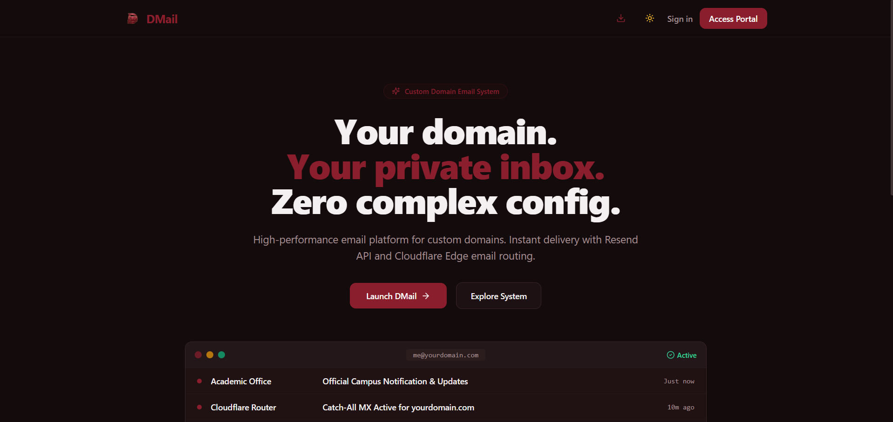
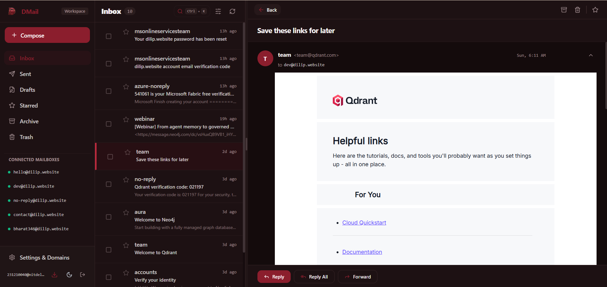
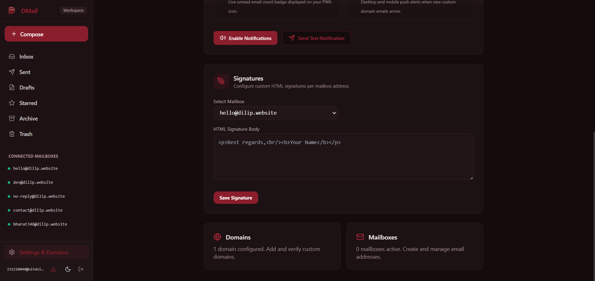
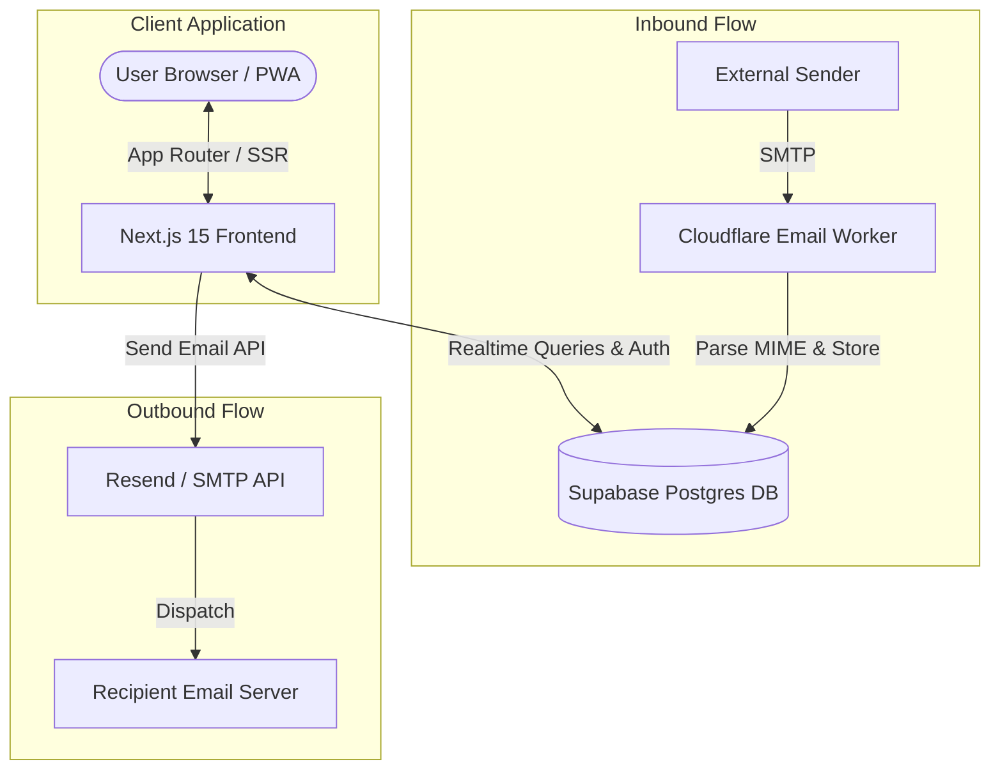

<div align="center">

  <a href="https://github.com/your-username/dmail">
    
  </a>

  <h1>DMail</h1>
  <p><strong>Enterprise-Grade Modern Webmail Suite & Custom Domain Mail Engine</strong></p>

  <p>
    <a href="#features"><strong>Features</strong></a> •
    <a href="#architecture"><strong>Architecture</strong></a> •
    <a href="#tech-stack"><strong>Tech Stack</strong></a> •
    <a href="#getting-started"><strong>Getting Started</strong></a> •
    <a href="#inbound-email-receiver-cloudflare-worker"><strong>Email Receiver</strong></a> •
    <a href="#deployment"><strong>Deployment</strong></a>
  </p>

  <p>
    
    
    
    
    
    
  </p>

  <br />
  

</div>

---

## Overview

**DMail** is an open-source, full-stack webmail application and domain management platform designed for speed, privacy, and seamless email workflow. Built on top of **Next.js 15 (App Router)**, **Supabase**, and **Cloudflare Email Workers**, DMail enables custom domain verification, real-time email ingestion, rich composition with safety controls like *Undo Send*, and installable Progressive Web App (PWA) capabilities.

---

## Interface Preview

<div align="center">

| Webmail Dashboard | Workspace & Thread View |
| :---: | :---: |
|  |  |

<br />

### Settings & Domain Management


</div>

---

## Features

### Core Webmail Experience
* **Resizable Split-Pane Interface**: Drag-to-resize dual/triple panel view built for high productivity.
* **Email Threading**: Automatic conversation grouping by thread ID, message references, and subject headers.
* **Multi-Folder Navigation**: Fast access across `Inbox`, `Sent`, `Drafts`, `Starred`, `Archive`, and `Trash`.
* **Global Search (`Cmd + K`)**: Real-time modal search indexing senders, recipients, subjects, and email bodies.
* **Keyboard Shortcuts**: Built-in shortcut overlay for power users (`C` to compose, `J/K` navigation, `E` archive, `#` delete).

### Rich Composition & Safety
* **Rich Text HTML Editor**: Full formatting suite powered by custom formatting tools, image/link support, and raw text generation.
* **Undo Send**: Configurable safety buffer toast allowing users to cancel accidentally dispatched emails before transmission.
* **Multi-Recipient Support**: Native support for `To`, `CC`, and `BCC` fields with validation.
* **Custom Signatures**: Dynamic HTML signature insertion based on selected mailbox.

### Custom Domains & Mailbox Administration
* **Domain DNS Verification**: Live verification status checks for **MX**, **SPF**, **DKIM**, and **DMARC** DNS records.
* **Multi-Mailbox Management**: Support for creating and sending from multiple domain mailboxes and aliases.
* **Routing & Automation**: Configure email forwarding rules and automated vacation autoresponders per mailbox.
* **Send Quota Tracking**: Real-time outbound volume and rate-limit tracking via organization quotas.

### Offline & PWA Capability
* **Progressive Web App**: Native installation support on desktop and mobile browsers with adaptive app icons.
* **Offline Detection**: Live network status detection banner keeping users informed during connectivity outages.
* **Web Push Notifications**: Toast and browser notifications for incoming emails.
* **Theme Engine**: Seamless Light, Dark, and System theme switching powered by `next-themes`.

<div align="center">
  <br />
  
  
  
</div>

---

## Architecture



---

## Tech Stack

| Category | Technology | Usage |
| :--- | :--- | :--- |
| **Framework** | [Next.js 15](https://nextjs.org/) | App Router, Server Actions, API Routes, React 19 |
| **Database & Auth** | [Supabase](https://supabase.com/) | Postgres Database, Auth SSR (`@supabase/ssr`), Row Level Security |
| **Inbound Processing** | [Cloudflare Workers](https://workers.cloudflare.com/) | Cloudflare Email Routing receiver worker (`workers/dmail-receiver`) |
| **Outbound Email** | [Resend](https://resend.com/) / [Nodemailer](https://nodemailer.com/) | API and SMTP email dispatch |
| **UI & Styling** | [Tailwind CSS](https://tailwindcss.com/) & [shadcn/ui](https://ui.shadcn.com/) | Radix UI primitives, Lucide icons, Dark mode styling |
| **State & Data** | [TanStack Query v5](https://tanstack.com/query) | Async state management & optimistic cache updates |

---

## Project Structure

```
dmail/
├── app/                        # Next.js App Router routes
│   ├── api/                    # REST API endpoints (emails, mailboxes, domains)
│   ├── auth/                   # Auth flows & callback handlers
│   ├── mail/                   # Main webmail client dashboard & settings
│   ├── manifest.ts             # PWA Web Manifest configuration
│   ├── layout.tsx              # Root layout & providers
│   └── page.tsx                # Landing & authentication portal
├── components/                 # React UI components
│   ├── mail/                   # Webmail UI (Email list, thread, compose, settings)
│   ├── ui/                     # Reusable shadcn/ui components
│   ├── notification-provider.tsx # Browser notification system
│   └── offline-banner.tsx      # Network status monitoring
├── lib/                        # Core utilities & database types
│   ├── supabase/               # Supabase SSR client/server initializers
│   ├── types/                  # Database schema & domain TypeScript definitions
│   └── utils.ts                # Shared helper functions
├── workers/                    # Edge Workers
│   └── dmail-receiver/         # Cloudflare Email Worker for MIME parsing & ingestion
├── public/                     # Static assets & icons
└── tailwind.config.ts          # Tailwind CSS styling design tokens
```

---

## Getting Started

### Prerequisites

Ensure you have the following installed:
* **Node.js**: `v18.x` or higher
* **npm**, **pnpm**, or **yarn**
* A **Supabase** account ([supabase.com](https://supabase.com))
* A **Cloudflare** account (for inbound email routing)

### 1. Clone & Install Dependencies

```bash
git clone https://github.com/your-username/dmail.git
cd dmail
npm install
```

### 2. Configure Environment Variables

Create a `.env.local` file in the project root:

```env
# Supabase Configuration
NEXT_PUBLIC_SUPABASE_URL=https://your-project.supabase.co
NEXT_PUBLIC_SUPABASE_PUBLISHABLE_KEY=your-supabase-publishable-key
SUPABASE_SERVICE_ROLE_KEY=your-supabase-service-role-key

# Outbound Email API Key (Resend / SMTP)
RESEND_API_KEY=re_your_resend_api_key

# Application URL
NEXT_PUBLIC_SITE_URL=http://localhost:3000

# Access Control (Set to "*" for open dev access, or restrict to your email)
ALLOWED_EMAIL=*
```

### 3. Initialize Database Schema

Apply the Supabase migrations or set up the database tables (`organizations`, `domains`, `mailboxes`, `mailbox_aliases`, `emails`, `signatures`, `autoresponders`, `forwarding_rules`, `org_send_quotas`) using the Supabase SQL Editor.

### 4. Run Development Server

```bash
npm run dev
```

Open [http://localhost:3000](http://localhost:3000) in your browser to access DMail.

---

## Inbound Email Receiver (Cloudflare Worker)

DMail processes inbound emails via a Cloudflare Email Routing Worker located in `workers/dmail-receiver`.

### Deploying the Receiver Worker

1. Navigate to the worker directory:
   ```bash
   cd workers/dmail-receiver
   npm install
   ```

2. Configure environment bindings in `wrangler.toml`:
   ```toml
   name = "dmail-receiver"
   main = "src/index.ts"
   compatibility_date = "2024-01-01"

   [vars]
   SUPABASE_URL = "https://your-project.supabase.co"
   # SUPABASE_SERVICE_ROLE_KEY configured via secret
   ```

3. Set your Supabase Service Role Key secret:
   ```bash
   npx wrangler secret put SUPABASE_SERVICE_ROLE_KEY
   ```

4. Deploy worker to Cloudflare:
   ```bash
   npx wrangler deploy
   ```

5. In the Cloudflare Dashboard under **Email Routing -> Email Workers**, bind your domain's catch-all or specific email addresses to the `dmail-receiver` worker.

---

## Keyboard Shortcuts

| Shortcut | Action |
| :--- | :--- |
| <kbd>Cmd</kbd> + <kbd>K</kbd> / <kbd>Ctrl</kbd> + <kbd>K</kbd> | Open Global Search Modal |
| <kbd>C</kbd> | Compose New Email |
| <kbd>J</kbd> / <kbd>K</kbd> | Move Selection Down / Up |
| <kbd>E</kbd> | Archive Selected Email |
| <kbd>#</kbd> or <kbd>Del</kbd> | Move Selected Email to Trash |
| <kbd>S</kbd> | Toggle Starred Status |
| <kbd>Esc</kbd> | Close Modal / Deselect |

---

## Scripts

| Script | Description |
| :--- | :--- |
| `npm run dev` | Start Next.js development server |
| `npm run build` | Build production application bundle |
| `npm run start` | Run production build server |
| `npm run lint` | Run ESLint check |

---

## License

This project is open-source under the [MIT License](LICENSE).

